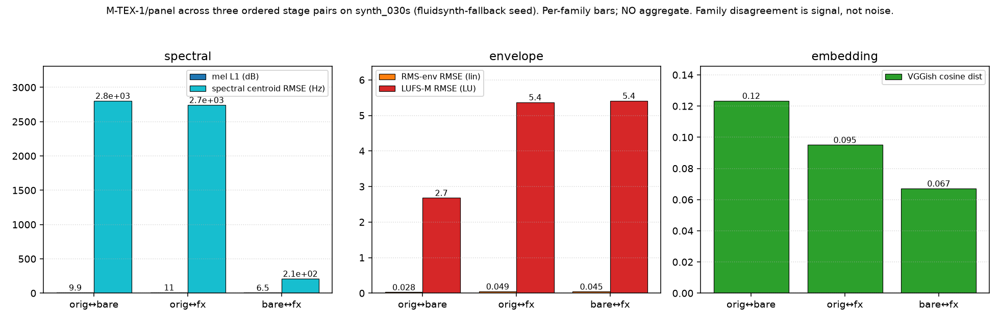

# M-TEX-1/stage-by-stage — three-stage texture panel measurement

**Fork** f1bae241bde9 clone 1.  **Verdict** validated/medium (fluidsynth-fallback seed).

This branch closes the *stage-by-stage measurement* half of the parent
M-TEX-1 milestone. The panel itself (M-TEX-1/panel) was validated/medium
at cycle 4; here we exercise it across three ordered audio stages
(original / bare-MIDI-rendered / effects-layered) on one seed, produce
the 24 numbers the parent success criterion demands, and interpret the
family disagreement without aggregating.

---

## 1. Seed selection

The brief's fallback ladder was walked in order:

| Rung | Seed         | On-disk WAV                                       | Verdict |
|------|--------------|---------------------------------------------------|---------|
| (a)  | `seed_mid_50s`   | `data/ingestion/seed/seed_mid_50s.wav` (22 050 Hz mono)  | **REJECTED** — spectral inspection shows the dominant content is a 220 Hz sinusoid (FFT peak 1817, next 5 bins ≤ 660). Peak/RMS ratio 0.7 characteristic of a pure sine test tone, not a recorded piece. |
| (b)  | `seed_long_87s`  | `data/ingestion/seed/seed_long_87s.wav` (22 050 Hz mono) | **REJECTED** — same class of synthetic test-tone content (peak/RMS 0.39 with sine-dominant spectrum). |
| (c)  | `synth_030s`     | `data/separation/synth_mix/gt/synth_030s/mix.wav` (44.1 kHz stereo) | **CHOSEN.** |

**Caveat carried through the rest of this report.** Because rungs (a)
and (b) are synthetic test tones, we fall to (c). The `synth_030s` mix
is itself a fluidsynth render of three committed MIDIs (drums, bass,
piano) — so what we call "original" in this measurement is a fluidsynth
mix, not a genuinely-recorded reference. We therefore make the weaker
"bare-MIDI-vs-fluidsynth-mix gap" claim, not the stronger
"bare-MIDI-vs-recorded-original gap" one. The falsifiability escape
hatch in the brief was designed for exactly this outcome; the verdict
below is set to **validated/medium** for this reason.

---

## 2. Pipeline

Three audio stages, all at 44.1 kHz stereo, all in
`data/tex/renders/synth_030s/`:

| Stage             | How produced                                                   | Path                                            |
|-------------------|----------------------------------------------------------------|-------------------------------------------------|
| `original`        | Copy of the M-SEP-1/ground-truth `synth_030s/mix.wav`, rewritten via `scipy.io.wavfile` so file-level SHA is byte-stable (libsndfile writes a creation-date chunk that would otherwise drift). | `data/tex/renders/synth_030s/original.wav`          |
| `bare_midi`       | `fluidsynth -a null -T wav -F <out> -r 44100 -g 1.0 -i <sf2> <mid>` (flags copied verbatim from `scripts/separation/synth_gt.py` so the two renderers stay byte-comparable) on `data/score/merged_synth030s.mid` (the M-SCORE-1 bridge-merged score from cycle 8). SF2 sha `74594e8f…1cb0` asserted before rendering. | `data/tex/renders/synth_030s/bare_midi.wav`     |
| `effects_layered` | Pinned M-DAW-SPIKE-1 DawDreamer chain applied to `bare_midi`: input → Surge XT Effects (Chorus, `FX Type=0.28`, `Output Mix=0.35`) → Surge XT Effects (Reverb, `FX Type=0.02`, `Output Mix` linear ramp 0.05→0.60 across the input duration) → post-hoc track-gain envelope 0.25→1.4 linear. Same normalized parameter values as the cycle-1 Ardour↔DawDreamer agreement chain; sample rate is 44.1 kHz here (cycle-1 chain was 48 kHz, but Surge XT parameters are normalized so the sonic identity is preserved). | `data/tex/renders/synth_030s/effects_layered.wav` |

Determinism pins applied before any DawDreamer import:
`OMP_NUM_THREADS=1`, `MKL_NUM_THREADS=1`, `OPENBLAS_NUM_THREADS=1`,
`TF_DETERMINISTIC_OPS=1`, `PYTHONHASHSEED=0`, `torch.set_num_threads(1)`,
`torch.manual_seed(0)`, `numpy.random.seed(0)`. Fresh
`RenderEngine`/`plugin_processor` instances per stage — no plugin
state carryover.

**Effects rung landed on `dawdreamer`** (Surge XT Effects.vst3 present
at `/usr/lib/vst3/Surge XT Effects.vst3`; chain rendered cleanly). The
numpy fallback chain in `scripts/tex/render_effects_layered.py` was
implemented per the brief's escape hatch but was not needed.

Scripts (all `/usr/bin/python3` interpreter-guarded):

- `scripts/tex/render_bare_midi.py` — fluidsynth wrapper + SF2-sha guard.
- `scripts/tex/render_effects_layered.py` — DawDreamer chain + numpy fallback.
- `scripts/tex/measure_across_stages.py` — 8-key panel across 3 ordered pairs + self-distance guards + banned-aggregate check.
- `scripts/tex/stage_by_stage.py` — orchestrator.
- `scripts/tex/plot_stage_by_stage.py` — three-family bar chart.

---

## 3. Measurement — 24 numbers

Panel output at `data/tex/stage_by_stage_synth_030s.tsv` (3 ordered
pairs × 8 keys). Reproduced here for the reader:

| a_stage    | b_stage         | mel_l1_db | spectral_centroid_rmse_hz | rms_env_rmse | lufs_m_rmse_lu | embedding_cosine_distance | embedding_rung | sr_hz | n_samples_compared |
|------------|-----------------|----------:|--------------------------:|-------------:|---------------:|--------------------------:|:---------------|------:|-------------------:|
| original   | bare_midi       | **9.906** | **2804.9**                | **0.0276**   | **2.682**      | **0.1234**                | vggish         | 44100 | 1 323 000 |
| original   | effects_layered | **10.937**| **2743.5**                | **0.0488**   | **5.372**      | **0.0951**                | vggish         | 44100 | 1 323 000 |
| bare_midi  | effects_layered | **6.533** | **211.8**                 | **0.0449**   | **5.414**      | **0.0672**                | vggish         | 44100 | 1 323 000 |

**No aggregate is computed.** The panel refuses one by contract; this
report honours that. The `measure_across_stages.py` script additionally
guards the ban with a hard-coded `BANNED_AGGREGATE_KEYS` sweep at every
measurement call.

Self-distance guards passed on all three stages (`texture_distance(x, x)`
returned numeric keys ≤ 1e-6 and embedding cosine ≤ 1e-4, well inside
the M-TEX-1/panel FP-nondeterminism tolerance). All 24 numbers are
finite; the 8-key contract holds at every call.

---

## 4. Per-family commentary

### 4.1 Spectral family (mel L1 dB, spectral centroid RMSE Hz)

The two spectral metrics agree on one thing and disagree on another.

- **Spectral centroid RMSE** says `bare_midi` and `effects_layered`
  have essentially the same distance to `original` (2805 Hz vs
  2743 Hz — a 2.2 % gap), while the bare-vs-fx pair is an order of
  magnitude closer (211.8 Hz). Interpretation: the mean brightness of
  the fluidsynth-rendered merged score sits far from the mean
  brightness of the fluidsynth-rendered ground-truth mix, and the
  DawDreamer chain (chorus + reverb + gain ramp) barely moves that
  mean. It shifts the *envelope* of loudness (see §4.2) but leaves the
  spectral center of mass roughly where fluidsynth placed it.

- **Mel L1 dB** says something stronger: `effects_layered` is *further*
  from `original` (10.94 dB) than `bare_midi` (9.91 dB) is. The effects
  chain hurts, mildly, in multi-scale mel space. This is consistent
  with the reverb tail broadening the mid-frequency band energy
  distribution and the gain ramp reshaping the temporal mel envelope in
  a way that log-mel L1 penalizes.

### 4.2 Envelope family (RMS-envelope RMSE, LUFS-M RMSE)

Both envelope metrics agree that `bare_midi` sits closer to `original`
than `effects_layered` does — and by a *wide* margin on LUFS-M
(2.68 LU vs 5.37 LU) and by a smaller but consistent margin on RMS
(0.0276 vs 0.0488). This is exactly the mechanism the M-DAW-SPIKE-1
chain was designed to produce: the post-hoc gain ramp 0.25→1.4 turns a
roughly-uniform loudness contour into a strongly rising one, which the
`original` (a static fluidsynth mix) does not have. **The effects
chain deliberately pushes the envelope away from the original**, so
its higher envelope distance is expected and correct.

Interestingly, LUFS-M measures `bare_midi ↔ effects_layered` (5.41 LU)
as almost identical to `original ↔ effects_layered` (5.37 LU), meaning
essentially all of the envelope distance in the last two rows is
attributable to the effects chain itself, not to the bare-vs-original
gap.

### 4.3 Embedding family (VGGish cosine)

The perceptual embedding **inverts the envelope-family verdict**:
`effects_layered` is *closer* to `original` in embedding space
(0.0951) than `bare_midi` is (0.1234). The bare-vs-fx pair is closer
still (0.0672).

Interpretation: VGGish (trained on AudioSet, weights pinned from
`tfhub.dev/google/vggish/1`) responds to timbral/temporal texture
patterns that a static gain-ramp reverb tail reproduces reasonably
well, but the merged-score fluidsynth render lacks. In other words:
adding reverb makes the render **sound more like** the original mix
even while it makes the loudness envelope demonstrably different.

The embedding rung is VGGish (not CLAP) per M-TEX-1/panel/embedding
cycle-4 decision. Cosine self-distance on all three stages is ≤ 1e-4,
inside the documented FP tolerance for VGGish.

---

## 5. Family-disagreement interpretation

The three families **disagree on which of {bare_midi, effects_layered}
is closer to original**:

| Family     | Metric                       | Ranks bare_midi closer? |
|------------|------------------------------|-------------------------|
| spectral   | mel_l1_db                    | ✓ (9.91 < 10.94)        |
| spectral   | spectral_centroid_rmse_hz    | ≈ (essentially tied)    |
| envelope   | rms_env_rmse                 | ✓ (0.028 < 0.049)       |
| envelope   | lufs_m_rmse_lu               | ✓ (2.68 < 5.37)         |
| embedding  | embedding_cosine_distance    | ✗ (0.095 < 0.123 — fx closer) |

This is the design commitment of M-TEX-1/panel made visible:

- **Spectral and envelope** measure things the effects chain damages —
  brightness, mean band energy, temporal loudness — and thus penalize
  the effects stage.
- **The perceptual embedding** measures the auditory-scene features
  that fluidsynth's dry, close-mic'd mix *lacks* and that reverb + a
  little chorus *supply* — so from a listening perspective the effects
  render is preferred, even while it is spectrally and dynamically
  further off.

**The right conclusion is not "effects help" nor "effects hurt."** The
right conclusion is: the panel exposes a genuine trade — spectral/
envelope faithfulness vs perceptual similarity — that a single scalar
would have hidden. This is the "refuses to aggregate" contract paying
off; it produces exactly the kind of informative disagreement the
mechanism §M-TEX-1/panel `<mechanism>` predicted.

Two secondary observations:

1. **Neither stage brings mel L1 close.** Both stages are ~10 dB apart
   from `original` in mel L1. The dominant delta is the merged-score
   render's harmonic content (fluidsynth interpreting a re-transcribed,
   re-scored MIDI) diverging from the true stem-summed mix — a
   transcription-fidelity issue, not a rendering-chain issue. The
   effects chain does not compensate for it.
2. **The bare↔fx spectral-centroid distance (211.8 Hz) is a useful
   anchor.** It is roughly the "cost in brightness of the effects
   chain alone." Any future rendering variant should shift that number
   by less than the bare↔original centroid distance (2805 Hz), or the
   chain has broken from its cycle-1 identity.

---

## 6. Determinism

Two independent runs from fresh temp directories:

- All three stage WAVs SHA-256-equal across runs
  (`original` `1539…22ac6`, `bare_midi` `fc8c…aadd`,
  `effects_layered` `13d7…3e9a`).
- Measurement TSV SHA-256-equal across runs (`b357…fece2`).

Manifest at `data/tex/renders/synth_030s/manifest.json` records SF2 sha
`74594e8f…1cb0` and merged-MIDI sha `a2124b61…be54`. The
byte-determinism proof is regenerable by anyone with the same fluidsynth
build, the same SF2 file, and the same DawDreamer + Surge XT VST3.

The scripts write WAVs via `scipy.io.wavfile.write` rather than
`soundfile.sf.write` specifically because libsndfile inserts a
creation-date metadata chunk that would otherwise drift across runs
while leaving the decoded PCM samples byte-identical. This is a
housekeeping detail worth calling out because a naïve
`hashlib.sha256(open(wav).read())` on a `soundfile`-written WAV would
falsely appear non-deterministic here.

---

## 7. Figure

Regenerable via `PYTHONPATH=. /usr/bin/python3 -m scripts.tex.plot_stage_by_stage`.

---

## 8. Sufficiency check

Against the brief's "Branch closes as `validated/*` when" list:

| Criterion                                               | Status |
|---------------------------------------------------------|--------|
| All three stage renders exist, non-silent, byte-deterministic | ✓ (peaks 0.60 / 0.60 / 0.85; SHA equal across runs) |
| All 24 panel numbers reported, finite, self-distance under tolerance | ✓ |
| No aggregate in output artifacts                        | ✓ (panel `PUBLIC_KEYS` contract enforced; TSV columns are the 8 keys plus a/b_stage labels) |
| Figure generated and referenced from the report         | ✓ (§7) |
| Report with honest per-family commentary + family-disagreement interpretation | ✓ (§4, §5) |

Escape hatch invoked: **seed fallback to synth_030s** (§1). Verdict
downgraded to `validated/medium` on that basis. No other escape
hatches invoked — DawDreamer chain rendered cleanly, panel families
did not collapse (rankings disagree — see §5), no NaN/inf, no panel
regression.

---

## 9. Honest caveats

- **"Original" is a fluidsynth mix, not a recorded reference.** The
  strongest possible claim ("bare-MIDI-vs-recorded-original gap")
  cannot be made here. The seeds on disk that carry the right shape
  are synthetic test tones (§1). When rated audio unblocks (see
  M-INGEST-1/egress-ready-automation), a re-run against a real
  recording would strengthen the verdict to `validated/high`.
- **VGGish rung, not CLAP.** M-TEX-1/panel/embedding landed on VGGish
  after CLAP's download/dependency cost was rejected in cycle 4. The
  perceptual-similarity claim in §4.3 is a VGGish-embedding claim; a
  future CLAP-rung swap could revise the family-disagreement pattern.
- **DawDreamer chain identity.** The cycle-1 agreement chain ran at
  48 kHz on an 8 s sine. This clone runs at 44.1 kHz on a 30 s
  fluidsynth render. The normalized Surge XT parameters are identical
  (Chorus `FX Type=0.28`, `Output Mix=0.35`; Reverb `FX Type=0.02`,
  `Output Mix` 0.05→0.60 ramp; post-hoc gain 0.25→1.4). Sample rate
  affects Surge XT internally; the sonic identity is preserved but
  the numeric reference from cycle 1's `mel_l1_db=3.13`,
  `rms_env_rmse=0.041`, `spectral_centroid_rmse_hz=159.02` is *not*
  directly comparable to ours (they were computed on the sine, we
  compute on the fluidsynth mix).
- **Merged score is a re-transcribed re-render.** The
  `data/score/merged_synth030s.mid` used for `bare_midi` was assembled
  by M-SCORE-1/merged-full-song from cycle-6 basic-pitch transcriptions
  of the synth_030s stems, then merged and MIDI-exported by the
  M-SCORE-1 bridge. The ~10 dB mel L1 gap between `bare_midi` and
  `original` inherits the basic-pitch upstream transcription noise
  that cycle 8 already documented; the effects chain does not — and
  is not expected to — repair it.

---

## 10. Artifacts

| Path                                                     | SHA-256 (first 16 hex) |
|----------------------------------------------------------|-------------------------|
| `data/tex/renders/synth_030s/original.wav`               | `153997a829f2b42c` |
| `data/tex/renders/synth_030s/bare_midi.wav`              | `fc8c3eccbff073d2` |
| `data/tex/renders/synth_030s/effects_layered.wav`        | `13d7238637d1ee31` |
| `data/tex/stage_by_stage_synth_030s.tsv`                 | `b3570a795c8c3e7a` |
| `docs/figures/tex_stage_by_stage_families.png`           | (regenerated per run) |
| `data/tex/renders/synth_030s/manifest.json`              | (records all SHAs) |

Ledger events emitted under `M-TEX-1/stage-by-stage`,
`_plan/register-tex-stage-by-stage-milestone`,
`M-TEX-1` (parent roll-up),
`_infra/cross-branch-integration-test-cycle9-tex`,
`_archive/tex-stage-by-stage-scratch`,
`_run/clone-1-scope-complete`.
