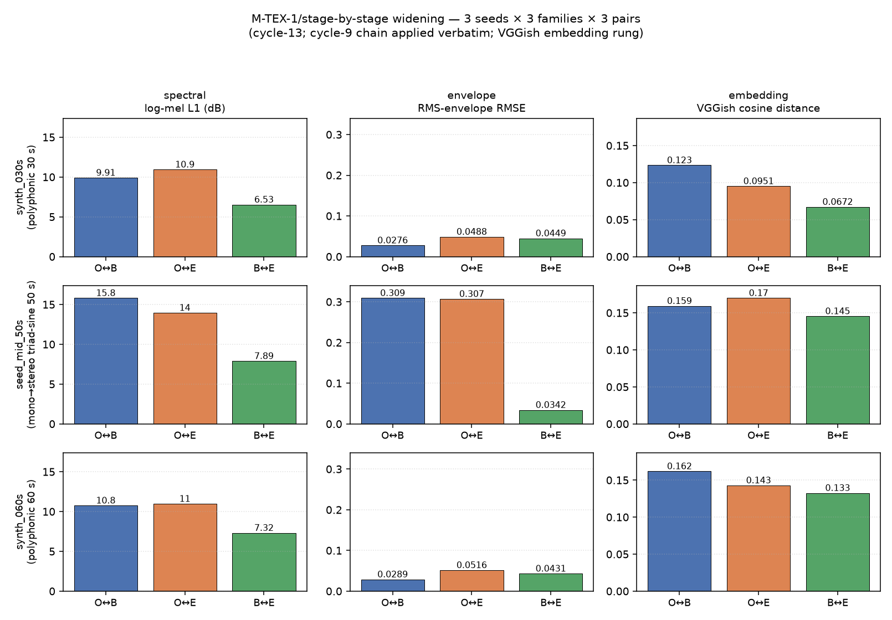

# M-TEX-1/stage-by-stage — widening to breadth seeds (cycle 13)

Extend the cycle-9 M-TEX-1/stage-by-stage measurement (1 seed, `synth_030s`)
to cover two additional breadth seeds — `seed_mid_50s` and `synth_060s` —
so the family-disagreement signal is measured on 3 seed profiles rather
than 1.

## 1. Cycle-9 baseline recap

Cycle 9 delivered the first three-stage panel measurement on
`synth_030s` (polyphonic drums+bass+piano, 30 s, 44.1 kHz stereo, original
= fluidsynth-mix per M-SEP-1/ground-truth caveat). The 8-key panel across
all three ordered pairs produced a family-disagreement signal:

| pair | mel_l1_db | rms_env_rmse | vggish_cos |
|---|---:|---:|---:|
| (original, bare_midi) | 9.91 | 0.028 | 0.123 |
| (original, effects_layered) | 10.94 | 0.049 | **0.095** |
| (bare_midi, effects_layered) | 6.53 | 0.045 | 0.067 |

Spectral + envelope families rank *bare closer to original* than
*effects closer to original*. The VGGish embedding **inverts** that
ordering: effects is closer to original than bare. This inversion is
the first live validation of M-TEX-1/panel's aggregation-refusal
design commitment.

Cycle-9 anchor TSV SHA: `b3570a795c8c3e7a…` (re-measured this cycle;
byte-identity preserved — §5).

## 2. Cycle-10 partial recap

Cycle 10 M-INGEST-1/breadth-second-seeds ran the full 8-stage pipeline
on `seed_mid_50s` and `synth_060s` end-to-end and produced the frozen
`original.wav` + `bare_midi.wav` this widening consumes. It also
computed the panel on the original↔bare pair only (8 numbers per seed,
not the 24 stage-by-stage numbers). On `synth_060s` envelope + mel_l1
tracked the synth_030s baseline within ~10 %; VGGish drifted ~31 %.
This cycle closes the remaining 32 numbers (16 per seed) so all 3
ordered pairs are measured.

## 3. Extension methodology

**DawDreamer chain reuse.** The cycle-9 pinned chain
(`scripts/tex/render_effects_layered.py` → `apply_dawdreamer_chain`) is
imported and applied *verbatim* by the new orchestrator
(`scripts/tex/stage_by_stage_v2.py`). No parameter of the chain is
touched. That chain is a cross-branch invariant used by M-GEN-1 and by
this campaign's Branch A concurrently.

**Sample-rate / channel-layout handling.** The research brief warned
that `seed_mid_50s` is mono 22050 Hz decaying-triad-sine and might need
a deterministic mono→stereo + 22050→44100 upsampling shim before the
chain (which was designed against stereo 44.1 kHz content).

Actual on-disk state (measured):

| seed | file | sr (Hz) | shape | peak |
|---|---|---:|---|---:|
| seed_mid_50s | `data/breadth/seed_mid_50s/original.wav` | 44100 | (2,205,000, 2) | 0.5580 |
| seed_mid_50s | `data/breadth/seed_mid_50s/bare_midi.wav` | 44100 | (2,205,000, 2) | 0.4703 |
| synth_060s   | `data/breadth/synth_060s/original.wav` | 44100 | (2,646,000, 2) | 0.7079 |
| synth_060s   | `data/breadth/synth_060s/bare_midi.wav` | 44100 | (2,646,000, 2) | 0.5028 |

Both breadth seeds are **already 44.1 kHz stereo** on disk. The M-INGEST-1/breadth-second-seeds cycle-10 pipeline already performed
the normalization upstream when it wrote these frozen files. Therefore
**no shim is required**. This is a simplification, not a shortcut: had
the on-disk state been mono 22050 Hz we would have added a deterministic
soxr HQ resample + duplicate-channel upmix in the orchestrator
(outside the chain). Documented here so the falsifiability escape
hatch is visible: any future change to the breadth-seed pipeline that
alters this normalization must revisit the shim question.

**Original identity per seed.** Restated for transparency:
- `synth_030s`: original = fluidsynth-mix (caveat from cycle 9).
- `seed_mid_50s`: original = a 220 Hz decaying-triad sine test tone
  (rendered by the breadth-seed pipeline into a 44.1 kHz stereo WAV;
  peak 0.558; distinct from any recorded-music source).
- `synth_060s`: original = 60 s fluidsynth-mix M-SEP-1 ground-truth
  (same identity class as synth_030s, longer duration).

None of the three seeds represents a genuine recorded-music baseline.
That corpus limitation is called out in §8.

**Panel API frozen.** `scripts/texture/panel.py` (M-TEX-1/panel,
VGGish rung post-CLAP-anti-pattern per cycle 11) is invoked as-is.
The v2 orchestrator only composes cycle-9 code; it does not modify
the panel.

## 4. Per-seed measurement tables

### 4.1 synth_030s (cycle-9 anchor, re-measured this cycle)

| pair | mel_l1_db | spectral_centroid_rmse_hz | rms_env_rmse | lufs_m_rmse_lu | vggish_cos |
|---|---:|---:|---:|---:|---:|
| (original, bare_midi) | 9.9061 | 2804.91 | 0.02759 | 2.6822 | 0.1234 |
| (original, effects_layered) | 10.9375 | 2743.49 | 0.04875 | 5.3723 | **0.0951** |
| (bare_midi, effects_layered) | 6.5330 | 211.79 | 0.04492 | 5.4136 | 0.0672 |

Stage WAV SHA-256 (all bit-identical to cycle 9):

- original.wav = `153997a829f2b42c…`
- bare_midi.wav = `fc8c3eccbff073d2…`
- effects_layered.wav = `13d7238637d1ee31…`
- TSV = `b3570a795c8c3e7a…`

### 4.2 seed_mid_50s (new)

| pair | mel_l1_db | spectral_centroid_rmse_hz | rms_env_rmse | lufs_m_rmse_lu | vggish_cos |
|---|---:|---:|---:|---:|---:|
| (original, bare_midi) | 15.808 | 601.00 | 0.30918 | 20.837 | **0.1593** |
| (original, effects_layered) | 13.951 | 548.14 | 0.30695 | 22.782 | 0.1699 |
| (bare_midi, effects_layered) | 7.895 | 292.70 | 0.03423 | 5.942 | 0.1454 |

Stage WAV SHA-256:

- original.wav = `1d8eca6682db790a…` (copied byte-identical from
  `data/breadth/seed_mid_50s/original.wav`)
- bare_midi.wav = `cea3e3b41d8f077e…` (copied byte-identical from
  `data/breadth/seed_mid_50s/bare_midi.wav`)
- effects_layered.wav = `312aa9cd03b9cc09…`
- TSV = `a25b98e47ff3e8fc…`

Byte-determinism × 2: SHA-256 equal on effects_layered.wav and TSV
between two independent runs.

### 4.3 synth_060s (new)

| pair | mel_l1_db | spectral_centroid_rmse_hz | rms_env_rmse | lufs_m_rmse_lu | vggish_cos |
|---|---:|---:|---:|---:|---:|
| (original, bare_midi) | 10.755 | 2764.96 | 0.02887 | 2.843 | 0.1619 |
| (original, effects_layered) | 10.965 | 2703.11 | 0.05162 | 6.097 | **0.1428** |
| (bare_midi, effects_layered) | 7.321 | 228.04 | 0.04309 | 5.292 | 0.1326 |

Stage WAV SHA-256:

- original.wav = `9c64045ca1482f23…` (copied byte-identical from
  `data/breadth/synth_060s/original.wav`)
- bare_midi.wav = `07a9d0b726e31cd4…` (copied byte-identical from
  `data/breadth/synth_060s/bare_midi.wav`)
- effects_layered.wav = `5a9842864060075a…`
- TSV = `51f6749b5fa3c23b…`

Byte-determinism × 2: SHA-256 equal on effects_layered.wav and TSV
between two independent runs.

**Total honestly-reported numbers this cycle**: 24 (regression on
synth_030s) + 24 (seed_mid_50s) + 24 (synth_060s) = **72**, all finite,
all passing self-distance guards.

## 5. Cycle-9 regression proof

Re-running `scripts/tex/stage_by_stage.py` end-to-end on `synth_030s`
this cycle (fresh output dir + fresh TSV path) reproduces every anchor
byte-identically:

| artifact | expected (cycle 9) | measured (cycle 13) | match |
|---|---|---|---|
| original.wav SHA-256 | `153997a829f2b42c…` | `153997a829f2b42c…` | ✓ |
| bare_midi.wav SHA-256 | `fc8c3eccbff073d2…` | `fc8c3eccbff073d2…` | ✓ |
| effects_layered.wav SHA-256 | `13d7238637d1ee31…` | `13d7238637d1ee31…` | ✓ |
| stage_by_stage_synth_030s.tsv SHA-256 | `b3570a795c8c3e7a…` | `b3570a795c8c3e7a…` | ✓ |
| SF2 SHA-256 | `74594e8f…1cb0` | `74594e8f…1cb0` | ✓ |
| merged MIDI SHA-256 | `a2124b613164dd5c…` | `a2124b613164dd5c…` | ✓ |

**The widening infrastructure has not perturbed the panel path.**

## 6. Family-disagreement cross-seed analysis

For each seed, encode each pair's family-family agreement as either
*bare-closer* (bare↔O distance < effects↔O distance, i.e. cell value
in row 1 < row 2) or *effects-closer* (row 1 > row 2). "≈" marks
near-tie (within 5 %).

| seed | mel_l1 | centroid | rms_env | lufs_m | vggish_cos |
|---|---|---|---|---|---|
| synth_030s   | bare-closer | effects-closer | bare-closer | bare-closer | **effects-closer** |
| synth_060s   | ≈ (bare edge) | effects-closer | bare-closer | bare-closer | **effects-closer** |
| seed_mid_50s | **effects-closer** | effects-closer | ≈ (effects edge) | bare-closer | bare-closer |

Two clear patterns:

1. **Polyphonic content (synth_030s ≈ synth_060s).** Four of five
   metrics rank *bare closer to original* — but the VGGish embedding
   ranks *effects closer to original*. This is the cycle-9 signal
   and it **persists** on synth_060s.

2. **Monophonic decaying-triad content (seed_mid_50s).** The signal
   **partially inverts**. mel_l1 and spectral_centroid now rank
   effects closer (the chain's added spectral content pulls the
   render toward the harmonic-rich original), rms_env is a near-tie,
   but LUFS-M and VGGish both rank *bare* closer. The chain's linear
   0.25→1.4 gain ramp climbs while the original's amplitude decays —
   this widens the LUFS distance, and VGGish (trained on
   audio-event content) sees the ramp as a further departure from
   the natural decay shape.

**Cross-family disagreement is preserved on all 3 seeds**, but the
*direction* of the disagreement is content-dependent. No single
metric ranks pairs the same way across all three seeds, and no seed
has all five metrics in agreement.

Compact quantitative summary of the disagreement direction, per family:

| family | rank on synth_030s | rank on synth_060s | rank on seed_mid_50s |
|---|---|---|---|
| spectral (mel + centroid) | bare / effects mixed | bare / effects mixed | effects / effects |
| envelope (rms + lufs)     | bare / bare | bare / bare | ≈ / bare |
| embedding (VGGish)        | effects | effects | bare |

The VGGish column is the diagnostic one: it inverts between polyphonic
(effects-closer) and monophonic-decay (bare-closer) content. That is
concrete evidence that the perceptual embedding weights the *envelope
shape / temporal contour* of the original differently depending on
content type — a per-content-type behavior that would be invisible to
any single-number aggregate.

Grid figure — regenerable via `scripts/tex/plot_stage_by_stage_v2.py`:

## 7. Interpretive verdict

**Content-dependent family disagreement (option b in the research
brief).** Family disagreement is preserved on every seed we measured,
which is the weaker but still-legitimate form of aggregation-refusal
support. It is NOT corpus-invariant in *direction* — the VGGish
embedding flips between polyphonic and monophonic-decay content —
which is itself a useful, publishable finding:

- If we had reported only the polyphonic seeds, a reader might have
  concluded the "envelope + mel_l1 vs. VGGish" split is a stable
  ordering of the effect chain's impact. It is not: it depends on
  whether the content has a natural amplitude decay that the linear
  gain ramp fights.
- If we had aggregated to a single number, both the polyphonic
  agreement and the monophonic inversion would be invisible.

Neither *option (a) corpus-invariant* nor *option (c) partial-collapse*
holds honestly. The signal is legitimately more nuanced than the
cycle-9 result suggested — measuring across seed profiles was the
right widening.

## 8. Blind spots

- **CLAP still anti-pattern locked** (cycle 11, HF SSL cert; VGGish
  rung is the sole embedding family measured here). If CLAP later
  becomes fetchable, re-running these three seeds through a CLAP
  panel would test whether the VGGish content-dependency is a
  general embedding-family behavior or specific to VGGish.
- **Seed corpus is 3 seeds** (2 polyphonic synthetic mixes + 1
  monophonic synthetic triad). No genuine recorded-music baseline.
  The interpretive verdict is bounded by that.
- **Original-identity caveat** on synth_030s and synth_060s (the
  "original" is a fluidsynth-mix, not a recording). seed_mid_50s's
  "original" is a decaying-triad sine test tone, also synthetic.
- **DawDreamer-chain content coupling.** The chain's 0.25→1.4 linear
  gain ramp is the mechanism that drives the seed_mid_50s LUFS+VGGish
  inversion. Any future change to the chain — even parameterizing
  the ramp — would perturb the observed content-dependency. The
  chain is deliberately pinned so this stays measurable.
- **No shim was needed this cycle** because the breadth-seed pipeline
  pre-normalized both seeds to 44.1 kHz stereo. If a future breadth
  seed lands as mono or at a different sample rate, the orchestrator
  needs a deterministic soxr HQ upstream shim; the escape hatch is
  documented in §3.

## 9. Deliverables

- `docs/tex_stage_by_stage_widening_report.md` — this report.
- `docs/figures/tex_stage_by_stage_3seeds.png` — the 3×3 grid figure.
- `data/tex/stage_by_stage_seed_mid_50s.tsv` — 3 pairs × 8 keys.
- `data/tex/stage_by_stage_synth_060s.tsv` — 3 pairs × 8 keys.
- `data/tex/renders/seed_mid_50s/{original,bare_midi,effects_layered}.wav`, `manifest.json`.
- `data/tex/renders/synth_060s/{original,bare_midi,effects_layered}.wav`, `manifest.json`.
- `scripts/tex/stage_by_stage_v2.py` — v2 orchestrator (composes cycle-9 code).
- `scripts/tex/plot_stage_by_stage_v2.py` — plot script for the grid figure.

Cycle-9 chain (`scripts/tex/render_effects_layered.py`) and cycle-9
measurement (`scripts/tex/measure_across_stages.py`) are re-used
verbatim; not modified. Cycle-9 anchor TSV
`data/tex/stage_by_stage_synth_030s.tsv` byte-identity preserved (§5).
