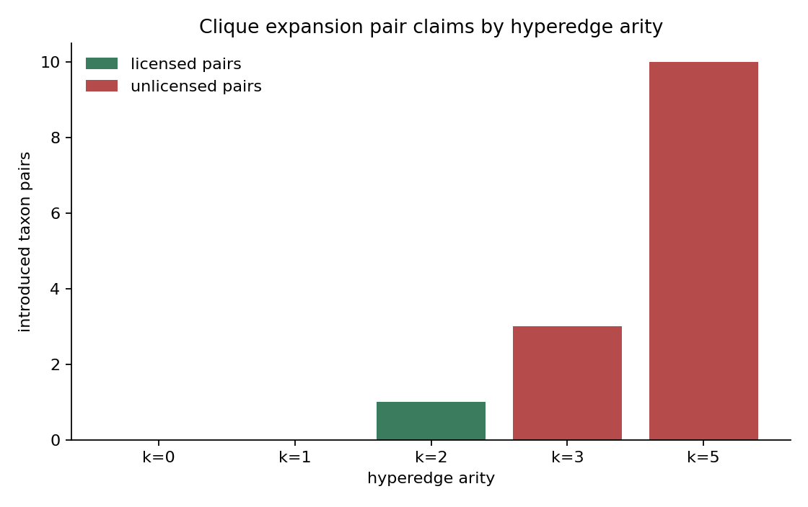

# M7 Formal Clique-Expansion Diagnostic

## Proposition

Let a role-labeled hyperedge be `e = (M, roles, family)` with `k = |M|` taxon members. Its clique expansion replaces the single incidence relation with all unordered taxon pairs `{u, v}` for `u, v in M`, creating `k(k - 1) / 2` pairwise adjacencies.

Clique expansion is semantically safe for a task only when every introduced pairwise adjacency is an allowed claim under the hyperedge family's declared semantics. If a hyperedge family represents shared context, provenance, convergence stress, or role-dependent reticulate evidence rather than mutual taxon-taxon similarity, clique expansion introduces unlicensed pairwise claims.

## Proof Sketch

The combinatorial count follows by choosing two distinct members from `k` members: `C(k, 2) = k(k - 1) / 2`. For `k = 0` or `k = 1`, no pair exists, so expansion is vacuous. For `k = 2`, expansion creates one pair and can be equivalent to the native hyperedge if the task semantics explicitly license that pair as the relevant evidence claim.

For `k >= 3`, clique expansion creates multiple pairwise adjacencies. A native hyperedge can assert "these members share one context" without asserting that each pair is mutually similar. Therefore, if even one introduced pair is not licensed by the hyperedge semantics, the clique-expanded graph is not equivalent to the native hypergraph for that task.

Role labels make the failure sharper. A synthetic reticulate hyperedge with one child and two source lineages can license child-to-source-lineage near-miss credit while not licensing source-lineage-to-source-lineage similarity. Clique expansion loses that distinction unless the pairwise graph carries enough edge typing and role constraints to reconstruct the original incidence semantics.

## Finite Verification

`scripts/verify_formal_diagnostic.py` generates exact finite examples in `data/formal_diagnostic/finite_examples.csv`.

| example | family | k | introduced | licensed | unlicensed ratio |
|---|---|---:|---:|---:|---:|
| empty context | regional checklist | 0 | 0 | 0 | 0.000000 |
| singleton context | regional checklist | 1 | 0 | 0 | 0.000000 |
| pairwise-safe trait task | trait syndrome | 2 | 1 | 1 | 0.000000 |
| context-only hyperedge | regional checklist | 3 | 3 | 0 | 1.000000 |
| larger context-only hyperedge | regional checklist | 5 | 10 | 0 | 1.000000 |
| reticulate role example | reticulate signal | 3 | 3 | 2 | 0.333333 |
| trait-convergence trap | trait syndrome | 3 | 3 | 0 | 1.000000 |

## M6 Linkage

The M6 experiment is evidence for this diagnostic, not a biological proof. On the synthetic benchmark, native hypergraph scoring had mean hierarchy distance `1.772727`, clique expansion had `2.090909`, and the collapse-to-clique ablation moved native hypergraph scoring to `2.090909`, a `+0.318182` hierarchy-distance penalty.

The M6 clique diagnostic table contains 33 hyperedges with introduced taxon pairs:

| family | hyperedges | taxon members | introduced pairs | licensed pairs | unlicensed ratio |
|---|---:|---:|---:|---:|---:|
| `regional_checklist_context` | 4 | 20 | 40 | 0 | 1.000000 |
| `reticulate_or_hybrid_signal` | 7 | 21 | 21 | 14 | 0.333333 |
| `trait_syndrome` | 22 | 44 | 22 | 0 | 1.000000 |

The regional checklist rows are context edges: they support source-scoped checklist context, not global taxon similarity. The reticulate rows are role-dependent: child-source near-miss is licensed in the synthetic benchmark, but source-source similarity is not. The trait rows are convergence stressors: they can support trait-state evidence, but not taxonomic identity or phylogenetic closeness.

## Harmless Cases

Clique expansion is harmless when the target task only needs pairwise co-membership and every generated pair is an allowed claim. A `k = 2` hyperedge with pairwise semantics is the simplest case. A larger hyperedge is also safe if its intended meaning is exactly "all member pairs stand in this relation" and the graph retains enough edge type/provenance to avoid confusing that relation with taxonomy, synonymy, phylogeny, or occurrence evidence.

This condition is stronger than "the graph has the same connected components." Connectedness preserves reachability, but it does not preserve role labels, arity, or the distinction between shared context and mutual similarity.

## Limitations

The reticulate evidence used here is synthetic. M6 had no held-out noisy-occurrence or trait-convergence cases in the test split, so the diagnostic does not show predictive failure for those mechanisms. The result supports H4 as a semantic warning and finite counterexample template, not a claim that clique expansion is always worse or that native hypergraphs are generally more accurate.
