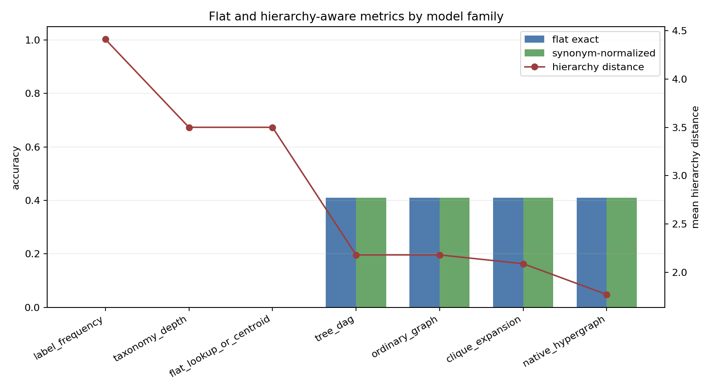
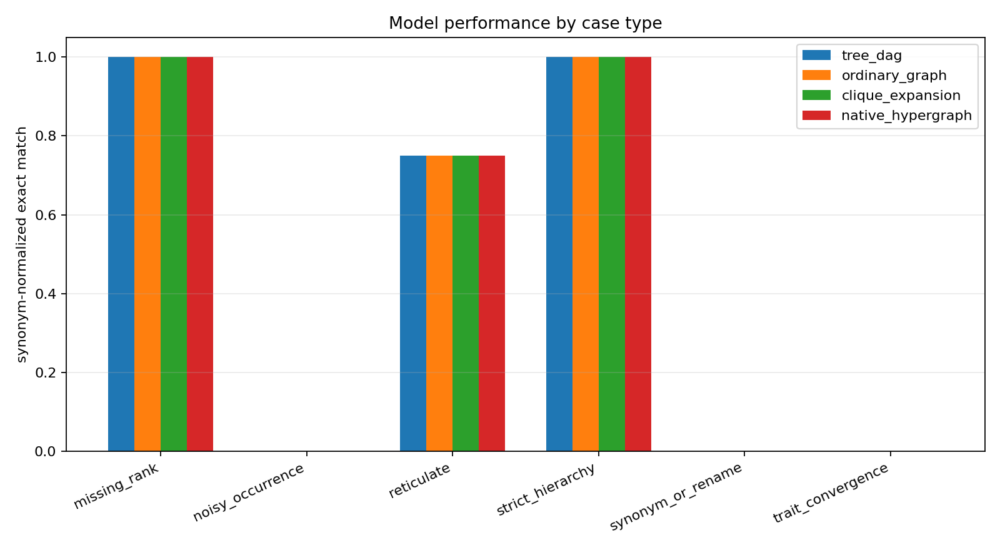
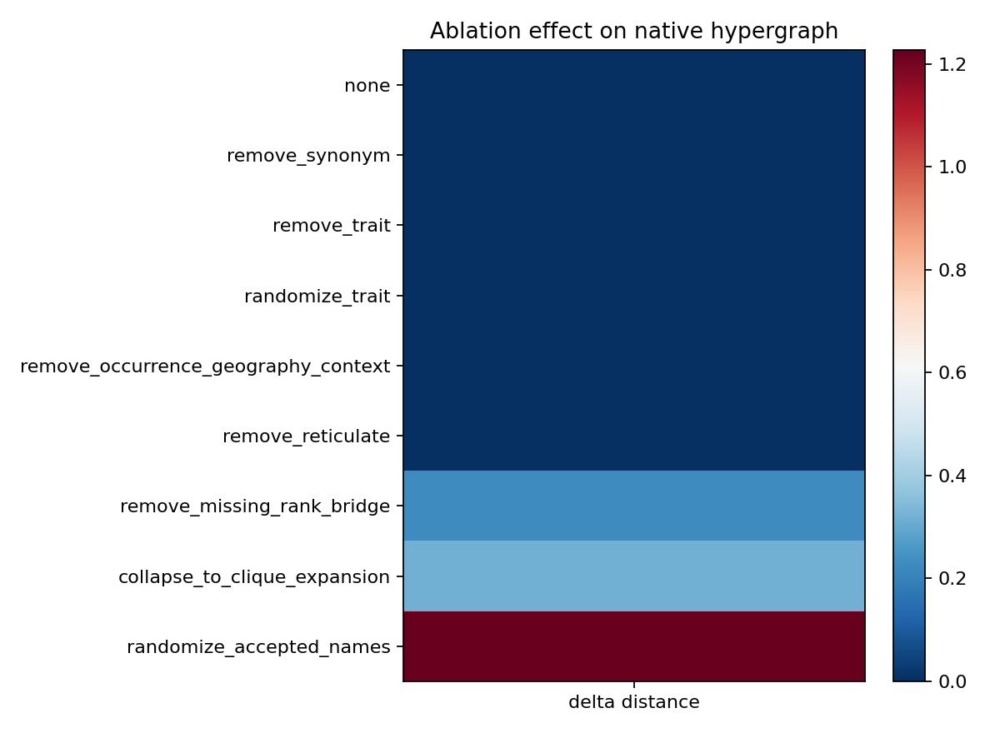
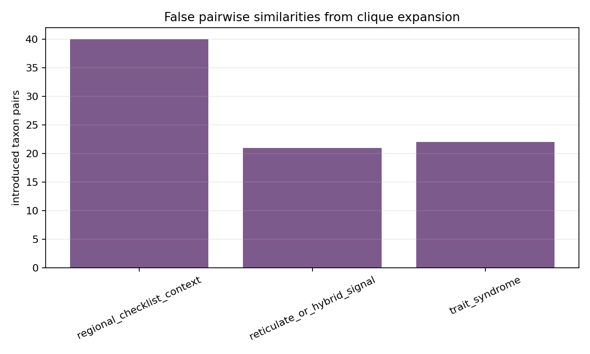

# M6 Baseline And Hypergraph Experiments

## Scope

This cycle tests deterministic baselines on the validated synthetic benchmark at `data/synthetic_benchmark/v0.1`. The Cycle 3 public sample is used only as a loader and source-evidence plumbing check: `data/public_taxonomy_sample/v0.1/hyperedges.csv` parses successfully, has 327 incidence rows, and all rows have `is_synthetic=false`.

No biological novelty claim is made. Reticulate, trait, missing-rank, occurrence, and geography signals in this experiment are synthetic benchmark mechanisms.

## Methods

The experiment runner is `scripts/run_synthetic_experiments.py`. It runs seven model families from `tools/baselines.py`: label frequency, taxonomy depth, flat lookup/centroid, tree/DAG, ordinary graph, clique expansion, and native role-labeled hypergraph scoring.

Information budgets are constrained. Tree/DAG uses only `taxonomic_parentage`; ordinary graph excludes native reticulate hyperedges; clique expansion converts hyperedges to pairwise relations; native hypergraph scores role-labeled incidence. Direct synonym-to-accepted mappings are not exposed to prediction except through accepted-name IDs already visible in the example; synonym normalization is used as an evaluation metric.

Command:

```bash
python3 scripts/run_synthetic_experiments.py --benchmark-dir data/synthetic_benchmark/v0.1 --public-sample-dir data/public_taxonomy_sample/v0.1 --out-dir data/experiments/synthetic_v0.1 --seed 20260517 --ablation all
```

## Aggregate Results

On the test split (`n=22`), tree/DAG, ordinary graph, clique expansion, and native hypergraph tied for best flat and synonym-normalized exact match at `0.409091`. Native hypergraph had the best mean hierarchy distance at `1.772727`, compared with tree/DAG `2.181818`, ordinary graph `2.181818`, and clique expansion `2.090909`.



## Case-Type Results

Tree/DAG, ordinary graph, clique expansion, and native hypergraph all solve strict-hierarchy test cases in this split (`1.000000` synonym-normalized exact match). Native hypergraph improves hierarchy distance on reticulate cases (`0.750000`) relative to tree/DAG, ordinary graph, and clique expansion (`1.000000`), but exact reticulate accuracy is tied at `0.750000`.

Missing-rank has only one test case and all structure-aware methods solve it exactly. There are no noisy-occurrence or trait-convergence cases in the test split, so those mechanisms are not evaluated by held-out case-type metrics in this run.



## Ablations And Negative Results

Removing missing-rank bridges worsens native hierarchy distance by `+0.227273`, collapsing native hypergraph scoring to clique expansion worsens it by `+0.318182`, and randomizing accepted-name mappings worsens it by `+1.227273`. Removing or randomizing trait edges changes no aggregate metric in this split, which is a useful null result: trait hyperedges did not drive the observed native advantage.

Removing reticulate hyperedges also changes no aggregate metric in this deterministic scorer, weakening H2 for exact reticulate prediction. The native method’s reticulate benefit appears as better hierarchy distance among tied exact predictions, not as a robust accuracy gain.

Strict negative control is satisfied: on a generated benchmark with synonym, missing-rank, reticulation, trait-convergence, and occurrence-noise rates all set to zero, tree/DAG and native hypergraph have identical mean hierarchy distance (`0.571429`).



## Clique Expansion Diagnostic

Clique expansion introduced 33 multi-way edge diagnostics in `clique_false_similarity.csv`. These include trait, reticulate, and regional context hyperedges whose taxon members become pairwise similarities even when the original hyperedge represents a multi-way context or trap.



## Hypothesis Status

H1 is weakly supported: synonym-normalized evaluation is implemented, but model rankings match flat exact match in this M6 run because predictions are accepted taxon IDs.

H2 is weakened: native hypergraph improves reticulate hierarchy distance and aggregate hierarchy distance, but does not improve exact accuracy and the remove-reticulate ablation is flat.

H3 is supported: randomizing accepted-name mappings sharply degrades results, and synonym/label plumbing remains a major explanatory factor.

H4 is supported as a diagnostic, not yet as a performance claim: clique expansion creates unlicensed pairwise similarities, but it remains competitive on aggregate metrics.

## Limitations

The models are deterministic scoring baselines, not optimized classifiers. The test split is small and lacks noisy-occurrence and trait-convergence cases, so those ablations are recorded as null results rather than evidence that those families never matter. Public WFO/GBIF/Open Tree data are only used for schema-readiness checks in this cycle.
