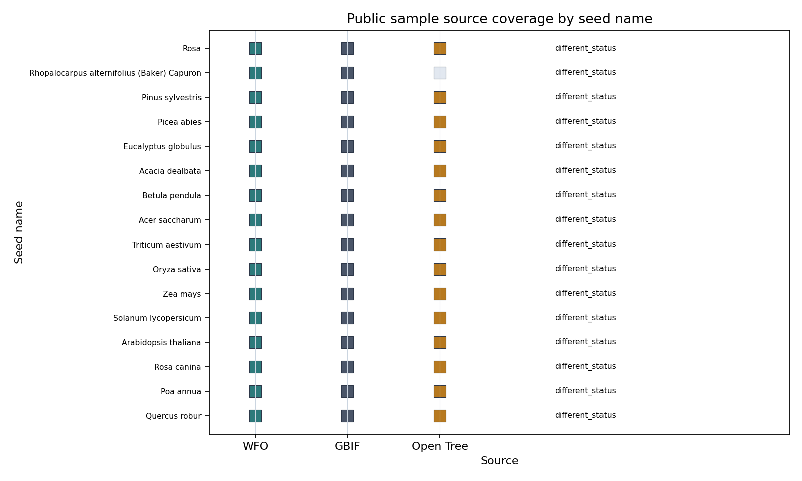

# Public Taxonomy Sample Design

Cycle 3 adds a small public-data-backed identifier layer for the plant taxonomy hypergraph campaign. The sample is intentionally narrow: it freezes no-auth WFO Plant List, GBIF species match, and Open Tree TNRS responses for 16 seed names, then transforms them into source-specific taxonomy, nomenclature, crosswalk, split, and incidence tables. It does not reconcile the sources into a single accepted truth record.

## Generated Artifacts

The reproducible command is:

```bash
python3 scripts/build_public_taxonomy_sample.py --out-dir data/public_taxonomy_sample/v0.1
```

The output directory contains `seed_names.csv`, raw JSON responses under `raw/wfo/`, `raw/gbif/`, and `raw/opentree/`, normalized `taxa.csv`, `names.csv`, `source_crosswalk.csv`, `hyperedges.csv`, `splits.csv`, `metadata.json`, and the coverage figure.



## Source Roles

WFO is treated as plant name/taxonomy evidence, GBIF as backbone match evidence, and Open Tree as taxonomy/phylogeny synthesis context. The tables preserve separate source identifiers: WFO IDs, GBIF keys, and OTT IDs are not collapsed into a single canonical taxon ID. This supports later baseline comparisons that can decide which evidence families are visible without hiding disagreement during ingestion.

The current frozen sample has 16 seed names. All 16 have responses from at least two sources, and all 16 show a `different_status` crosswalk category because WFO name matching often returned candidate-level records while GBIF returned `ACCEPTED` backbone matches and Open Tree returned TNRS matches. This is a useful public-data grounding result: the disagreement is representational, not a claim that one source is biologically wrong.

## Hypergraph Encoding

`taxa.csv` stores source-specific taxon records with `local_taxon_id`, `source`, `source_taxon_id`, name, rank, parent, status, query, match type, and confidence. `names.csv` stores query and matched/canonical name strings with accepted-taxon mappings only for name-normalization tasks. `source_crosswalk.csv` records the per-seed source identifiers and disagreement category without forcing an accepted cross-source ID.

`hyperedges.csv` uses the Cycle 1 incidence format. This cycle emits `taxonomic_parentage` where GBIF match results expose a parent key, `synonym_cluster` for source-local name normalization clusters, and `regional_checklist_context` as source-context evidence linking query names to source-specific taxon records. No `reticulate_or_hybrid_signal` edges are emitted, and no synthetic trait or missing-rank mechanisms are imported into this public sample.

## Leakage Controls

`splits.csv` assigns split groups by source-local accepted taxon or synonym cluster. All name rows are marked `task_visibility=name_normalization_only`, so direct synonym-to-accepted mappings are not treated as general classification labels. This sample is therefore ready for later M6 checks about information budgets, but it does not itself run tree, graph, or hypergraph baselines.

## Null Results And Limits

GBIF occurrence reads were not used in this cycle, so `occurrence_provenance` edges are absent by design. The sample supports identifier, name, source, status, rank, and limited parentage plumbing only. It does not support real trait, range, reticulation, hybrid-origin, occurrence-quality, or phylogenetic novelty claims.

The sample is small and seed-list curated, so it is not representative of global plant taxonomy. Its value is that it tests whether the Cycle 1 schema can encode real WFO/GBIF/Open Tree source evidence while preserving source-specific differences for later fair baselines and ablations.
