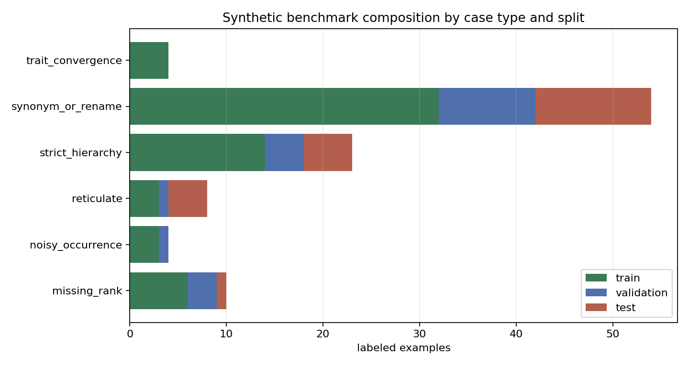

# Synthetic Reticulate Taxonomy Benchmark Design

This benchmark is a deterministic, fully synthetic stress test for the Cycle 1 hypergraph schema. It is not a biological dataset and does not assert real plant trait syndromes, ranges, missing ranks, hybrid origins, or taxonomic changes. Its purpose is to create known mechanisms that later tree, DAG, graph, flat, and native-hypergraph baselines can be judged against.

## Generated Artifacts

The default command writes `data/synthetic_benchmark/v0.1/`:

```bash
python3 scripts/generate_synthetic_benchmark.py --seed 20260517 --out-dir data/synthetic_benchmark/v0.1/
```

The directory contains `taxa.csv`, `names.csv`, `hyperedges.csv`, `examples.csv`, `splits.csv`, `metadata.json`, and `composition.png`. The default scale is 4 families, 12 genera, 60 species, and about 100 labeled examples, small enough to inspect manually.



## Mechanisms

Taxonomy is represented as accepted synthetic family, genus, and species taxa. Most species have a genus parent; missing-rank species instead point directly to a family and receive a `missing_rank_bridge` hyperedge marking the absent genus rank. This tests whether a method can handle an observed incomplete hierarchy without inventing unsupported taxonomy.

Nomenclature is represented in `names.csv` as accepted names plus optional synonym, renamed-label, and noisy-verbatim labels. All names for the same accepted taxon share a `leakage_group_id`, and `splits.csv` assigns each group to exactly one split so a future name-normalization model cannot learn a held-out accepted taxon through a synonym cluster.

Trait evidence is synthetic. Local trait hyperedges group species within a genus-like context, while convergence-trap hyperedges deliberately connect species from different families. Those convergence edges are meant to create false-positive pressure: trait similarity is evidence for a benchmark feature, not proof of taxonomic closeness.

Occurrence and regional context are synthetic. Regional checklist hyperedges connect source, region, family, and a small set of listed taxa. Occurrence provenance hyperedges connect occurrence records, taxa, observations, regions, and source nodes, with a configurable noise rate that assigns some records to an implausible region.

Reticulate/hybrid-like cases are synthetic oracle structures. A `reticulate_or_hybrid_signal` hyperedge connects one child taxon to at least two source lineages and a synthetic phylogeny node. A strict single-parent tree projection must either drop one source lineage or duplicate the child; the native incidence table preserves both source-lineage roles without converting them into unrestricted pairwise similarity.

## Metrics and Oracle Checks

`tools/hierarchy_metrics.py` implements minimal checks for the benchmark:

- `flat_exact_match`: atomic label correctness.
- `synonym_normalized_exact_match`: exact match after accepted-taxon normalization through `names.csv`.
- `hierarchy_distance` and `mean_hierarchical_distance_error`: ancestor-path distance in the observed taxonomy.
- `hierarchy_coherence_violation_rate`: detects incompatible family/genus/species predictions.
- `reticulate_near_miss_score`: gives full credit for the reticulate target and partial credit for documented synthetic source lineages only.

The metric tests cover positive and negative cases for synonyms, wrong species in the right genus, wrong genus in the right family, missing-rank bridge behavior, incoherent multi-rank predictions, and reticulate parent-lineage partial credit.

## Negative Controls

The generator mechanisms are independently configurable. Running with:

```bash
python3 scripts/generate_synthetic_benchmark.py \
  --seed 20260517 \
  --out-dir data/synthetic_benchmark/v0.1_negative_control/ \
  --synonym-rate 0 \
  --missing-rank-rate 0 \
  --reticulation-rate 0 \
  --trait-convergence-rate 0 \
  --occurrence-noise-rate 0
```

creates a strict-hierarchy control with no synonym/rename labels, no missing-rank bridges, no reticulate hyperedges, no convergence traps, and no known implausible occurrence regions. In that mode, a tree/DAG baseline should not be structurally disadvantaged by the benchmark design.

## Unsupported Biological Claims

The benchmark does not support claims about real plant taxonomy, phylogeny, hybrid origins, trait syndromes, species ranges, checklist disagreements, or occurrence quality. Public-data-backed WFO/GBIF/Open Tree samples remain a later M5 milestone. Cycle 2 only supplies a deterministic synthetic substrate for later falsification-oriented model and metric comparisons.
