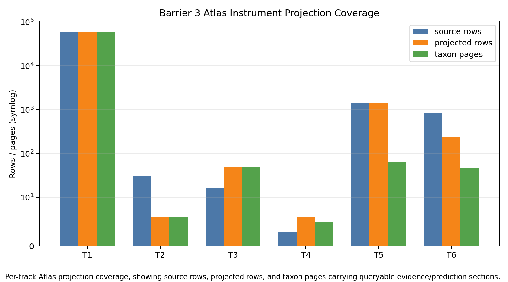

# Barrier 3 Atlas Instrument Readiness

Verdict: **ready_with_nonblocking_warnings**.

This package audits whether Wave 3 instruments are queryable from the Botanical Atlas. It does not run Wave 4 validation, does not promote biological predictions, and does not write to the master prediction or speculation ledgers.

Atlas rebuild/accounting: 60000 pages, 60000 search rows, master ledgers header-only = True.

| Track | Instrument status | Atlas queryability | Caveat quality | Evidence/prediction boundary | Remaining Wave 4-only work |
|---|---|---|---|---|---|
| Track 1 Reticulation Atlas | ready | 60000 rows on 60000 pages | present | preserved | Canonical polyploid/hybrid recovery after accepted-key coverage repair. |
| Track 2 Ghost Hyperedges | ready | 6 rows on 6 pages | present | preserved | Held-out Janzen-Martin recovery and living-megafauna contrast. |
| Track 3 Convergence Pressure | ready_with_nonblocking_warning | 50 rows on 50 pages | present | preserved | Independent trait-list validation and source/family-size ablations; page projection is support-list-limited. |
| Track 4 Domestication Hypergraph | ready_data_limited | 6 rows on 5 pages | present | preserved | Expert crop-wild-relative comparison after climate vectors are computable. |
| Track 5 Chemodiversity Predictor | ready_with_source_dominance_warning | 1405 rows on 65 pages | present | preserved | Temporal phytochemistry holdout and source-dominance ablations. |
| Track 6 Foundation-Model Probe | ready_with_nonblocking_warning | 244 rows on 48 pages | present | preserved | Free/open/local model execution if available; current runner is benchmark-only/data-limited. |

## Contract Notes

- Track 1 TCI rows are data-limited instrument outputs over all accepted-key pages, not validated reticulation claims.
- Track 3 convergence rows are pending trait-level priors; page linkage is explicitly partial because long support lists are truncated in `convergence_predictions.tsv`.
- Track 4 remains data-limited because observed bioclim vectors are absent; Atlas rows are candidate rankings, not climate-suitability recommendations.
- Track 5 remains source-dominated and Duke-sensitive; Atlas rows are screening priors, not detections, bioactivity claims, or safety claims.
- Track 6 runner mode is `benchmark_only_data_limited`; it is benchmark-only/data-limited, not a publishable model-performance evaluation.
- `prediction_ledger.tsv` and `speculation_ledger.tsv` remain header-only.
