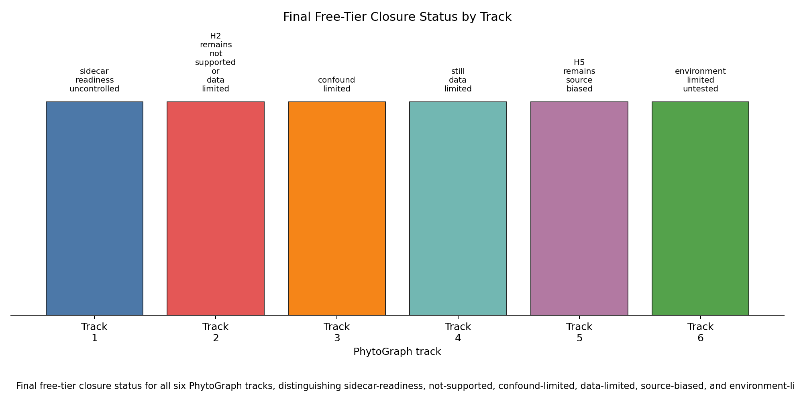

# Final Free-Tier Closure Synthesis

## Scope

This synthesis reconciles the strongest auditor-validated free-tier branch outcome for each PhytoGraph track. It does not perform new evidence search, change schema v1.0, alter branch science outputs, or write rows to the master `prediction_ledger.tsv` or `speculation_ledger.tsv`.

The global result is conservative: PhytoGraph remains successful as infrastructure, instrumentation, Atlas, formal-diagnostic, and falsification/closure science, but the original criterion of at least one validated prediction per track remains unmet.

## Canonical Status Table

| Track | Final free-tier status | Validated evidence counts | Blocker | Future-data requirement | Claim boundary |
|---|---|---|---|---|---|
| Track 1 | `sidecar_readiness_uncontrolled` | 22 GBIF event taxa; 11 source groups; 2 WFO-projected taxa; 0/17 matched-control event recovery | GBIF sidecar signal is not WFO-projected and source-density controls remain unresolved | Audited GBIF-to-WFO accepted-key projection or admitted sidecar namespace plus source-density controls preserving event signal | No established reticulation hotspot, hybridization, or polyploid recovery claim |
| Track 2 | `H2_remains_not_supported_or_data_limited` | 8 canonical held-outs; 31 local candidates; 0/8 canonical held-outs pass validation contract | Accepted-key modern-failure evidence, source-class support, and living-megafauna controls do not clear the validation contract | Accepted-key modern-failure evidence, multi-source/source-class support, living-megafauna controls, and source-class-independent held-out recovery | No new anachronism, ghost-partner, or ecological-interaction claim |
| Track 3 | `confound_limited` | 3069 accepted-key trait carrier rows; 15 canonical traits; 0 controlled-ready traits | No trait separates convergence signal from family-size, sampling-density, projection-loss, and source gates | Broader trait coverage, phylogenetically separated carrier sets, and family-size/sampling-density controls | No convergence or adaptive-origin claim |
| Track 4 | `still_data_limited` | 3358 post-filter occurrence records; 0 numeric BIOCLIM vectors; 0 validation-allowed comparator rows | Coordinate recovery did not yield numeric local/free BIOCLIM vectors or disjoint expert comparator rows | Audited crop/CWR BIOCLIM summaries and disjoint candidate-level expert comparator rows | No crop-substitution recommendation or climate-adaptation claim |
| Track 5 | `H5_remains_source_biased` | Non-Duke temporal evidence insufficient; no validation-ready structured family/class stratum | Open non-Duke detections do not support a structured temporal family/class predictor rerun independent of Duke/source density | Accepted-key, dated, non-Duke taxon-compound rows across enough families/classes to estimate signatures without source collapse | No new phytochemical, bioactivity, or screening-priority claim |
| Track 6 | `environment_limited_untested` | 0 runnable local runtime-weight pairings; 0 executed responses; 0 scored responses | No approved local model runtime and weight pairing was available under the free/open/local constraint | Approved local model weights and runtime producing audited deterministic response rows with scorer diagnostics | No model error-rate, leaderboard, toxicity-look-alike, or vendor-comparison claim |

## Master-Ledger Boundary

The master `prediction_ledger.tsv` and `speculation_ledger.tsv` remain header-only. This is a validated non-promotion decision, not an omission: every free-tier track has at least one failed validation predicate, unresolved control, source-bias collapse, or execution blocker.

No final synthesis artifact promotes new taxonomy, reticulation, anachronism, convergence, climate-substitution, phytochemical, bioactivity, or model-performance claims. Track-local artifacts remain useful diagnostics and candidate-prior records, but they do not satisfy the cross-track promotion contract.

## Future-Data Recipes

- Track 1: Audited GBIF-to-WFO accepted-key projection or admitted sidecar namespace plus source-density controls preserving event signal.
- Track 2: Accepted-key modern-failure evidence, multi-source/source-class support, living-megafauna controls, and source-class-independent held-out recovery.
- Track 3: Broader trait coverage, phylogenetically separated carrier sets, and family-size/sampling-density controls.
- Track 4: Audited crop/CWR BIOCLIM summaries and disjoint candidate-level expert comparator rows.
- Track 5: Accepted-key, dated, non-Duke taxon-compound rows across enough families/classes to estimate signatures without source collapse.
- Track 6: Approved local model weights and runtime producing audited deterministic response rows with scorer diagnostics.

These predicates are intentionally specific enough to prevent another same-axis free-tier retry. A future reopen should vary the missing data axis rather than rerunning the same branch inputs.
