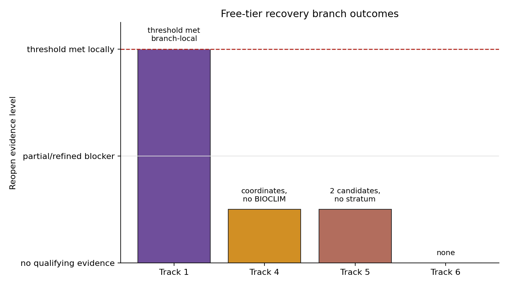

# Post-Reopen Closure Addendum

## Scope

This addendum reconciles the validated reopen evidence gate and four prioritized
reopen branches into the final PhytoGraph closure record. It does not ingest new
source data, rerun predictors, execute foundation models, change schema v1.0, or
write rows to the master `prediction_ledger.tsv` or `speculation_ledger.tsv`.

## Branch Outcomes

| Track | Reopen result | Quantitative blocker | Master-ledger action |
|---|---|---|---|
| Track 1 | `branch_local_threshold_met_reconciliation_pending` | Free-tier branch recovered event-shaped rows for 22 distinct GBIF accepted-key taxa across 11 source groups with 0/17 matched-control event recovery, but the GBIF accepted-key basis still requires reconciliation against the frozen WFO-oriented namespace or audited sidecar admission. | No master prediction or speculation row. |
| Track 4 | `still_data_limited` | Free-tier branch found 3,408 license-compatible coordinate records and 3,358 post-filter records, but 0 numeric BIOCLIM vectors and 0 validation-allowed held-out candidate-level crop/CWR comparison pairs. | No master prediction or speculation row. |
| Track 5 | `insufficient_non_duke_temporal_evidence_h5_remains_source_biased` | Free-tier branch found 2 manual accepted-key non-Duke historical detection candidates, but no structured family/class stratum sufficient to estimate `S_f[k]` or rerun temporal validation. | No master prediction or speculation row. |
| Track 6 | `no_new_qualifying_evidence` | 0 runnable runtime-weight pairings, 0 executed model responses, and 0 scored responses; error rates are undefined. | No master prediction or speculation row. |

The machine-readable closure table is
`data/reopen/reopen_closure_status.tsv`.

## Reconciliation With Final Artifacts

The reopen gate in `reports/reopen/reopen_evidence_gate.md` specified that a
closed branch can change status only when the missing evidence predicate becomes
true. The cycle 28 free-tier integration in
`reports/reopen/free_tier_recovery_integration.md` updates the closure matrix
without promoting master-ledger rows:

- Track 1 now has a branch-local threshold-met result from free-tier GBIF-keyed
  recovery, but it remains reconciliation-pending at master level until GBIF
  accepted keys are mapped to the frozen WFO-oriented namespace or admitted as
  an audited sidecar namespace.
- Track 4 recovered license-compatible coordinates for a bounded crop/CWR
  panel, but no observed numeric BIOCLIM vectors and no validation-ready
  candidate-level crop/CWR expert comparisons, so H4 remains data-limited.
- Track 5 recovered two manual accepted-key non-Duke historical detection
  candidates, but no structured family/class temporal evidence stratum, so H5
  remains not validated and source-biased.
- Track 6 found no runnable local/free/open runtime-weight pairing and produced
  no scored responses, so H6 remains environment-limited and untested.

These outcomes reinforce the Wave 5 conclusion rather than changing it. The
durable contribution is the audited null record: the exact missing predicates
are now documented, and a future cycle can test those predicates directly
without rediscovering the same blockers.

## Future Reopen Predicates

Track 1 can advance only if the recovered GBIF accepted-key event rows are
mapped into the frozen WFO-oriented namespace or admitted as an audited sidecar
namespace while preserving source-group spread and matched-control separation.

Track 4 can reopen only if occurrence-backed crop and CWR coordinates yield
accepted-key BIOCLIM summaries, and disjoint candidate-level expert comparator
rows exist before any climate-substitution scoring.

Track 5 can reopen only if non-Duke taxon-compound detections have accepted
taxon joins, compound identifiers, usable dates, family spread, and controls
that preserve signal without Duke source dominance.

Track 6 can reopen only if approved local model weights and a free/open/local
runtime produce audited deterministic responses with scorer diagnostics and
nonzero scored-response coverage.

These are predicates, not recommendations. They define the evidence that would
need to exist before another closure status change is considered.

## Final Free-Tier Synthesis

The final six-track free-tier closure layer is
`reports/reopen/final_free_tier_closure_synthesis.md`, backed by
`data/reopen/final_free_tier_track_status.tsv` and
`reports/reopen/figures/final_free_tier_track_status.png`.

| Track | Final free-tier status | Quantitative boundary |
|---|---|---|
| Track 1 | `sidecar_readiness_uncontrolled` | 22 GBIF sidecar event taxa across 11 source groups, WFO projection only 2 taxa, source-density controls unresolved. |
| Track 2 | `H2_remains_not_supported_or_data_limited` | 0/8 canonical held-outs pass the validation contract. |
| Track 3 | `confound_limited` | 3,069 accepted-key trait carrier rows, 15 traits, 0 controlled-ready traits. |
| Track 4 | `still_data_limited` | 3,358 post-filter occurrence records, 0 numeric BIOCLIM vectors, 0 validation-allowed comparator rows. |
| Track 5 | `H5_remains_source_biased` | Non-Duke temporal evidence is insufficient and no validation-ready structured family/class stratum exists. |
| Track 6 | `environment_limited_untested` | 0 runnable local runtime-weight pairings, 0 executed responses, 0 scored responses. |

The original validated-prediction-per-track criterion remains unmet. The
durable contribution is the conservative substrate/instrument/Atlas/formal
diagnostic package plus explicit null, source-biased, confound-limited,
data-limited, and environment-limited closure findings.

## Master-Ledger Discipline

The master ledgers remain header-only by design. That state is not missing work:
it is the validated non-promotion decision for branches whose predicates remain
false. Track-local candidate rows and diagnostic tables stay in their own
namespaces, while the master ledgers remain reserved for rows that satisfy the
campaign's validation, provenance, and ablation contracts.
