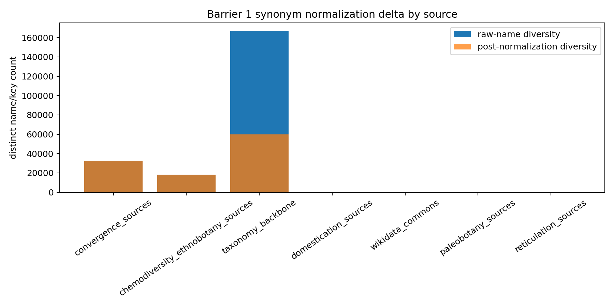
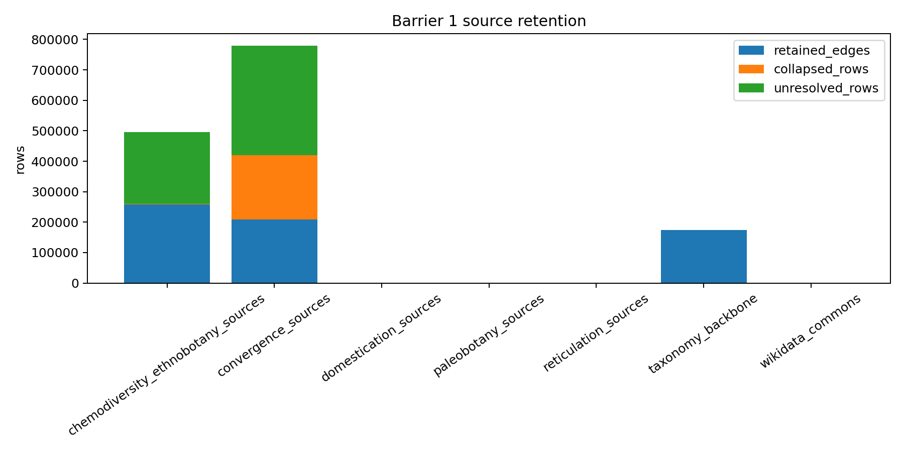

# Barrier 1 Join Report

Barrier 1 froze the current Wave-1 staging rows into `phytograph_dataset/` without acquiring new sources or starting Wave 2 enrichment. WFO accepted keys are used as operational substrate identifiers, not as taxonomic adjudication.

## Counts

| source_group | retained_edges | edge_types | resolved_taxon_edges | input_edges | collapsed_rows |
| --- | --- | --- | --- | --- | --- |
| chemodiversity_ethnobotany_sources | 257781 | 3 | 23524 | 259960 | 2179 |
| convergence_sources | 209297 | 3 | 27548 | 420545 | 211248 |
| domestication_sources | 190 | 3 | 6 | 190 | 0 |
| paleobotany_sources | 83 | 2 | 6 | 83 | 0 |
| reticulation_sources | 28 | 4 | 3 | 28 | 0 |
| taxonomy_backbone | 173644 | 3 | 173644 | 173644 | 0 |
| wikidata_commons | 160 | 1 | 10 | 160 | 0 |

## Synonym Normalization

| source_group | rows_before | raw_name_diversity_before | rows_after | accepted_key_diversity_after | resolved_rows | unresolved_rows | diversity_delta |
| --- | --- | --- | --- | --- | --- | --- | --- |
| chemodiversity_ethnobotany_sources | 259960 | 18342 | 259960 | 18164 | 23532 | 236428 | -178 |
| convergence_sources | 420545 | 32652 | 420545 | 32552 | 61501 | 359044 | -100 |
| domestication_sources | 190 | 104 | 190 | 104 | 6 | 184 | 0 |
| paleobotany_sources | 83 | 50 | 83 | 50 | 6 | 77 | 0 |
| reticulation_sources | 28 | 12 | 28 | 12 | 3 | 25 | 0 |
| taxonomy_backbone | 173644 | 166837 | 173644 | 59908 | 173582 | 62 | -106929 |
| wikidata_commons | 160 | 160 | 160 | 160 | 10 | 150 | 0 |

## Deduplication

| source_group | input_edges | retained_edges | duplicate_groups | duplicate_rows | multiplicity_preserved_rows | collapsed_rows |
| --- | --- | --- | --- | --- | --- | --- |
| chemodiversity_ethnobotany_sources | 259960 | 257781 | 1234 | 3413 | 259960 | 2179 |
| convergence_sources | 420545 | 209297 | 101317 | 312565 | 0 | 211248 |
| domestication_sources | 190 | 190 | 0 | 0 | 0 | 0 |
| paleobotany_sources | 83 | 83 | 0 | 0 | 0 | 0 |
| reticulation_sources | 28 | 28 | 0 | 0 | 12 | 0 |
| taxonomy_backbone | 173644 | 173644 | 0 | 0 | 0 | 0 |
| wikidata_commons | 160 | 160 | 0 | 0 | 0 | 0 |

## Unresolved Name Classes

| source_group | ambiguity_reason | rows |
| --- | --- | --- |
| chemodiversity_ethnobotany_sources | no exact WFO accepted-name or synonym-cluster match | 207695 |
| chemodiversity_ethnobotany_sources | missing raw scientific name | 28733 |
| convergence_sources | no exact WFO accepted-name or synonym-cluster match | 359044 |
| domestication_sources | no exact WFO accepted-name or synonym-cluster match | 184 |
| paleobotany_sources | no exact WFO accepted-name or synonym-cluster match | 77 |
| reticulation_sources | no exact WFO accepted-name or synonym-cluster match | 25 |
| taxonomy_backbone | missing raw scientific name | 62 |
| wikidata_commons | no exact WFO accepted-name or synonym-cluster match | 150 |

## Wave 2 Readiness

| track | readiness | reason |
| --- | --- | --- |
| Track 1 Reticulation | ready_data_limited | M1.3 seed rows merged, but CCDB/C-values/Wood 2009 production-scale acquisition deferred. |
| Track 2 Ghost Hyperedges | ready_data_limited | Literature-curated paleo/anachronism seed rows merged; no inferred anachronism rows introduced. |
| Track 3 Convergence | ready | AusTraits trait_syndrome/fruit_morphology/life_form rows merged; convergence_signature count remains zero. |
| Track 4 Domestication | ready_data_limited | Current crop-pedigree/CWR seed rows merged; CWR expansion and climate extraction still deferred. |
| Track 5 Chemodiversity | ready | Phytochemical and ethnobotanical assertions merged with provenance; Duke source dominance flagged for ablation. |
| Track 6 Foundation Model Probe | ready_static_only | Static/free/open benchmark scaffolding only; paid-provider harness work remains out of scope and was not executed. |

## Null Results And Gaps

M1.3, M1.6, and M1.9 remain data-limited. No inferred `anachronism_candidate_edge` rows and no pre-instrument `convergence_signature` rows were introduced. One media row retained an explicit `license-missing-in-source-row` marker so missingness remains auditable.
