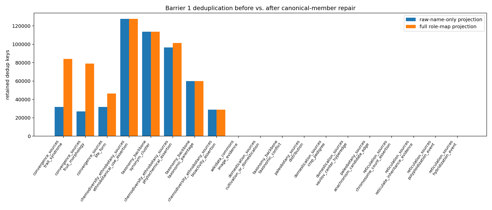
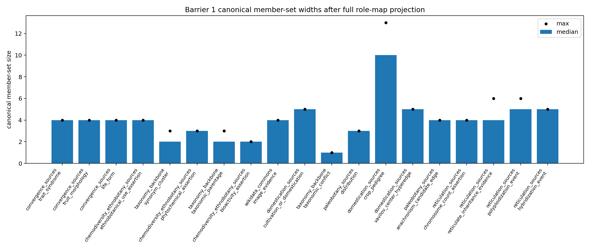

# Barrier 1 Canonical Member Repair Report

The first Barrier 1 freeze used a lossy projection for large source frames: many retained hyperedges deduplicated on raw taxon name alone, so same-taxon/different-trait and same-taxon/different-compound assertions could collapse. The repair rewrites canonical members from the full typed role map, then applies synonym resolution back into `hyperedges.parquet` before deduplication.

## What Changed

- `canonical_node_ids_json` now includes the accepted taxon key when resolved plus non-taxon role members such as trait, fruit type, compound, plant part, use, region, bioactivity class, crop pedigree, extinct fauna, paleo context, and media nodes.
- Resolved rows now have `accepted_taxon_key` populated and `pending_crosswalk=False`; unresolved rows keep raw-name members plus machine-readable `ambiguity_reason` caveats.
- Deduplication now keys on edge type, sorted full canonical typed member set, source ID, and the existing evidence-multiplicity policy.

## Synonym Propagation Audit

| source_group | edge_type | resolved_rows | propagated_rows | missing_rows |
| --- | --- | --- | --- | --- |
| chemodiversity_ethnobotany_sources | ethnobotanical_use_assertion | 9657 | 9657 | 0 |
| chemodiversity_ethnobotany_sources | phytochemical_assertion | 13875 | 13875 | 0 |
| convergence_sources | fruit_morphology | 21218 | 21218 | 0 |
| convergence_sources | life_form | 17310 | 17310 | 0 |
| convergence_sources | trait_syndrome | 22973 | 22973 | 0 |
| domestication_sources | crop_pedigree | 2 | 2 | 0 |
| domestication_sources | cultivation_or_domestication | 2 | 2 | 0 |
| domestication_sources | vavilov_center_hyperedge | 2 | 2 | 0 |
| paleobotany_sources | anachronism_candidate_edge | 6 | 6 | 0 |
| reticulation_sources | chromosome_count_assertion | 2 | 2 | 0 |
| reticulation_sources | reticulate_inheritance_evidence | 1 | 1 | 0 |
| taxonomy_backbone | synonym_cluster | 113582 | 113582 | 0 |
| taxonomy_backbone | taxonomic_parentage | 60000 | 60000 | 0 |
| wikidata_commons | image_evidence | 10 | 10 | 0 |

## Canonical Member Audit

| source_group | edge_type | input_rows | resolved_keys | unresolved_rows | min_member_width | median_member_width | max_member_width | retained_rows | deduplicated_rows |
| --- | --- | --- | --- | --- | --- | --- | --- | --- | --- |
| chemodiversity_ethnobotany_sources | bioactivity_assertion | 28733 | 0 | 28733 | 2 | 2.0 | 2 | 28733 | 0 |
| chemodiversity_ethnobotany_sources | ethnobotanical_use_assertion | 127564 | 9657 | 117907 | 3 | 4.0 | 4 | 127564 | 0 |
| chemodiversity_ethnobotany_sources | phytochemical_assertion | 103663 | 13875 | 89788 | 2 | 3.0 | 3 | 101484 | 2179 |
| convergence_sources | fruit_morphology | 136427 | 21218 | 115209 | 3 | 4.0 | 4 | 78963 | 57464 |
| convergence_sources | life_form | 127696 | 17310 | 110386 | 3 | 4.0 | 4 | 46290 | 81406 |
| convergence_sources | trait_syndrome | 156422 | 22973 | 133449 | 3 | 4.0 | 4 | 84044 | 72378 |
| domestication_sources | crop_pedigree | 43 | 2 | 41 | 9 | 10.0 | 13 | 43 | 0 |
| domestication_sources | cultivation_or_domestication | 104 | 2 | 102 | 5 | 5.0 | 5 | 104 | 0 |
| domestication_sources | vavilov_center_hyperedge | 43 | 2 | 41 | 5 | 5.0 | 5 | 43 | 0 |
| paleobotany_sources | anachronism_candidate_edge | 31 | 6 | 25 | 4 | 4.0 | 4 | 31 | 0 |
| paleobotany_sources | distribution | 52 | 0 | 52 | 3 | 3.0 | 3 | 52 | 0 |
| reticulation_sources | chromosome_count_assertion | 12 | 2 | 10 | 3 | 4.0 | 4 | 12 | 0 |
| reticulation_sources | hybridization_event | 1 | 0 | 1 | 5 | 5.0 | 5 | 1 | 0 |
| reticulation_sources | polyploidization_event | 4 | 0 | 4 | 5 | 5.0 | 6 | 4 | 0 |
| reticulation_sources | reticulate_inheritance_evidence | 11 | 1 | 10 | 3 | 4.0 | 6 | 11 | 0 |
| taxonomy_backbone | synonym_cluster | 113582 | 113582 | 0 | 2 | 2.0 | 3 | 113582 | 0 |
| taxonomy_backbone | taxonomic_conflict | 62 | 62 | 0 | 1 | 1.0 | 1 | 62 | 0 |
| taxonomy_backbone | taxonomic_parentage | 60000 | 60000 | 0 | 2 | 2.0 | 3 | 60000 | 0 |
| wikidata_commons | image_evidence | 160 | 10 | 150 | 4 | 4.0 | 4 | 160 | 0 |

## Dedup Collision Audit

| source_group | edge_type | dedup_key | rows | distinct_role_maps | distinct_non_tax_role_maps | min_member_width | max_member_width | example_edge_id |
| --- | --- | --- | --- | --- | --- | --- | --- | --- |
| chemodiversity_ethnobotany_sources | phytochemical_assertion | phytochemical_assertion	["DUKE_CHEM:11,4DIMETHYL3CYCLOHEXEN1YLETHANONE", "Shoot", "raw_name:hyssopus officinalis"]	Dr. Duke Phytochemical and Ethnobotanical Databases	FARMACY_NEW:495:11,4DIMETHYL3CYCLOHEXEN1YLETHANONE:JAF42:776 | 10 | 1 | 1 | 3 | 3 | phyto_edge:379b14967ce8cb09 |
| chemodiversity_ethnobotany_sources | phytochemical_assertion | phytochemical_assertion	["DUKE_CHEM:ALPHAPINENE", "Shoot", "raw_name:chrysanthemum parthenium"]	Dr. Duke Phytochemical and Ethnobotanical Databases	FARMACY_NEW:257:ALPHAPINENE:FFJ11(6):367 | 10 | 1 | 1 | 3 | 3 | phyto_edge:3c8338f919f8c3d3 |
| chemodiversity_ethnobotany_sources | phytochemical_assertion | phytochemical_assertion	["DUKE_CHEM:ALPHAPINENE", "Shoot", "raw_name:tanacetum parthenium"]	Dr. Duke Phytochemical and Ethnobotanical Databases	FARMACY_NEW:2220:ALPHAPINENE:FFJ11(6):367 | 10 | 1 | 1 | 3 | 3 | phyto_edge:48a6c9ef1cb5d6c7 |
| chemodiversity_ethnobotany_sources | phytochemical_assertion | phytochemical_assertion	["DUKE_CHEM:BETAFARNESENE", "Shoot", "raw_name:chrysanthemum parthenium"]	Dr. Duke Phytochemical and Ethnobotanical Databases	FARMACY_NEW:257:BETAFARNESENE:FFJ11(6):367 | 10 | 1 | 1 | 3 | 3 | phyto_edge:e97d5eef847147cb |
| chemodiversity_ethnobotany_sources | phytochemical_assertion | phytochemical_assertion	["DUKE_CHEM:BETAFARNESENE", "Shoot", "raw_name:tanacetum parthenium"]	Dr. Duke Phytochemical and Ethnobotanical Databases	FARMACY_NEW:2220:BETAFARNESENE:FFJ11(6):367 | 10 | 1 | 1 | 3 | 3 | phyto_edge:38c41bf97d4445ef |
| chemodiversity_ethnobotany_sources | phytochemical_assertion | phytochemical_assertion	["DUKE_CHEM:BORNEOL", "Shoot", "raw_name:chrysanthemum parthenium"]	Dr. Duke Phytochemical and Ethnobotanical Databases	FARMACY_NEW:257:BORNEOL:FFJ11(6):367 | 10 | 1 | 1 | 3 | 3 | phyto_edge:d0be0b041b349563 |
| chemodiversity_ethnobotany_sources | phytochemical_assertion | phytochemical_assertion	["DUKE_CHEM:BORNEOL", "Shoot", "raw_name:tanacetum parthenium"]	Dr. Duke Phytochemical and Ethnobotanical Databases	FARMACY_NEW:2220:BORNEOL:FFJ11(6):367 | 10 | 1 | 1 | 3 | 3 | phyto_edge:ec6e8e4cb9aeee4c |
| chemodiversity_ethnobotany_sources | phytochemical_assertion | phytochemical_assertion	["DUKE_CHEM:CAMPHENE", "Shoot", "raw_name:chrysanthemum parthenium"]	Dr. Duke Phytochemical and Ethnobotanical Databases	FARMACY_NEW:257:CAMPHENE:FFJ11(6):367 | 10 | 1 | 1 | 3 | 3 | phyto_edge:b814aba5e48c9ac4 |
| chemodiversity_ethnobotany_sources | phytochemical_assertion | phytochemical_assertion	["DUKE_CHEM:CAMPHENE", "Shoot", "raw_name:tanacetum parthenium"]	Dr. Duke Phytochemical and Ethnobotanical Databases	FARMACY_NEW:2220:CAMPHENE:FFJ11(6):367 | 10 | 1 | 1 | 3 | 3 | phyto_edge:fcba48204f52e2f9 |
| chemodiversity_ethnobotany_sources | phytochemical_assertion | phytochemical_assertion	["DUKE_CHEM:CAMPHOR", "Shoot", "raw_name:chrysanthemum parthenium"]	Dr. Duke Phytochemical and Ethnobotanical Databases	FARMACY_NEW:257:CAMPHOR:FFJ11(6):367 | 10 | 1 | 1 | 3 | 3 | phyto_edge:9a65d02f4bb39970 |
| chemodiversity_ethnobotany_sources | phytochemical_assertion | phytochemical_assertion	["DUKE_CHEM:CAMPHOR", "Shoot", "raw_name:tanacetum parthenium"]	Dr. Duke Phytochemical and Ethnobotanical Databases	FARMACY_NEW:2220:CAMPHOR:FFJ11(6):367 | 10 | 1 | 1 | 3 | 3 | phyto_edge:dcbf8ae52b3a9c39 |
| chemodiversity_ethnobotany_sources | phytochemical_assertion | phytochemical_assertion	["DUKE_CHEM:CHRYSANTHENYLACETATE", "Shoot", "raw_name:chrysanthemum parthenium"]	Dr. Duke Phytochemical and Ethnobotanical Databases	FARMACY_NEW:257:CHRYSANTHENYLACETATE:FFJ11(6):367 | 10 | 1 | 1 | 3 | 3 | phyto_edge:88ede90fc6d3f0f6 |
| chemodiversity_ethnobotany_sources | phytochemical_assertion | phytochemical_assertion	["DUKE_CHEM:CHRYSANTHENYLACETATE", "Shoot", "raw_name:tanacetum parthenium"]	Dr. Duke Phytochemical and Ethnobotanical Databases	FARMACY_NEW:2220:CHRYSANTHENYLACETATE:FFJ11(6):367 | 10 | 1 | 1 | 3 | 3 | phyto_edge:5b6c3cba8662ce4b |
| chemodiversity_ethnobotany_sources | phytochemical_assertion | phytochemical_assertion	["DUKE_CHEM:EO", "Shoot", "raw_name:chrysanthemum parthenium"]	Dr. Duke Phytochemical and Ethnobotanical Databases	FARMACY_NEW:257:EO:FFJ11(6):367 | 10 | 1 | 1 | 3 | 3 | phyto_edge:618b6ca70e3e9a1a |
| chemodiversity_ethnobotany_sources | phytochemical_assertion | phytochemical_assertion	["DUKE_CHEM:EO", "Shoot", "raw_name:tanacetum parthenium"]	Dr. Duke Phytochemical and Ethnobotanical Databases	FARMACY_NEW:2220:EO:FFJ11(6):367 | 10 | 1 | 1 | 3 | 3 | phyto_edge:415799ef20a48c40 |
| chemodiversity_ethnobotany_sources | phytochemical_assertion | phytochemical_assertion	["DUKE_CHEM:GAMMATERPINENE", "Shoot", "raw_name:chrysanthemum parthenium"]	Dr. Duke Phytochemical and Ethnobotanical Databases	FARMACY_NEW:257:GAMMATERPINENE:FFJ11(6):367 | 10 | 1 | 1 | 3 | 3 | phyto_edge:c6c1256f81b3a504 |
| chemodiversity_ethnobotany_sources | phytochemical_assertion | phytochemical_assertion	["DUKE_CHEM:GAMMATERPINENE", "Shoot", "raw_name:tanacetum parthenium"]	Dr. Duke Phytochemical and Ethnobotanical Databases	FARMACY_NEW:2220:GAMMATERPINENE:FFJ11(6):367 | 10 | 1 | 1 | 3 | 3 | phyto_edge:e5ba7dfa00753bb7 |
| chemodiversity_ethnobotany_sources | phytochemical_assertion | phytochemical_assertion	["DUKE_CHEM:GERMACRENED", "Shoot", "raw_name:chrysanthemum parthenium"]	Dr. Duke Phytochemical and Ethnobotanical Databases	FARMACY_NEW:257:GERMACRENED:FFJ11(6):367 | 10 | 1 | 1 | 3 | 3 | phyto_edge:b122db525031972b |
| chemodiversity_ethnobotany_sources | phytochemical_assertion | phytochemical_assertion	["DUKE_CHEM:GERMACRENED", "Shoot", "raw_name:tanacetum parthenium"]	Dr. Duke Phytochemical and Ethnobotanical Databases	FARMACY_NEW:2220:GERMACRENED:FFJ11(6):367 | 10 | 1 | 1 | 3 | 3 | phyto_edge:674faaab11a8197e |
| chemodiversity_ethnobotany_sources | phytochemical_assertion | phytochemical_assertion	["DUKE_CHEM:TERPINEN4OL", "Shoot", "raw_name:chrysanthemum parthenium"]	Dr. Duke Phytochemical and Ethnobotanical Databases	FARMACY_NEW:257:TERPINEN4OL:FFJ11(6):367 | 10 | 1 | 1 | 3 | 3 | phyto_edge:180404fea8d17b44 |
| chemodiversity_ethnobotany_sources | phytochemical_assertion | phytochemical_assertion	["DUKE_CHEM:TERPINEN4OL", "Shoot", "raw_name:tanacetum parthenium"]	Dr. Duke Phytochemical and Ethnobotanical Databases	FARMACY_NEW:2220:TERPINEN4OL:FFJ11(6):367 | 10 | 1 | 1 | 3 | 3 | phyto_edge:627b033d00a7a967 |
| chemodiversity_ethnobotany_sources | phytochemical_assertion | phytochemical_assertion	["DUKE_CHEM:ALPHACARYOPHYLLENE", "Shoot", "raw_name:hyssopus officinalis"]	Dr. Duke Phytochemical and Ethnobotanical Databases	FARMACY_NEW:495:ALPHACARYOPHYLLENE:JAF42:776 | 9 | 1 | 1 | 3 | 3 | phyto_edge:942341a54703eae6 |
| chemodiversity_ethnobotany_sources | phytochemical_assertion | phytochemical_assertion	["DUKE_CHEM:ALPHATERPINENE", "Shoot", "raw_name:chrysanthemum parthenium"]	Dr. Duke Phytochemical and Ethnobotanical Databases	FARMACY_NEW:257:ALPHATERPINENE:FFJ11(6):367 | 9 | 1 | 1 | 3 | 3 | phyto_edge:a45babe7474ee631 |
| chemodiversity_ethnobotany_sources | phytochemical_assertion | phytochemical_assertion	["DUKE_CHEM:ALPHATERPINENE", "Shoot", "raw_name:tanacetum parthenium"]	Dr. Duke Phytochemical and Ethnobotanical Databases	FARMACY_NEW:2220:ALPHATERPINENE:FFJ11(6):367 | 9 | 1 | 1 | 3 | 3 | phyto_edge:5b30df7f5ea7e8eb |
| chemodiversity_ethnobotany_sources | phytochemical_assertion | phytochemical_assertion	["DUKE_CHEM:ALPHATHUJENE", "Shoot", "raw_name:chrysanthemum parthenium"]	Dr. Duke Phytochemical and Ethnobotanical Databases	FARMACY_NEW:257:ALPHATHUJENE:FFJ11(6):367 | 9 | 1 | 1 | 3 | 3 | phyto_edge:40f8a686113d31fb |
| chemodiversity_ethnobotany_sources | phytochemical_assertion | phytochemical_assertion	["DUKE_CHEM:ALPHATHUJENE", "Shoot", "raw_name:tanacetum parthenium"]	Dr. Duke Phytochemical and Ethnobotanical Databases	FARMACY_NEW:2220:ALPHATHUJENE:FFJ11(6):367 | 9 | 1 | 1 | 3 | 3 | phyto_edge:bf4e6ad1f1ececef |
| chemodiversity_ethnobotany_sources | phytochemical_assertion | phytochemical_assertion	["DUKE_CHEM:BETAPINENE", "Shoot", "raw_name:chrysanthemum parthenium"]	Dr. Duke Phytochemical and Ethnobotanical Databases	FARMACY_NEW:257:BETAPINENE:FFJ11(6):367 | 9 | 1 | 1 | 3 | 3 | phyto_edge:89d0f19495778362 |
| chemodiversity_ethnobotany_sources | phytochemical_assertion | phytochemical_assertion	["DUKE_CHEM:BETAPINENE", "Shoot", "raw_name:hyssopus officinalis"]	Dr. Duke Phytochemical and Ethnobotanical Databases	FARMACY_NEW:495:BETAPINENE:JAF42:776 | 9 | 1 | 1 | 3 | 3 | phyto_edge:292167ed3d0632e0 |
| chemodiversity_ethnobotany_sources | phytochemical_assertion | phytochemical_assertion	["DUKE_CHEM:BETAPINENE", "Shoot", "raw_name:tanacetum parthenium"]	Dr. Duke Phytochemical and Ethnobotanical Databases	FARMACY_NEW:2220:BETAPINENE:FFJ11(6):367 | 9 | 1 | 1 | 3 | 3 | phyto_edge:b3ca9b98968305b9 |
| chemodiversity_ethnobotany_sources | phytochemical_assertion | phytochemical_assertion	["DUKE_CHEM:GERMACRENED", "Shoot", "raw_name:hyssopus officinalis"]	Dr. Duke Phytochemical and Ethnobotanical Databases	FARMACY_NEW:495:GERMACRENED:JAF42:776 | 9 | 1 | 1 | 3 | 3 | phyto_edge:7840ee1dbd288bee |
| chemodiversity_ethnobotany_sources | phytochemical_assertion | phytochemical_assertion	["DUKE_CHEM:HEDYCARYOL", "Shoot", "raw_name:hyssopus officinalis"]	Dr. Duke Phytochemical and Ethnobotanical Databases	FARMACY_NEW:495:HEDYCARYOL:JAF42:776 | 9 | 1 | 1 | 3 | 3 | phyto_edge:513575309b1ce0e1 |
| chemodiversity_ethnobotany_sources | phytochemical_assertion | phytochemical_assertion	["DUKE_CHEM:ISOPINOCAMPHONE", "Shoot", "raw_name:hyssopus officinalis"]	Dr. Duke Phytochemical and Ethnobotanical Databases	FARMACY_NEW:495:ISOPINOCAMPHONE:JAF42:776 | 9 | 1 | 1 | 3 | 3 | phyto_edge:f01e603d3a44284f |
| chemodiversity_ethnobotany_sources | phytochemical_assertion | phytochemical_assertion	["DUKE_CHEM:PCYMENE", "Shoot", "raw_name:chrysanthemum parthenium"]	Dr. Duke Phytochemical and Ethnobotanical Databases	FARMACY_NEW:257:PCYMENE:FFJ11(6):367 | 9 | 1 | 1 | 3 | 3 | phyto_edge:d6882fc87b2cbad1 |
| chemodiversity_ethnobotany_sources | phytochemical_assertion | phytochemical_assertion	["DUKE_CHEM:PCYMENE", "Shoot", "raw_name:tanacetum parthenium"]	Dr. Duke Phytochemical and Ethnobotanical Databases	FARMACY_NEW:2220:PCYMENE:FFJ11(6):367 | 9 | 1 | 1 | 3 | 3 | phyto_edge:bdbcd8775b49da12 |
| chemodiversity_ethnobotany_sources | phytochemical_assertion | phytochemical_assertion	["DUKE_CHEM:PINOCAMPHONE", "Shoot", "raw_name:hyssopus officinalis"]	Dr. Duke Phytochemical and Ethnobotanical Databases	FARMACY_NEW:495:PINOCAMPHONE:JAF42:776 | 9 | 1 | 1 | 3 | 3 | phyto_edge:87ad2320fa90a061 |
| chemodiversity_ethnobotany_sources | phytochemical_assertion | phytochemical_assertion	["DUKE_CHEM:PINOCARVONE", "Shoot", "raw_name:hyssopus officinalis"]	Dr. Duke Phytochemical and Ethnobotanical Databases	FARMACY_NEW:495:PINOCARVONE:JAF42:776 | 9 | 1 | 1 | 3 | 3 | phyto_edge:9c29cadb2dcb9250 |
| chemodiversity_ethnobotany_sources | phytochemical_assertion | phytochemical_assertion	["DUKE_CHEM:ALPHAGURJUNENE", "Shoot", "raw_name:hyssopus officinalis"]	Dr. Duke Phytochemical and Ethnobotanical Databases	FARMACY_NEW:495:ALPHAGURJUNENE:JAF42:776 | 8 | 1 | 1 | 3 | 3 | phyto_edge:181c99dbc7191943 |
| chemodiversity_ethnobotany_sources | phytochemical_assertion | phytochemical_assertion	["DUKE_CHEM:ALPHATERPINEOL", "Shoot", "raw_name:chrysanthemum parthenium"]	Dr. Duke Phytochemical and Ethnobotanical Databases	FARMACY_NEW:257:ALPHATERPINEOL:FFJ11(6):367 | 8 | 1 | 1 | 3 | 3 | phyto_edge:e9e0c67a9972da6d |
| chemodiversity_ethnobotany_sources | phytochemical_assertion | phytochemical_assertion	["DUKE_CHEM:ALPHATERPINEOL", "Shoot", "raw_name:tanacetum parthenium"]	Dr. Duke Phytochemical and Ethnobotanical Databases	FARMACY_NEW:2220:ALPHATERPINEOL:FFJ11(6):367 | 8 | 1 | 1 | 3 | 3 | phyto_edge:269b86a631bf562f |
| chemodiversity_ethnobotany_sources | phytochemical_assertion | phytochemical_assertion	["DUKE_CHEM:BETACARYOPHYLLENE", "Shoot", "raw_name:chrysanthemum parthenium"]	Dr. Duke Phytochemical and Ethnobotanical Databases	FARMACY_NEW:257:BETACARYOPHYLLENE:FFJ11(6):367 | 8 | 1 | 1 | 3 | 3 | phyto_edge:2e5db35846f4523a |
| chemodiversity_ethnobotany_sources | phytochemical_assertion | phytochemical_assertion	["DUKE_CHEM:BETACARYOPHYLLENE", "Shoot", "raw_name:hyssopus officinalis"]	Dr. Duke Phytochemical and Ethnobotanical Databases	FARMACY_NEW:495:BETACARYOPHYLLENE:JAF42:776 | 8 | 1 | 1 | 3 | 3 | phyto_edge:cedf594007cbadc4 |
| chemodiversity_ethnobotany_sources | phytochemical_assertion | phytochemical_assertion	["DUKE_CHEM:BETACARYOPHYLLENE", "Shoot", "raw_name:tanacetum parthenium"]	Dr. Duke Phytochemical and Ethnobotanical Databases	FARMACY_NEW:2220:BETACARYOPHYLLENE:FFJ11(6):367 | 8 | 1 | 1 | 3 | 3 | phyto_edge:e5d97540c83c3f93 |
| chemodiversity_ethnobotany_sources | phytochemical_assertion | phytochemical_assertion	["DUKE_CHEM:BETAPHELLANDRENE", "Shoot", "raw_name:hyssopus officinalis"]	Dr. Duke Phytochemical and Ethnobotanical Databases	FARMACY_NEW:495:BETAPHELLANDRENE:JAF42:776 | 8 | 1 | 1 | 3 | 3 | phyto_edge:810b2c9819458a14 |
| chemodiversity_ethnobotany_sources | phytochemical_assertion | phytochemical_assertion	["DUKE_CHEM:BICYCLOGERMACRENE", "Shoot", "raw_name:hyssopus officinalis"]	Dr. Duke Phytochemical and Ethnobotanical Databases	FARMACY_NEW:495:BICYCLOGERMACRENE:JAF42:776 | 8 | 1 | 1 | 3 | 3 | phyto_edge:b48149b3a19a43d3 |
| chemodiversity_ethnobotany_sources | phytochemical_assertion | phytochemical_assertion	["DUKE_CHEM:BORNYLACETATE", "Shoot", "raw_name:chrysanthemum parthenium"]	Dr. Duke Phytochemical and Ethnobotanical Databases	FARMACY_NEW:257:BORNYLACETATE:FFJ11(6):367 | 8 | 1 | 1 | 3 | 3 | phyto_edge:75d9c1d241cb6bb4 |
| chemodiversity_ethnobotany_sources | phytochemical_assertion | phytochemical_assertion	["DUKE_CHEM:BORNYLACETATE", "Shoot", "raw_name:tanacetum parthenium"]	Dr. Duke Phytochemical and Ethnobotanical Databases	FARMACY_NEW:2220:BORNYLACETATE:FFJ11(6):367 | 8 | 1 | 1 | 3 | 3 | phyto_edge:f206171176eb3d66 |
| chemodiversity_ethnobotany_sources | phytochemical_assertion | phytochemical_assertion	["DUKE_CHEM:CARYOPHYLLENEEPOXIDE", "Shoot", "raw_name:chrysanthemum parthenium"]	Dr. Duke Phytochemical and Ethnobotanical Databases	FARMACY_NEW:257:CARYOPHYLLENEEPOXIDE:FFJ11(6):367 | 8 | 1 | 1 | 3 | 3 | phyto_edge:b6eb1cf215acb5ea |
| chemodiversity_ethnobotany_sources | phytochemical_assertion | phytochemical_assertion	["DUKE_CHEM:CARYOPHYLLENEEPOXIDE", "Shoot", "raw_name:tanacetum parthenium"]	Dr. Duke Phytochemical and Ethnobotanical Databases	FARMACY_NEW:2220:CARYOPHYLLENEEPOXIDE:FFJ11(6):367 | 8 | 1 | 1 | 3 | 3 | phyto_edge:f654cfc885a7e7c9 |
| chemodiversity_ethnobotany_sources | phytochemical_assertion | phytochemical_assertion	["DUKE_CHEM:CHRYSANTHENOL", "Shoot", "raw_name:chrysanthemum parthenium"]	Dr. Duke Phytochemical and Ethnobotanical Databases	FARMACY_NEW:257:CHRYSANTHENOL:FFJ11(6):367 | 8 | 1 | 1 | 3 | 3 | phyto_edge:c30dde8a41bcd653 |
| chemodiversity_ethnobotany_sources | phytochemical_assertion | phytochemical_assertion	["DUKE_CHEM:CHRYSANTHENOL", "Shoot", "raw_name:tanacetum parthenium"]	Dr. Duke Phytochemical and Ethnobotanical Databases	FARMACY_NEW:2220:CHRYSANTHENOL:FFJ11(6):367 | 8 | 1 | 1 | 3 | 3 | phyto_edge:0126c2af0c18be2c |
| chemodiversity_ethnobotany_sources | phytochemical_assertion | phytochemical_assertion	["DUKE_CHEM:CISBETAOCIMENE", "Shoot", "raw_name:hyssopus officinalis"]	Dr. Duke Phytochemical and Ethnobotanical Databases	FARMACY_NEW:495:CISBETAOCIMENE:JAF42:776 | 8 | 1 | 1 | 3 | 3 | phyto_edge:b6df1c08a857c887 |
| chemodiversity_ethnobotany_sources | phytochemical_assertion | phytochemical_assertion	["DUKE_CHEM:MYRTENOL", "Shoot", "raw_name:hyssopus officinalis"]	Dr. Duke Phytochemical and Ethnobotanical Databases	FARMACY_NEW:495:MYRTENOL:JAF42:776 | 8 | 1 | 1 | 3 | 3 | phyto_edge:dc0b859bd2b92096 |
| chemodiversity_ethnobotany_sources | phytochemical_assertion | phytochemical_assertion	["DUKE_CHEM:SABINENE", "Shoot", "raw_name:chrysanthemum parthenium"]	Dr. Duke Phytochemical and Ethnobotanical Databases	FARMACY_NEW:257:SABINENE:FFJ11(6):367 | 8 | 1 | 1 | 3 | 3 | phyto_edge:6ff9b5bef1f06c0f |
| chemodiversity_ethnobotany_sources | phytochemical_assertion | phytochemical_assertion	["DUKE_CHEM:SABINENE", "Shoot", "raw_name:tanacetum parthenium"]	Dr. Duke Phytochemical and Ethnobotanical Databases	FARMACY_NEW:2220:SABINENE:FFJ11(6):367 | 8 | 1 | 1 | 3 | 3 | phyto_edge:d6d895fcb73b54a4 |
| chemodiversity_ethnobotany_sources | phytochemical_assertion | phytochemical_assertion	["DUKE_CHEM:THUJOPSENE", "Shoot", "raw_name:chrysanthemum parthenium"]	Dr. Duke Phytochemical and Ethnobotanical Databases	FARMACY_NEW:257:THUJOPSENE:FFJ11(6):367 | 8 | 1 | 1 | 3 | 3 | phyto_edge:71c35215edb6c64b |
| chemodiversity_ethnobotany_sources | phytochemical_assertion | phytochemical_assertion	["DUKE_CHEM:THUJOPSENE", "Shoot", "raw_name:tanacetum parthenium"]	Dr. Duke Phytochemical and Ethnobotanical Databases	FARMACY_NEW:2220:THUJOPSENE:FFJ11(6):367 | 8 | 1 | 1 | 3 | 3 | phyto_edge:5b1cafebf41a615d |
| chemodiversity_ethnobotany_sources | phytochemical_assertion | phytochemical_assertion	["DUKE_CHEM:ALLOAROMADENDRENE", "Shoot", "raw_name:hyssopus officinalis"]	Dr. Duke Phytochemical and Ethnobotanical Databases	FARMACY_NEW:495:ALLOAROMADENDRENE:JAF42:776 | 7 | 1 | 1 | 3 | 3 | phyto_edge:54bdef8d0c442279 |
| chemodiversity_ethnobotany_sources | phytochemical_assertion | phytochemical_assertion	["DUKE_CHEM:ALPHAPINENE", "Shoot", "raw_name:hyssopus officinalis"]	Dr. Duke Phytochemical and Ethnobotanical Databases	FARMACY_NEW:495:ALPHAPINENE:JAF42:776 | 7 | 1 | 1 | 3 | 3 | phyto_edge:a4e7c641159f515c |
| chemodiversity_ethnobotany_sources | phytochemical_assertion | phytochemical_assertion	["DUKE_CHEM:MYRTENOLMETHYLETHER", "Shoot", "raw_name:hyssopus officinalis"]	Dr. Duke Phytochemical and Ethnobotanical Databases	FARMACY_NEW:495:MYRTENOLMETHYLETHER:JAF42:776 | 7 | 1 | 1 | 3 | 3 | phyto_edge:6c7ca6e5c4998623 |
| chemodiversity_ethnobotany_sources | phytochemical_assertion | phytochemical_assertion	["DUKE_CHEM:SABINENEHYDRATE", "Shoot", "raw_name:chrysanthemum parthenium"]	Dr. Duke Phytochemical and Ethnobotanical Databases	FARMACY_NEW:257:SABINENEHYDRATE:FFJ11(6):367 | 7 | 1 | 1 | 3 | 3 | phyto_edge:4c8a877557deda91 |
| chemodiversity_ethnobotany_sources | phytochemical_assertion | phytochemical_assertion	["DUKE_CHEM:SABINENEHYDRATE", "Shoot", "raw_name:tanacetum parthenium"]	Dr. Duke Phytochemical and Ethnobotanical Databases	FARMACY_NEW:2220:SABINENEHYDRATE:FFJ11(6):367 | 7 | 1 | 1 | 3 | 3 | phyto_edge:ca095c361ce6f8ba |
| chemodiversity_ethnobotany_sources | phytochemical_assertion | phytochemical_assertion	["DUKE_CHEM:ALPHATHUJENE", "Shoot", "raw_name:hyssopus officinalis"]	Dr. Duke Phytochemical and Ethnobotanical Databases	FARMACY_NEW:495:ALPHATHUJENE:JAF42:776 | 6 | 1 | 1 | 3 | 3 | phyto_edge:cb21f03121da6e3e |
| chemodiversity_ethnobotany_sources | phytochemical_assertion | phytochemical_assertion	["DUKE_CHEM:BETAMYRCENE", "Shoot", "raw_name:hyssopus officinalis"]	Dr. Duke Phytochemical and Ethnobotanical Databases	FARMACY_NEW:495:BETAMYRCENE:JAF42:776 | 6 | 1 | 1 | 3 | 3 | phyto_edge:44368c397bf578bc |
| chemodiversity_ethnobotany_sources | phytochemical_assertion | phytochemical_assertion	["DUKE_CHEM:EUGENOLMETHYLETHER", "Shoot", "raw_name:hyssopus officinalis"]	Dr. Duke Phytochemical and Ethnobotanical Databases	FARMACY_NEW:495:EUGENOLMETHYLETHER:JAF42:776 | 6 | 1 | 1 | 3 | 3 | phyto_edge:fd526e0d62d00ab3 |
| chemodiversity_ethnobotany_sources | phytochemical_assertion | phytochemical_assertion	["DUKE_CHEM:LINALOL", "Shoot", "raw_name:hyssopus officinalis"]	Dr. Duke Phytochemical and Ethnobotanical Databases	FARMACY_NEW:495:LINALOL:JAF42:776 | 6 | 1 | 1 | 3 | 3 | phyto_edge:2b0bafed34fc29ec |
| chemodiversity_ethnobotany_sources | phytochemical_assertion | phytochemical_assertion	["DUKE_CHEM:PINOCARVONE", "Shoot", "raw_name:chrysanthemum parthenium"]	Dr. Duke Phytochemical and Ethnobotanical Databases	FARMACY_NEW:257:PINOCARVONE:FFJ11(6):367 | 6 | 1 | 1 | 3 | 3 | phyto_edge:316c826b709b2251 |
| chemodiversity_ethnobotany_sources | phytochemical_assertion | phytochemical_assertion	["DUKE_CHEM:PINOCARVONE", "Shoot", "raw_name:tanacetum parthenium"]	Dr. Duke Phytochemical and Ethnobotanical Databases	FARMACY_NEW:2220:PINOCARVONE:FFJ11(6):367 | 6 | 1 | 1 | 3 | 3 | phyto_edge:8ac0b08d28616000 |
| chemodiversity_ethnobotany_sources | phytochemical_assertion | phytochemical_assertion	["DUKE_CHEM:SABINENE", "Shoot", "raw_name:hyssopus officinalis"]	Dr. Duke Phytochemical and Ethnobotanical Databases	FARMACY_NEW:495:SABINENE:JAF42:776 | 6 | 1 | 1 | 3 | 3 | phyto_edge:849c4be022865927 |
| chemodiversity_ethnobotany_sources | phytochemical_assertion | phytochemical_assertion	["DUKE_CHEM:SPATHULENOL", "Shoot", "raw_name:hyssopus officinalis"]	Dr. Duke Phytochemical and Ethnobotanical Databases	FARMACY_NEW:495:SPATHULENOL:JAF42:776 | 6 | 1 | 1 | 3 | 3 | phyto_edge:c888d608f927cfa9 |
| chemodiversity_ethnobotany_sources | phytochemical_assertion | phytochemical_assertion	["DUKE_CHEM:TRANSPINOCARVEOL", "Shoot", "raw_name:hyssopus officinalis"]	Dr. Duke Phytochemical and Ethnobotanical Databases	FARMACY_NEW:495:TRANSPINOCARVEOL:JAF42:776 | 6 | 1 | 1 | 3 | 3 | phyto_edge:01c8ac6da4857a05 |
| chemodiversity_ethnobotany_sources | phytochemical_assertion | phytochemical_assertion	["DUKE_CHEM:1,8CINEOLE", "Shoot", "raw_name:mentha aquatica"]	Dr. Duke Phytochemical and Ethnobotanical Databases	FARMACY_NEW:614:1,8CINEOLE:NNK67:1417 | 5 | 1 | 1 | 3 | 3 | phyto_edge:3e5cf4f9d4e1d32e |
| chemodiversity_ethnobotany_sources | phytochemical_assertion | phytochemical_assertion	["DUKE_CHEM:ALPHAEUDESMOL", "Shoot", "raw_name:mentha aquatica"]	Dr. Duke Phytochemical and Ethnobotanical Databases	FARMACY_NEW:614:ALPHAEUDESMOL:NNK67:1417 | 5 | 1 | 1 | 3 | 3 | phyto_edge:6c5eff634c719806 |
| chemodiversity_ethnobotany_sources | phytochemical_assertion | phytochemical_assertion	["DUKE_CHEM:ALPHAGURJUNENE", "Shoot", "raw_name:mentha aquatica"]	Dr. Duke Phytochemical and Ethnobotanical Databases	FARMACY_NEW:614:ALPHAGURJUNENE:NNK67:1417 | 5 | 1 | 1 | 3 | 3 | phyto_edge:3da8124d87593476 |
| chemodiversity_ethnobotany_sources | phytochemical_assertion | phytochemical_assertion	["DUKE_CHEM:ALPHAPHELLANDRENE", "Fruit", "raw_name:citrus reticulata"]	Dr. Duke Phytochemical and Ethnobotanical Databases	FARMACY_NEW:281:ALPHAPHELLANDRENE:JEO4:265 | 5 | 1 | 1 | 3 | 3 | phyto_edge:31d4daff65ffc9c5 |
| chemodiversity_ethnobotany_sources | phytochemical_assertion | phytochemical_assertion	["DUKE_CHEM:ALPHAPINENE", "Fruit", "raw_name:citrus reticulata"]	Dr. Duke Phytochemical and Ethnobotanical Databases	FARMACY_NEW:281:ALPHAPINENE:JEO4:265 | 5 | 1 | 1 | 3 | 3 | phyto_edge:5ec482eaf4dfe48f |
| chemodiversity_ethnobotany_sources | phytochemical_assertion | phytochemical_assertion	["DUKE_CHEM:ALPHAPINENE", "Shoot", "raw_name:mentha aquatica"]	Dr. Duke Phytochemical and Ethnobotanical Databases	FARMACY_NEW:614:ALPHAPINENE:NNK67:1417 | 5 | 1 | 1 | 3 | 3 | phyto_edge:b9c2fbd58ecc63d3 |
| chemodiversity_ethnobotany_sources | phytochemical_assertion | phytochemical_assertion	["DUKE_CHEM:ALPHATHUJENE", "Fruit", "raw_name:citrus reticulata"]	Dr. Duke Phytochemical and Ethnobotanical Databases	FARMACY_NEW:281:ALPHATHUJENE:JEO4:265 | 5 | 1 | 1 | 3 | 3 | phyto_edge:32bc94333fbfee4d |
| chemodiversity_ethnobotany_sources | phytochemical_assertion | phytochemical_assertion	["DUKE_CHEM:BETAEUDESMOL", "Shoot", "raw_name:mentha aquatica"]	Dr. Duke Phytochemical and Ethnobotanical Databases	FARMACY_NEW:614:BETAEUDESMOL:NNK67:1417 | 5 | 1 | 1 | 3 | 3 | phyto_edge:da56fd5b2f164750 |
| chemodiversity_ethnobotany_sources | phytochemical_assertion | phytochemical_assertion	["DUKE_CHEM:BETAFARNESENE", "Shoot", "raw_name:mentha aquatica"]	Dr. Duke Phytochemical and Ethnobotanical Databases	FARMACY_NEW:614:BETAFARNESENE:NNK67:1417 | 5 | 1 | 1 | 3 | 3 | phyto_edge:3fc7fda7a0e86237 |
| chemodiversity_ethnobotany_sources | phytochemical_assertion | phytochemical_assertion	["DUKE_CHEM:BETAMYRCENE", "Shoot", "raw_name:mentha aquatica"]	Dr. Duke Phytochemical and Ethnobotanical Databases	FARMACY_NEW:614:BETAMYRCENE:NNK67:1417 | 5 | 1 | 1 | 3 | 3 | phyto_edge:aefecde0328bf68b |

## Figures

## Result

Tier 0 accepted taxonomy rows are reported as 60,000; the 113,582 synonym rows remain separate synonym coverage. Wave 2 remains blocked until this repair is audited, and no Track 6 paid-provider code was executed or extended.
