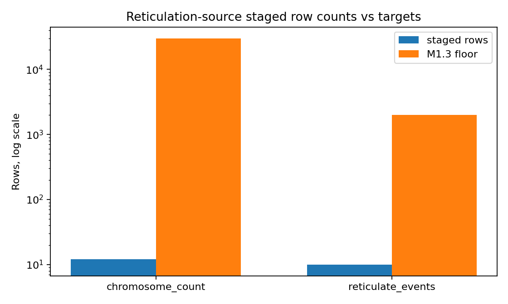
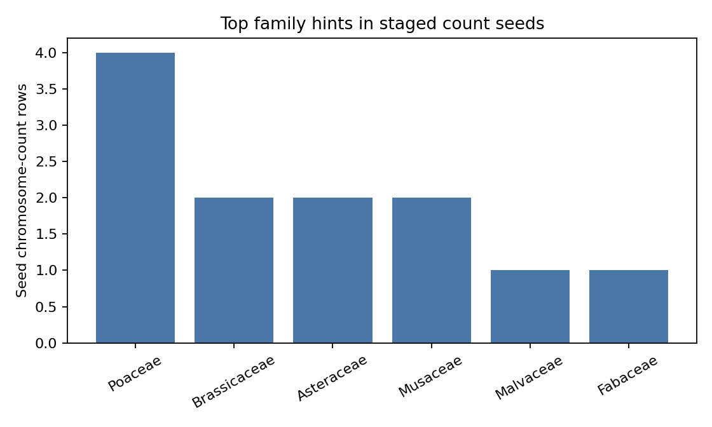
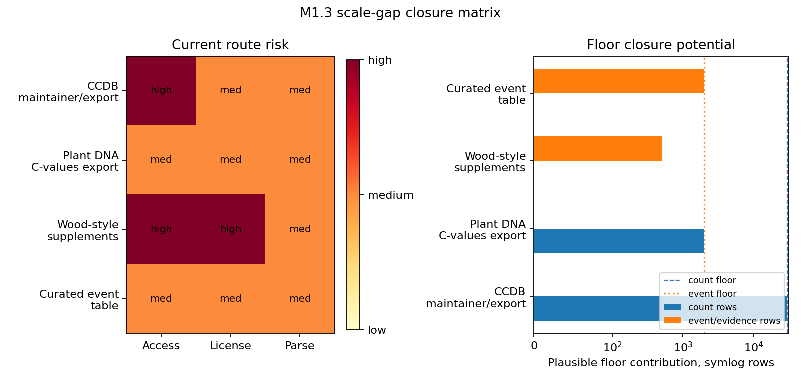

# M1.3 Reticulation Source Ingest Audit

## Scope

This fan-out branch stages reticulation specialty evidence for PhytoGraph Track 1 under frozen schema v1.0. Canonical node IDs are raw scientific names (`raw_name:<name>`); no WFO, GBIF, or other Barrier-1 taxonomic key was invented locally.

This pass is access-limited. CCDB and Plant DNA C-values were reachable as web applications, but no unauthenticated bulk CSV/API endpoint was found from the probed public pages. The PNAS/Wood et al. DOI endpoint returned an HTTP 403 for machine retrieval, so only conservative public canonical seed rows were staged and the quantitative shortfall is explicit.

## Artifacts

| Path | Purpose |
|---|---|
| `scripts/ingest_reticulation_sources.py` | Source probe, raw checksum capture, conservative normalized staging, and plot generation. |
| `tests/test_reticulation_staging.py` | Pytest-form validation for provenance, allowed edge types, parent roles, ploidy caveats, and count-only negative control. |
| `substrate/staging/reticulation_sources/raw/checksum_manifest.tsv` | Raw-response checksum manifest. |
| `substrate/staging/reticulation_sources/normalized/source_manifest.tsv` | Per-source access, license, reliability, and bias metadata. |
| `substrate/staging/reticulation_sources/normalized/chromosome_count_assertions.tsv` | Staged chromosome-count assertions. |
| `substrate/staging/reticulation_sources/normalized/ploidy_state_assertions.tsv` | Caveated ploidy-context rows represented as `reticulate_inheritance_evidence`. |
| `substrate/staging/reticulation_sources/normalized/hybridization_events.tsv` | Source-backed hybridization event seed rows. |
| `substrate/staging/reticulation_sources/normalized/polyploidization_events.tsv` | Source-backed polyploidization event seed rows. |
| `substrate/staging/reticulation_sources/normalized/reticulate_inheritance_evidence.tsv` | Multi-parent reticulate-inheritance evidence seed rows. |
| `substrate/staging/reticulation_sources/plots/source_row_counts_vs_targets.png` | Scale-floor diagnostic plot. |
| `substrate/staging/reticulation_sources/plots/top_families_count_bias.png` | Initial source-density bias diagnostic plot. |
| `scripts/reticulation_bulk_intake.py` | Local-file-only bulk intake harness for later approved CCDB, C-values, and curated event exports. |
| `tests/test_reticulation_bulk_intake.py` | Fixture tests for count parsing, event parent roles, ploidy caveats, provenance rejection, and one-parent demotion/rejection. |
| `substrate/staging/reticulation_sources/normalized/bulk_intake_contract.tsv` | Machine-readable input-column contract for approved bulk files. |
| `substrate/staging/reticulation_sources/normalized/format_readiness.tsv` | Runtime-honest supported-format policy for CSV, TSV, JSON, and XLSX intake. |
| `substrate/staging/reticulation_sources/BULK_ACCESS_PLAN.md` | Conductor-facing acquisition plan for closing the M1.3 scale gaps. |
| `substrate/staging/reticulation_sources/BARRIER1_HANDOFF.md` | Barrier 1 decision summary for conductor merge without clone-private context. |
| `substrate/staging/reticulation_sources/plots/m1_3_scale_gap_closure_matrix.png` | Access/license/parse-risk matrix and plausible floor contribution by source route. |
| `tests/test_reticulation_format_readiness.py` | Tests that enforce the access-limited handoff wording and XLSX dependency policy. |
| `scripts/check_reticulation_handoff.py` | Stdlib handoff/readiness checker for environments without pytest. |

## Source Access Audit

| Source | Access Method | Probe Result | License / Attribution | Reliability | Bias / Caveat |
|---|---|---:|---|---:|---|
| CCDB, Tel Aviv University [27], [28] | `GET https://ccdb.tau.ac.il/` via script; landing page saved and checksummed | HTTP 200, HTML web app; no bulk endpoint found from landing/browse probes | License not stated on probed pages; cite CCDB and Rice et al. | 0.86 | Strong cytogenetic aggregation value, but likely skewed toward published temperate, crop, and model-system lineages. |
| Plant DNA C-values, Kew [29] | `GET https://cvalues.science.kew.org/` via script; landing page saved and checksummed | HTTP 200, HTML search app; no all-row export endpoint found from probed pages | License not stated on probed pages; cite Kew Plant DNA C-values Database | 0.88 | Genome-size evidence, not ploidy truth; species-scale coverage cannot be promoted to event claims. |
| Wood et al. 2009 [30] | `GET https://doi.org/10.1073/pnas.0811575106` via script | HTTP 403 from machine retrieval path in this run | PNAS article/supplement copyright; factual extracted seed rows only | 0.82 | Useful for synthesis claims, but machine-readable supplementary extraction remains blocked. |

Raw checksums are in `raw/checksum_manifest.tsv`. These null results constrain Barrier 1: the coordinator should either provide approved source dumps, manual downloads, or explicit permission for a documented export workflow before expecting the M1.3 scale floors.

## Staged Row Counts

| Evidence table | Rows staged | M1.3 target | Status |
|---|---:|---:|---|
| `chromosome_count_assertions.tsv` | 12 | 30,000 | Access-limited; target not reached. |
| `ploidy_state_assertions.tsv` | 6 | supporting only | Conservative caveated evidence. |
| `hybridization_events.tsv` | 1 | part of 2,000 event floor | Seed only. |
| `polyploidization_events.tsv` | 4 | part of 2,000 event floor | Seed only. |
| `reticulate_inheritance_evidence.tsv` | 5 | part of 2,000 event floor | Seed only. |







## Normalization Policy

Chromosome count strings are preserved verbatim and parsed only into conservative helper fields: `count_type`, `parsed_min`, `parsed_max`, `is_range`, `is_approximate`, `is_mixed_or_irregular`, and `parse_status`. Multiple counts per taxon are not collapsed; count multiplicity remains signal for Track 1.

Count-only rows do not generate `polyploidization_event` rows. `ploidy_state_assertions.tsv` uses schema edge type `reticulate_inheritance_evidence` and marks rows as `inferred_supporting_evidence_not_event`, because schema v1.0 does not include a separate `ploidy_state_assertion` edge type.

## Dedup Policy

No cross-source biological deduplication was performed in this clone. Within each staging table, rows are source assertions keyed by raw scientific name, edge type, source ID, source record context, and supporting-source set. Barrier 1 should deduplicate only after taxonomy-backbone crosswalks are available.

## Positive And Negative Validation

Positive seed cases staged: `Triticum aestivum`, `Brassica napus`, `Spartina anglica`, `Tragopogon mirus`, and `Tragopogon miscellus` appear in event/evidence rows with parent roles where known.

Negative control staged: `Arabidopsis thaliana` has a count/ploidy-context row, but no `hybridization_event` or `polyploidization_event`. This verifies the required rule that a single chromosome count does not imply a reticulation event.

## Bias Profile

The immediate source-bias signal is already visible despite the seed-scale run: Poaceae, Brassicaceae, and crop/model-system examples dominate the staged positives. This is expected for cytogenetic and polyploid literature and must not be interpreted as biological reticulation density.

Known over-sampled strata: temperate Northern Hemisphere flora, crop lineages, textbook model systems, and recently studied allopolyploids. Known under-sampled strata: tropical understory angiosperms, non-crop woody lineages, regions with lower cytogenetic publication density, and taxa with unstable synonymy.

## Blockers

The 30,000 chromosome-count floor was not reached because this clone did not find a documented public CCDB bulk export/API endpoint during low-impact probes. The 2,000 event floor was not reached because the initial curated sources were not machine-retrievable as structured event tables in this run.

This is not a parse failure. It is an access/source-class blocker. To close M1.3 at scale, the next cycle needs one of: an approved CCDB export file, a maintainer-provided CCDB dump, a documented C-values export, or a curated allopolyploid/hybrid event table from systematic-botany supplements that can be redistributed or transformed under campaign provenance rules.

## Bulk Intake Readiness

`scripts/reticulation_bulk_intake.py` now provides the late-arrival production path. It accepts only approved local files with an explicit `--source` (`ccdb`, `plant_dna_cvalues`, or `curated_events`) and refuses to run unless source version, access date, license, attribution, and acquisition route are declared. By default it writes to `normalized/bulk_intake_preview/`; `--promote` is required to overwrite normalized staging tables after validation.

The intake contract is in `normalized/bulk_intake_contract.tsv`. The key evidence rules are unchanged: count-only rows create only `chromosome_count_assertion`; Plant DNA C-values/ploidy context is caveated `reticulate_inheritance_evidence`; event rows require at least two parent roles unless explicitly demoted to caveated evidence.

## Barrier 1 Handoff Readiness

`BARRIER1_HANDOFF.md` gives the conductor a main-workspace decision artifact: classify M1.3 as `validated/access-limited`, merge seed rows only as access-limited evidence, and do not treat the branch as satisfying production row-count floors. The handoff reiterates that chromosome-count assertions do not imply reticulation event edges.

`normalized/format_readiness.tsv` records supported file formats. CSV, TSV, and JSON are available through stdlib-backed parsing; XLSX is conditional because `openpyxl` is not installed in the current handoff environment, so Barrier 1 should require CSV/TSV conversion unless `openpyxl` is installed and verified.

## Verification

Commands run:

```bash
python3 scripts/ingest_reticulation_sources.py
python3 -m pytest -q tests/test_reticulation_staging.py
python3 - <<'PY'
# stdlib validation equivalent because pytest is unavailable in this environment
PY
```

`python3 -m pytest` failed because `pytest` is not installed. The stdlib validation passed the same critical checks: provenance fields are present, edge types conform to schema v1.0, asserted hybrid parents have at least two parent roles, inferred ploidy rows are not marked as established event facts, and the count-only negative control does not create an event row.
