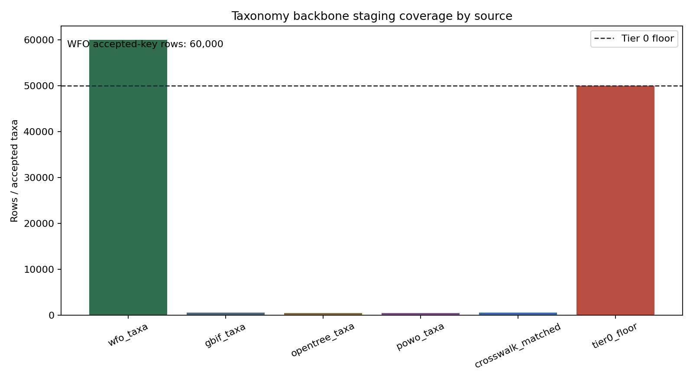

# M1.1 Taxonomy Backbone Ingest Audit

## Scope

This branch staged a source-preserving taxonomy backbone for Barrier 1. WFO is the operational accepted-key anchor; this is not a biological adjudication that WFO is correct over GBIF, Open Tree, or POWO.
The accepted-key set is restricted to WFO descendants of the `Angiosperms` node; an earlier unfiltered probe also returned gymnosperm and bryophyte families, so that path was rejected.

## Source Access

| source | path used | no-auth result | license / citation note | bulk suitability | staged rows |
|---|---|---:|---|---|---:|
| WFO Plant List | Zenodo static file `wfo_plantlist_2025-12.zip` | yes | WFO Plant List 2025-12; Zenodo DOI 10.5281/zenodo.18007552; see metadata.json/license | bulk suitable | 60000 |
| GBIF taxonomy | Species match API | yes | GBIF API terms/citation guidelines | API-only in this run; full backbone is ~1GB and deferred | 505 |
| Open Tree taxonomy | TNRS API | yes | Open Tree of Life license/citation guidance | API batch suitable for crosswalk samples; bulk TLS path failed locally | 436 |
| POWO | `api/2/search?name=` JSON endpoint | yes | Royal Botanic Gardens, Kew POWO website terms; API sampled conservatively | conservative sampled API use only; no bulk dump path confirmed | 477 |

## Outputs

| artifact | rows |
|---|---:|
| `accepted_taxa.parquet` | 60000 |
| `synonym_clusters.parquet` | 113582 |
| `common_names.parquet` | 0 |
| `source_crosswalk.parquet` | 60000 |
| `taxonomic_conflicts.parquet` | 62 |

## Crosswalk Coverage

- Tier 0 floor: 50,000 accepted taxa.
- Accepted taxa staged: 60,000.
- API crosswalk attempts: 500 WFO accepted names plus prior M5 seed overlap where present.
- Rows with at least one external ID: 505.
- Rows without external IDs are retained with explicit null fields, mostly `wfo_only_not_attempted`.

Conflict categories:

- `accepted_name_disagreement`: 62
- `matched_name_rank_agreement`: 443
- `wfo_only_not_attempted`: 59495

## Provenance And Evidence Scope

Every staged row includes `source`, `source_identifier`, `access_date`, `license`, and `ingest_clone_id`. Synonym rows are marked `name_normalization_only` and cannot support trait, range, edibility, phylogeny, reticulation, or biological-novelty claims.

## Validation

- `python3 tools/taxonomy_backbone_checks.py substrate/staging/taxonomy_backbone --min-accepted 50000`: passed (`accepted_taxa=60000 source_crosswalk=60000 synonym_clusters=113582 taxonomic_conflicts=62`).
- `python3 -m unittest tests/test_taxonomy_backbone.py`: passed (5 tests).
- `python3 -m unittest tests/test_public_taxonomy_sample.py`: passed unchanged (6 tests).

## Known Disagreements And Blockers

- POWO: no bulk no-auth dump was confirmed during this clone; API matching is intentionally sampled to avoid aggressive scraping.
- GBIF: full backbone archive is public but ~1GB; this branch used API matching for crosswalk evidence and WFO for scale.
- Open Tree: the public bulk URL probed earlier failed TLS verification locally; TNRS API remained usable.
- Family assignment and angiosperm membership are inherited from WFO parent traversal and should be checked at Barrier 1 before sibling branches treat them as join features.

## Figure

