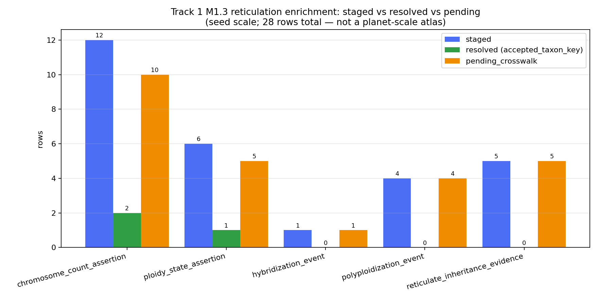
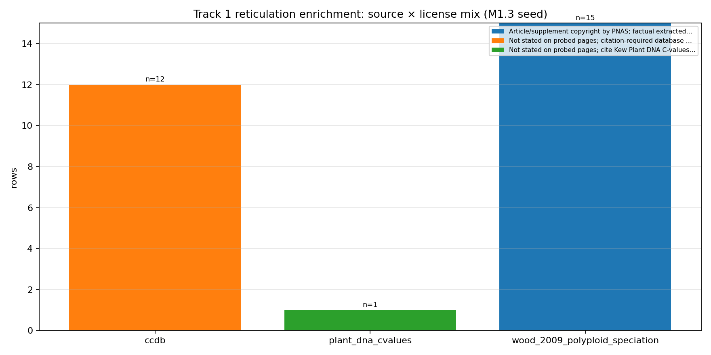

# Track 1 Wave 2 Reticulation Enrichment Audit (data-limited)

## Scope

This audit covers the projection of the 28-row M1.3 reticulation seed
evidence onto the frozen Barrier-1 substrate's accepted-key namespace.
It produces the authoritative Track 1 namespace artifacts under
`tracks/track1/data/` and `tracks/track1/plots/` for downstream Wave 3
M3.T1 instrument and Wave 4 validation cycles.

**Explicitly out of scope this cycle:**

- No `tree_compatibility_index` (TCI). The instrument is M3.T1 work.
- No reticulation index of any flavor.
- No M3.T1 instrument code, no convergence_signature, no Track 3/5 leakage.
- No synonym re-normalization. The substrate-published synonym maps
  (`substrate/staging/taxonomy_backbone/accepted_taxa.parquet`,
  `synonym_clusters.parquet`, and the derived
  `phytograph_dataset/synonym_resolution.parquet`) are the sole resolution oracle.
- No bulk CCDB or Plant DNA C-values recovery. M1.3 remains data-limited;
  see `substrate/staging/reticulation_sources/BULK_ACCESS_PLAN.md`.
- No writes outside `tracks/track1/`. Substrate stays read-only.

## Input Inventory

| Staged TSV (under `substrate/staging/reticulation_sources/normalized/`) | rows | source_id(s) |
|---|---:|---|
| `chromosome_count_assertions.tsv` | 12 | `ccdb` |
| `ploidy_state_assertions.tsv` | 6 | `wood_2009_polyploid_speciation` (5), `plant_dna_cvalues` (1) |
| `hybridization_events.tsv` | 1 | `wood_2009_polyploid_speciation` |
| `polyploidization_events.tsv` | 4 | `wood_2009_polyploid_speciation` |
| `reticulate_inheritance_evidence.tsv` | 5 | `wood_2009_polyploid_speciation` |
| **Total staged** | **28** | |

### Per-file edge_type assignment (audit-logged)

The `ploidy_state_assertions.tsv` rows carry `edge_type=reticulate_inheritance_evidence`
in the staged column — a pre-Barrier-1 demotion to "caveated ploidy-context, not
event." For Wave 2 enrichment we re-label by **file basename**, producing five
distinct edge types as the brief enumerates:

| Staged file basename | Emitted `edge_type` | Staged `edge_type` column |
|---|---|---|
| chromosome_count_assertions | `chromosome_count_assertion` | `chromosome_count_assertion` |
| ploidy_state_assertions | `ploidy_state_assertion` | `reticulate_inheritance_evidence` (pre-repair demotion) |
| hybridization_events | `hybridization_event` | `hybridization_event` |
| polyploidization_events | `polyploidization_event` | `polyploidization_event` |
| reticulate_inheritance_evidence | `reticulate_inheritance_evidence` | `reticulate_inheritance_evidence` |

The original staged value is preserved verbatim in the enrichment parquet under
the column `staged_edge_type_column`, so the demotion history is recoverable
without consulting the staging TSV. The `allowed_evidence_scope` text from the
staged row is preserved untouched (Test B); the relabel is metadata only, not
a promotion of evidence (e.g., a ploidy-context row still says "supports
caveated ploidy-context evidence only; does not establish event timing or
progenitors").

## Join Methodology

For each staged row `r`:

1. `accepted_taxon_key, match_status, ambiguity_reason = resolve_name(r.raw_scientific_name, accepted_map, synonym_map)`
   where `accepted_map`, `synonym_map` come from `barrier1_common.load_name_maps()` —
   the exact substrate-published lookup used at Barrier 1
   (`scripts/barrier1_apply_synonyms.py`, classify_resolution).
2. If `accepted_taxon_key` is non-empty → `pending_crosswalk=False`,
   accepted key appears in `canonical_node_ids_json`, and the raw-name
   placeholder is dropped per the Barrier-1 canonical-member-repair convention
   (`barrier1_common.canonical_member_list`).
3. Otherwise → `pending_crosswalk=True`, raw-name placeholder
   `raw_name:<normalized>` is retained in `canonical_node_ids_json`,
   and `caveats_json.canonicalization_status` records the match status.

**Substrate version stamp:** Barrier-1 repair `_plan/barrier1-canonical-member-repair`
validated at 2026-05-17T23:45:00Z, accepted_taxon_key namespace
`wfo:wfo-*-2025-12` (WFO Plant List 2025-12, accepted-name subset of size 59,788;
synonym map size 109,020).

## Coverage

(mirrors `tracks/track1/data/reticulation_coverage_summary.tsv`)

| edge_type | staged | resolved | pending | accepted_keys_covered |
|---|---:|---:|---:|---:|
| chromosome_count_assertion | 12 | 2 | 10 | 2 |
| ploidy_state_assertion | 6 | 1 | 5 | 1 |
| hybridization_event | 1 | 0 | 1 | 0 |
| polyploidization_event | 4 | 0 | 4 | 0 |
| reticulate_inheritance_evidence | 5 | 0 | 5 | 0 |
| **Total** | **28** | **3** | **25** | **2 distinct keys** |

Resolved rows (raw → accepted):

- `Arabidopsis thaliana` → `wfo:wfo-0000541830-2025-12` (chromosome_count, ploidy_state)
- `Arachis hypogaea` → `wfo:wfo-0000174378-2025-12` (chromosome_count)

All 28 staged rows are emitted; no silent drops (Test D). All 25 pending rows
carry their raw scientific name and a machine-readable `canonicalization_status`
in caveats. Source breakdown and license breakdown are preserved verbatim
(see TSV).

## Canonical Seed Case Audit

(mirrors `tracks/track1/data/canonical_seed_case_status.tsv`)

| Seed | Status | Accepted key | Edge types attached | Rows |
|---|---|---|---|---:|
| Triticum aestivum | pending_crosswalk | — | chromosome_count, ploidy_state, polyploidization, reticulate_inheritance | 4 |
| Brassica napus | pending_crosswalk | — | chromosome_count, ploidy_state, polyploidization, reticulate_inheritance | 4 |
| Spartina anglica | pending_crosswalk | — | chromosome_count, hybridization, ploidy_state, reticulate_inheritance | 4 |
| Tragopogon mirus | pending_crosswalk | — | chromosome_count, ploidy_state, polyploidization, reticulate_inheritance | 4 |
| Tragopogon miscellus | pending_crosswalk | — | chromosome_count, ploidy_state, polyploidization, reticulate_inheritance | 4 |
| Musa acuminata × balbisiana | missing_from_staging | — | — | 0 |
| Musa acuminata | pending_crosswalk | — | chromosome_count | 1 |
| Musa balbisiana | pending_crosswalk | — | chromosome_count | 1 |

**Key finding (data-limited):** None of the canonical Track 1 polyploid
validation seeds resolves to an accepted key in the current substrate. The
WFO accepted-name subset distributed with Barrier 1 does not include
*Triticum aestivum*, *Brassica napus*, *Spartina anglica*, *Tragopogon mirus*,
*Tragopogon miscellus*, *Musa acuminata*, or *Musa balbisiana* as exact
accepted-name strings, nor as synonym strings. They are therefore all
held `pending_crosswalk=True` with the raw scientific name preserved. The
nothospecies binomial `Musa acuminata × balbisiana` is not in the staged
M1.3 inputs at all (the seed list uses the two progenitor binomials and
the literature-synthesis cross is implicit); this is an expected gap
because WFO does not key nothospecies hybrids of cultivated bananas, and
re-ingesting under a nothospecies name was out of scope this cycle.

This is a Barrier-1 / M1.1 coverage gap that propagates into Track 1. It
does **not** indicate any Track 1 enrichment bug. M3.T1 must treat the
pending_crosswalk subset as first-class for instrument design (see
"Forward-handoff" below).

## Data-Limited Caveats

- **M1.3 bulk recovery deferred.** CCDB has no documented bulk export
  reachable at probe time; Plant DNA C-values release 7.1 (April 2019)
  exposes only a web search UI; Wood et al. 2009 PNAS supplement returned
  HTTP 403. See `substrate/staging/reticulation_sources/BULK_ACCESS_PLAN.md`.
- **28 source rows → 28 retained accepted-key reticulation hyperedges**,
  of which **3 are accepted-key resolved** and **25 are pending_crosswalk**.
  This is data-limited and **not** sufficient for a planet-scale
  reticulation index.
- Plant DNA C-values is represented by one staged row only.
- Curated hybridization literature is seed-only (Wood et al. 2009 synthesis).
- Cultivar pedigree databases are absent.
- No chromosome count is interpreted as ploidy or as a polyploidization
  event during enrichment. `allowed_evidence_scope` is preserved verbatim
  to prevent silent promotion downstream (Test B).
- Hybridization and polyploidization events preserve the full multi-parent
  `node_roles_json` role map; canonical member sets are built via
  `barrier1_common.canonical_member_list` so multi-parent members are not
  collapsed.

## Provenance & License Preservation

`source_id`, `source_name`, `source_version_or_release`, `access_date`,
`license`, and `attribution` are preserved verbatim per row. The license
distribution is:

- CCDB: "Not stated on probed pages; citation-required database use" (12 rows)
- Plant DNA C-values: "Not stated on probed pages; cite Kew Plant DNA
  C-values Database" (1 row)
- Wood et al. 2009 PNAS synthesis: "Article/supplement copyright by PNAS;
  factual extracted rows only" (15 rows)

No license string was reshaped, normalized, or stripped.

## Figures





Side-car captions live alongside each PNG as `*.caption.txt`. Both figures
regenerate from `scripts/track1_plot_reticulation_coverage.py`.

## Forward-Handoff Non-Claims for Wave 3 M3.T1

Wave 3 instrument cycles must NOT:

1. Interpret absence of a reticulation edge for a taxon as evidence of
   single-parent inheritance. Tier 0 contains 60,000 accepted taxa; M1.3
   enrichment touches at most 3 of them — absence is overwhelmingly
   "not yet attempted," not "shown to be single-parent."
2. Compute a `tree_compatibility_index` aggregated across angiosperms from
   this scale (28 rows, 5 distinct emitted edge types). H1 (planet-scale
   reticulation atlas) is **not** testable from the current substrate.
3. Promote a `chromosome_count_assertion` row to evidence of
   polyploidization or to a specific ploidy state. The staged
   `allowed_evidence_scope` text explicitly forbids it; tests guard
   that text from being rewritten.
4. Treat `pending_crosswalk=True` rows as deletable. The canonical Track 1
   polyploid validation seeds are in the pending set; the instrument
   should either (a) consume raw_name placeholders alongside accepted keys
   or (b) trigger a substrate-side `_plan/barrier1-canonical-seed-recovery`
   request to extend the WFO accepted subset before M3.T1 prediction.
5. Read from sibling track namespaces (`tracks/track2/`–`tracks/track6/`)
   during instrument construction. Cross-track joins are Barrier-2 concerns.

## Consistency with prior preflight artifacts

`tracks/track1/reticulation_enrichment/PREFLIGHT_AUDIT.md` and the
sibling `seed_enrichment_features.tsv`, `seed_case_expectations.tsv`
were produced in cycle 2 against pre-Barrier-1-repair raw-name keys (their
canonical IDs are `raw_name:<scientific_name_with_underscores>` and they
predate the canonical-member-projection repair). They are retained as
historical evidence of the preflight; this audit (`ENRICHMENT_AUDIT.md`) is
the new authoritative Wave 2 Track 1 enrichment record. The prior preflight
TSVs are **not** overwritten or modified by this cycle.

## Artifact Inventory

| Path | Purpose |
|---|---|
| `scripts/track1_reticulation_enrichment.py` | Enrichment script |
| `scripts/track1_plot_reticulation_coverage.py` | Figure generator |
| `tests/test_track1_reticulation_enrichment.py` | Tests A–F |
| `tracks/track1/data/chromosome_count_assertions.parquet` | 12 rows |
| `tracks/track1/data/ploidy_state_assertions.parquet` | 6 rows |
| `tracks/track1/data/hybridization_events.parquet` | 1 row |
| `tracks/track1/data/polyploidization_events.parquet` | 4 rows |
| `tracks/track1/data/reticulate_inheritance_evidence.parquet` | 5 rows |
| `tracks/track1/data/reticulation_enrichment_edges.parquet` | union (28) |
| `tracks/track1/data/reticulation_coverage_summary.tsv` | coverage table |
| `tracks/track1/data/canonical_seed_case_status.tsv` | seed audit |
| `tracks/track1/plots/reticulation_coverage_by_edge_type.png` | figure 1 |
| `tracks/track1/plots/reticulation_source_license_mix.png` | figure 2 |
| `tracks/track1/docs/ENRICHMENT_AUDIT.md` | this document |

## Reproduce / Verify

```bash
python3 scripts/track1_reticulation_enrichment.py
python3 scripts/track1_plot_reticulation_coverage.py
python3 -m pytest -q tests/test_track1_reticulation_enrichment.py
python3 tools/validate_barrier1_substrate.py
python3 -m long_exposure.tools.promise_check <run-root>
```

Expected: 6 tests pass; substrate validator PASS; promise_check exits 0
with the line-85 immutable exception consumed.
