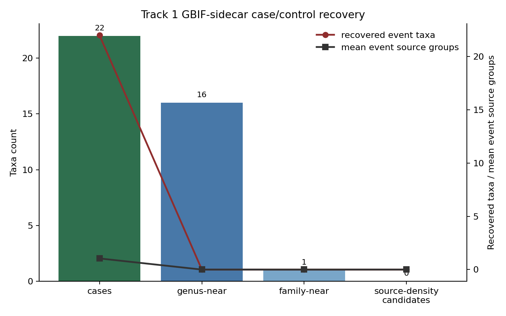

# Track 1 Free-Tier Control Strengthening

## Determination

Final status: `sidecar_readiness_uncontrolled`.

This package keeps the validated GBIF accepted-key sidecar fixed: 22 retained event taxa, 23 retained event-shaped rows, and no master prediction or speculation row. It does not rerun the TCI predictor and does not reopen WFO-based H1 validation.

## Case And Control Construction

Cases are the retained rows from `free_tier_reticulation_reconciled_evidence.tsv`, collapsed to one row per GBIF accepted key. Controls start from `free_tier_reticulation_reconciled_controls.tsv` and are annotated with the prior panel's GBIF match, family, genus, and broad OpenAlex/Crossref metadata proxies.

| control_match_basis | rows |
| --- | --- |
| genus_near | 16 |
| family_near | 1 |

## Source-Density Diagnostics

| diagnostic | case_mean | case_median | control_mean | control_median | effect_direction | caveat | pass_fail |
| --- | --- | --- | --- | --- | --- | --- | --- |
| retained_event_taxa | 1.045 | 1.0 | 0.0 | 0.0 | cases_above_controls | Counts are from retained GBIF-sidecar event rows; they support readiness diagnostics only. | pass |
| source_density_control | 1.045 | 1.0 | 0.0 | 0.0 | cases_have_event_source_exposure_controls_zero | Controls have comparable metadata search exposure but no curated event source groups; this leaves targeted-source artifact risk. | fail |
| publication_proxy_control | 29623.636 | 10648.0 | 29816.059 | 6481.0 | metadata_exposure_overlaps | OpenAlex reticulation-query counts are broad metadata proxies and not evidence rows. | pass |
| family_size_control | 1.833 | 1.0 | 1.417 | 1.0 | same_family_opportunity_present | Existing controls cover 12 case families; family size is measured within the local panel, not global taxonomy. | pass |
| gbif_wfo_resolution_control | 0.909 | 1.0 | 0.0 | 0.0 | cases_have_more_wfo_sidecar_name_turnover | WFO projection was intentionally not attempted for controls because WFO-only case evidence already collapsed to 2 taxa. | fail |
| low_publication_control_constructibility | 29623.636 | 10648.0 | 338.0 | 338.0 | low_publication_controls_sparse_or_insufficient | Only 2 low-publication control(s) are available from the local panel; this is not enough to interpret sparse-control non-recovery. | fail |

## Matching Failures

The existing controls are useful for family/genus opportunity and broad metadata exposure, but they are not comparable on curated event-source exposure: retained cases have at least one event source group by construction, while controls have zero curated event source groups. Low-publication controls are inadequate from the local panel: only 2 usable sparse control(s) were found, and rejected sparse-control candidates plus reasons are recorded in `free_tier_reticulation_low_publication_controls.tsv`.

## Admissibility Status

`sidecar_control_supported_readiness` is not assigned. The sidecar still separates cases from the existing matched controls on event recovery, but source-density comparability is not strong enough to rule out targeted-source artifact risk. The conservative status is therefore `sidecar_readiness_uncontrolled`.

## Future Data Required For WFO-Based H1 Reopening

WFO-based H1 validation would require an expanded frozen WFO crosswalk that resolves the canonical hybrid/polyploid event taxa at accepted species or sanctioned hybrid-name rank, plus comparable non-event controls with WFO projection, family/genus opportunity, and source exposure measured under the same query protocol. It would also require curated reticulation/non-reticulation evidence extraction for controls, not only metadata hit counts.

