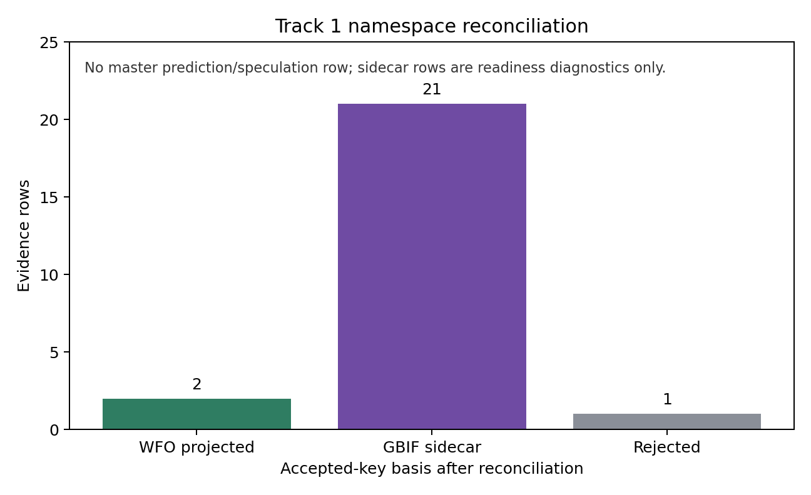

# Track 1 Free-Tier Namespace Reconciliation

determination: `gbif_sidecar_admissible_for_readiness_only`

## Scope

This package reconciles the Track 1 free-tier GBIF accepted-key reticulation evidence against the frozen WFO-oriented substrate. It does not rerun the tree-compatibility predictor, does not change schema v1.0, does not modify the master substrate, and creates no master prediction or speculation row.

## Summary

| Metric | Result |
|---|---:|
| Distinct GBIF accepted-key event taxa accounted for | 22 |
| WFO-projected event taxa | 2 |
| GBIF sidecar-admitted event taxa | 20 |
| Rejected diagnostic rows | 1 |
| Retained event-shaped evidence rows | 23 |
| Retained independent source groups | 11 |
| Matched-control event recovery | 0 / 17 |

The WFO-only projection does not preserve the branch-local threshold: only two GBIF accepted-key event taxa project cleanly to species-level WFO keys in the frozen local crosswalk. The non-null finding is that the remaining accepted-key event evidence can be kept as a clearly labeled GBIF sidecar readiness layer, subject to auditor acceptance and with no promotion into the master substrate or master prediction ledger.

## wfo_projected_evidence

WFO-projected rows require an exact species-level match in `phytograph_dataset/taxon_crosswalk.parquet`; genus-level matches and form-level hybrid candidates are not accepted as species projections.

| gbif_scientific_name | wfo_candidate_key | wfo_candidate_name | source_group |
| --- | --- | --- | --- |
| Arachis hypogaea L. | wfo:wfo-0000174378-2025-12 | Arachis hypogaea | genome_sequence |
| Arabidopsis suecica (Fr.) Norrl. | wfo:wfo-0000541826-2025-12 | Arabidopsis suecica | genome_phylogenomics |

## gbif_sidecar_evidence

Rows listed here retain a GBIF accepted key and event-shaped source support, but they did not receive a clean WFO species-level projection in the frozen local crosswalk. They are admissible only as Track 1 evidence-readiness diagnostics, not as master-substrate accepted keys and not as predictions.

| gbif_taxon_key | gbif_scientific_name | event_type | source_group |
| --- | --- | --- | --- |
| gbif:7795888 | Triticum aestivum L. | polyploidization_event | genome_phylogenomics |
| gbif:7795888 | Triticum aestivum L. | reticulate_inheritance_evidence | genome_sequence |
| gbif:3042636 | Brassica napus L. | polyploidization_event | genome_sequence |
| gbif:3152661 | Gossypium hirsutum L. | polyploidization_event | genome_sequence |
| gbif:2895345 | Coffea arabica L. | polyploidization_event | molecular_origin_study |
| gbif:2928774 | Nicotiana tabacum L. | polyploidization_event | genome_sequence |
| gbif:3029912 | Fragaria ×ananassa (Weston) Rozier | polyploidization_event | genome_sequence |
| gbif:9398259 | Sporobolus anglicus (C.E.Hubb.) P.M.Peterson & Saarela | hybridization_event | polyploid_review |
| gbif:5386951 | Tragopogon ×mirus Ownbey | polyploidization_event | polyploid_case_study |
| gbif:5386909 | Tragopogon ×miscellus Ownbey | polyploidization_event | polyploid_case_study |
| gbif:3119246 | Helianthus anomalus S.F.Blake | hybridization_event | hybrid_speciation_case_study |
| gbif:3119233 | Helianthus deserticola Heiser | hybridization_event | hybrid_speciation_case_study |
| gbif:3119149 | Helianthus paradoxus Heiser | hybridization_event | hybrid_speciation_case_study |
| gbif:5298384 | Iris ×nelsonii Randolph | hybridization_event | hybrid_speciation_case_study |
| gbif:3001244 | Malus domestica (Suckow) Borkh. | reticulate_inheritance_evidence | crop_introgression_study |
| gbif:8077391 | Citrus ×aurantium L. | hybridization_event | genome_phylogenomics |
| gbif:3002461 | Rosa canina L. | reticulate_inheritance_evidence | reticulation_case_study |
| gbif:2878688 | Quercus robur L. | reticulate_inheritance_evidence | introgression_case_study |
| gbif:2762752 | Musa ×paradisiaca L. | hybridization_event | crop_origin_review |
| gbif:7931731 | Prunus domestica L. | polyploidization_event | crop_origin_study |
| gbif:9073641 | Camelina sativa (L.) Crantz | polyploidization_event | genome_sequence |

## rejected_or_unresolved_evidence

Rejected rows are excluded from validation-readiness counts. The current rejection is diagnostic-only Citrus evidence where GBIF collapsed `Citrus sinensis` to the same accepted key used for `Citrus aurantium`; the retained Citrus event row is the accepted-key `Citrus ×aurantium` sidecar row.

| input_name | gbif_taxon_key | gbif_scientific_name | rejection_reason |
| --- | --- | --- | --- |
| Citrus sinensis | gbif:8077391 | Citrus ×aurantium L. | support_status is diagnostic_only, not accepted_key_event_shaped |

## Control Diagnostic

Matched controls remain represented under the same GBIF branch basis, with 0/17 controls carrying event-shaped evidence. This preserves the useful negative control from the free-tier pass, but it is still a high-publication matched panel and is not a source-density or family-size ablation.

## Admissibility Decision

The package supports a narrow auditor decision: WFO projection alone is insufficient to reopen WFO-based Track 1 closure, but a labeled GBIF accepted-key sidecar preserves 22 distinct accepted-key event taxa across 11 source groups with 0/17 matched-control recovery. Admission of that sidecar would upgrade Track 1 evidence readiness only within a sidecar namespace and only under the existing no-promotion rule.

## Remaining Blocker

A master-level Track 1 validation upgrade still requires auditor/conductor acceptance of the GBIF sidecar or a stronger WFO crosswalk. The sidecar does not solve broad generalization to under-studied clades, family-size controls, or low-publication source-density controls.
