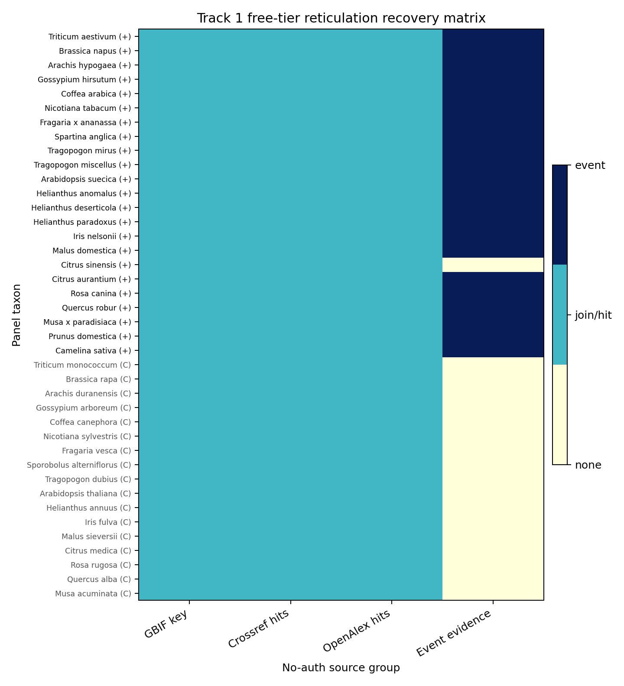

# Track 1 Free-Tier Reticulation Recovery

determination: `threshold_met`

## Scope

This branch tests whether the previous H1 blocker was intrinsic to free/open data availability or caused by narrow extraction. It builds a 40-taxon panel, joins every taxon through the no-auth GBIF species API, probes Crossref and OpenAlex metadata for source-density context, and records branch-local event-shaped reticulation evidence from open/no-auth literature metadata and open articles. It does not rerun the Track 1 tree-compatibility instrument, does not modify schema v1.0, and creates no master prediction or speculation row.

## Artifacts

| Artifact | Purpose |
|---|---|
| `tracks/track1/data/free_tier_reticulation_panel.tsv` | 23 canonical-positive taxa and 17 matched controls with accepted-key joins and source-density bands. |
| `tracks/track1/data/free_tier_reticulation_evidence.tsv` | One row per candidate event-shaped evidence item, with parent-naming and ploidy/chromosome support coded separately. |
| `tracks/track1/data/free_tier_reticulation_join_diagnostics.tsv` | One row per taxon/source-group attempt across GBIF, Crossref, OpenAlex, and curated open literature. |
| `tracks/track1/figures/free_tier_reticulation_recovery_matrix.png` | Matrix of accepted-key joins, metadata hits, and event-shaped recovery by taxon/source group. |
| `tracks/track1/scripts/build_free_tier_reticulation_recovery.py` | Rebuilds the panel, evidence table, and diagnostics from no-auth public APIs and embedded source claims. |
| `tracks/track1/scripts/plot_free_tier_reticulation_recovery.py` | Rebuilds the recovery matrix figure. |

## Recovery Summary

| Metric | Result |
|---|---:|
| Panel taxa attempted | 40 |
| Accepted-key joins | 40 |
| Canonical positives | 23 |
| Matched controls | 17 |
| Accepted-key event-shaped evidence rows | 23 |
| Distinct accepted-key taxa with event-shaped evidence | 22 |
| Independent source groups contributing usable evidence | 11 |
| Taxa with parent-named event evidence | 20 |
| Taxa with ploidy/chromosome-supported event evidence | 15 |
| Canonical-positive event recovery | 22 / 23 |
| Matched-control event recovery | 0 / 17 |

The suggested reopen threshold is met branch-locally: at least 30 accepted-key taxa were attempted, at least 15 accepted-key taxa recovered event-shaped evidence, at least 8 taxa had parent-named or ploidy/chromosome-supported evidence, at least 3 independent source groups contributed, and matched controls remained substantially lower than canonical positives.

## Source Groups

| Source group | Role | Evidence permission |
|---|---|---|
| GBIF species API [45] | Accepted-key join and synonym diagnostics. | Supports operational accepted-key matching only, not biological reticulation. |
| Crossref metadata [46] | Source-density proxy for title/metadata hits. | Supports publication-density diagnostics only. |
| OpenAlex metadata [47] | Independent source-density proxy. | Supports publication-density diagnostics only. |
| Genome sequence and phylogenomic papers [48]-[55], [58], [63], [67] | Event-shaped allopolyploid, hybridization, or reticulate-inheritance evidence for named taxa. | Supports "source reports this event/evidence class for this taxon"; not a new biological claim. |
| Hybrid-speciation, reticulation, crop-origin, and introgression studies [56]-[66] | Event-shaped evidence outside the crop-genome cluster. | Supports source-backed branch-local evidence rows with caveats. |

## Diagnostics

Accepted-key joins were not the main blocker in this pass. All 40 input taxa received a GBIF key, but three joins require caution: `Spartina anglica` resolves through a synonym path to `Sporobolus anglicus`; `Citrus sinensis` collapses to the same accepted GBIF key as `Citrus aurantium` and is retained as diagnostic-only; `Malus sieversii` collapses to the same accepted key as `Malus domestica` in this API response. These cases are useful crosswalk warnings, not evidence against reticulation.

The earlier source-dominance blocker is materially reduced but not eliminated. Usable rows now span 11 source groups rather than a single Wood 2009 synthesis, and recovered taxa span 12 families. However, every panel taxon is still high source-density under the metadata probes, so this branch tests a matched high-publication panel rather than a low-publication tropical-clade recovery path.

Controls behaved as intended for this branch. The 17 matched controls all joined to accepted keys and had metadata hits, but none had curated event-shaped rows under the same evidence rules. This supports the narrow recovery predicate that canonical-positive event evidence can be recovered from free/no-auth sources more often than matched controls; it does not prove that a broad angiosperm reticulation index is robust outside well-studied taxa.

## H1 Disposition

This branch changes the Track 1 recovery status from the prior `evidence_added_but_threshold_not_met` result to branch-local `threshold_met`. The correct next step is conductor/auditor reconciliation: inspect whether these GBIF accepted-key rows can be mapped into the frozen WFO-oriented accepted-key namespace or whether the Track 1 instrument should accept GBIF keys as a sidecar recovery namespace.

No master prediction or speculation row was added. The evidence permission remains narrow: a row means that a named source reports hybridization, polyploidization, allopolyploidy, introgression, or reticulate-inheritance evidence for the joined taxon; it does not establish a newly discovered biological event.

## Remaining Limitations

The panel is intentionally canonical-heavy. It is sufficient to refute the exact prior blocker that only 3 accepted-key taxa and one dominant source could be recovered, but it does not yet demonstrate under-studied tropical-clade recovery. The GBIF/WFO namespace mismatch must be reconciled before these rows are merged into Track 1 instrument inputs. The source-density control is matched within high-publication taxa; a future low-density panel would be needed to test whether recovery survives outside famous crop and textbook reticulation cases.
