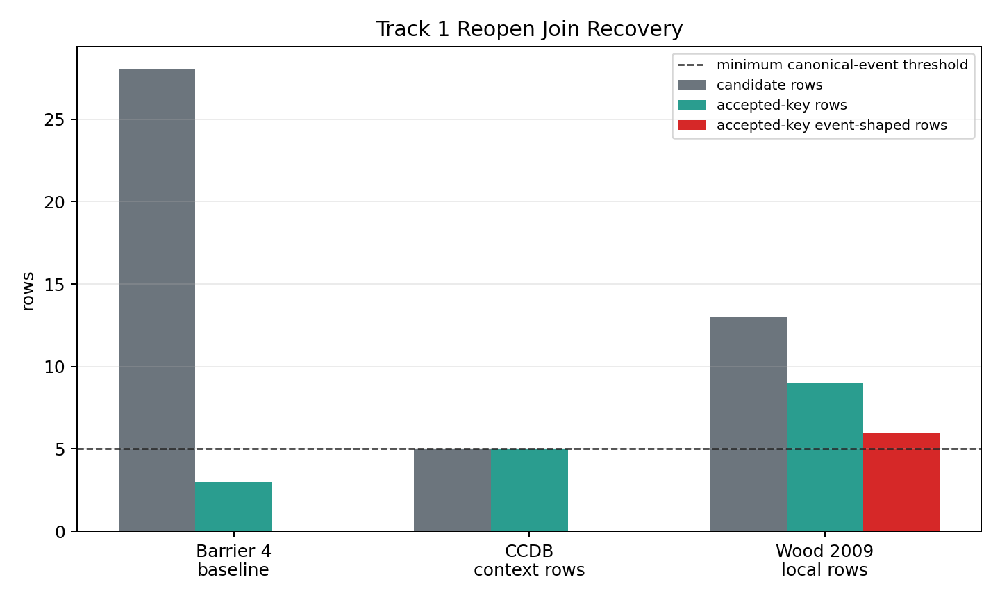

# Track 1 Reopen Reticulation Evidence

## Scope

This branch tests whether local/open Track 1 sources can add accepted-key, event-shaped reticulation evidence beyond the Barrier 4 closure baseline. It does not rerun the tree-compatibility index, does not modify the frozen schema, and does not write to the master prediction or speculation ledgers.

determination: `evidence_added_but_threshold_not_met`.

## Sources Inspected

| Source | Access mode | Accepted rows | Event-shaped accepted rows | Decision |
|---|---:|---:|---:|---|
| Barrier 4 frozen accepted-subset Track 1 enrichment | local files | 3 / 28 | 0 | baseline only; accepted rows are chromosome/ploidy context |
| CCDB chromosome-count seed rows | local staged seed rows | 5 / 5 | 0 | context only; does not support event-shaped reopen |
| Wood et al. 2009 polyploid speciation synthesis plus cached full-WFO join | local staged rows + local WFO cache | 9 / 13 | 6 | added accepted-key event-shaped rows, but too narrow and source-dominated |

The candidate table is `tracks/track1/data/reticulation_reopen_candidate_events.tsv`. The join summary is `tracks/track1/data/reticulation_reopen_join_diagnostics.tsv`.

## Accepted And Rejected Rows

The reopen package retained 18 inspected candidate rows. Six rows are accepted-key event-shaped rows: `Triticum aestivum` has `polyploidization_event` and `reticulate_inheritance_evidence`; `Brassica napus` has the same two event scopes; `Spartina anglica` has `hybridization_event` and `reticulate_inheritance_evidence` through synonym rescue to `Sporobolus anglicus`.

Five CCDB rows joined to accepted keys, but all are `chromosome_count_only`, so they are context and do not count toward reopen. Four Wood 2009 event-shaped rows for `Tragopogon mirus` and `Tragopogon miscellus` were inspected and rejected because no accepted WFO key was recovered in the available local lookup.

## Threshold Check

The reopen gate requires materially more than the Barrier 4 closure baseline: at minimum, accepted-key event-shaped recovery for enough canonical seed cases to justify rerunning Track 1 scoring, plus broader confound coverage. This branch recovered 6 accepted-key event-shaped rows across 3 accepted-key taxa, but only 2 taxa joined by exact accepted name; the `Spartina anglica` event rows require synonym rescue. It also produced no additional 30 accepted-key reticulation rows for source-density or family-size controls.

Therefore, the branch improves the evidence inventory but does not meet the reopen threshold. The apparent event-shaped gain is dominated by a single Wood 2009 source, so it cannot support broad H1 reopening or new biological claims.

## Controls

Source-density control: failed for reopening. All accepted-key event-shaped rows come from a single literature-synthesis source, so the evidence gain is source-dominated.

Synonym-normalization control: partially failed for reopening. One of 3 accepted-key event taxa is recovered only through synonym rescue, and the exact accepted-name event recovery remains below the canonical threshold.

Event-shape control: passed for classification. Chromosome-count-only and ploidy-context rows are recorded, but excluded from event-shaped counts.

## Boundary

No prediction row or speculation row was added. The result is an evidence-recovery branch only: Track 1 remains data-limited unless a future source adds accepted-key event-shaped rows with broader coverage and independent provenance.
