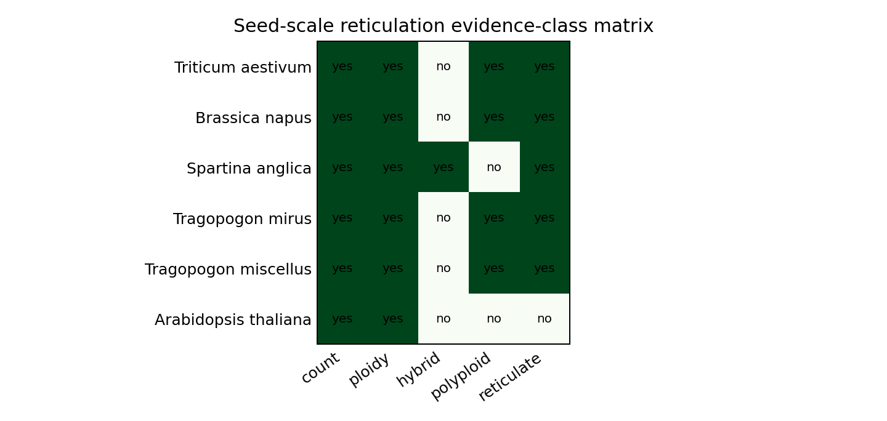

# Track 1 Reticulation Enrichment Preflight Audit

This is a seed-scale preflight from M1.3 `validated/access-limited` staging, not M2.T1 production reticulation enrichment and not evidence of production coverage. It proves that existing normalized rows can be transformed into schema-conformant Track 1 feature records while preserving raw scientific-name canonical IDs.

## Inputs

| table | rows |
|---|---:|
| `chromosome_count_assertions.tsv` | 12 |
| `ploidy_state_assertions.tsv` | 6 |
| `hybridization_events.tsv` | 1 |
| `polyploidization_events.tsv` | 4 |
| `reticulate_inheritance_evidence.tsv` | 5 |

Total staged input rows read: 28.
Feature rows emitted: 12.
Event-supported seed taxa: 5.

## Canonical Cases

| taxon | role | count rows | ploidy context | hybrid events | polyploid events | reticulate evidence | event supported |
|---|---|---:|---:|---:|---:|---:|---|
| Triticum aestivum | canonical positive | 1 | 1 | 0 | 1 | 1 | true |
| Brassica napus | canonical positive | 1 | 1 | 0 | 1 | 1 | true |
| Spartina anglica | canonical positive | 1 | 1 | 1 | 0 | 1 | true |
| Tragopogon mirus | canonical positive | 1 | 1 | 0 | 1 | 1 | true |
| Tragopogon miscellus | canonical positive | 1 | 1 | 0 | 1 | 1 | true |
| Arabidopsis thaliana | negative control | 1 | 1 | 0 | 0 | 0 | false |

## Evidence Boundary

- Chromosome-count rows support `chromosome_count_assertion` features only; they do not create `hybridization_event`, `polyploidization_event`, or event-supported flags.
- Ploidy-context rows are retained as caveated supporting context and counted separately from explicit event rows.
- Event support requires an explicit `hybridization_event`, `polyploidization_event`, or parent-bearing `reticulate_inheritance_evidence` row.
- Canonical IDs remain `raw_name:<scientific_name_with_underscores>`; taxonomy backbone crosswalk keys are deferred to Barrier 1.

## Demotions And Non-Inferences

- Arabidopsis thaliana: ploidy context retained as caveated reticulate_inheritance_evidence, not an event.
- Brassica napus: ploidy context retained as caveated reticulate_inheritance_evidence, not an event.
- Spartina anglica: ploidy context retained as caveated reticulate_inheritance_evidence, not an event.
- Tragopogon mirus: ploidy context retained as caveated reticulate_inheritance_evidence, not an event.
- Tragopogon miscellus: ploidy context retained as caveated reticulate_inheritance_evidence, not an event.
- Triticum aestivum: ploidy context retained as caveated reticulate_inheritance_evidence, not an event.
- Count-only evidence is not promoted to reticulation event support.
- No one-parent or underspecified event rows were present in the validated seed event tables.
- No missing-provenance rows were accepted; source IDs, source names, licenses, access dates, and allowed-support summaries are preserved in the feature TSV.

## Later Production Requirements For M3.T1

The tree-compatibility-index prototype will need production-scale fields for every accepted row: raw scientific name, raw count text or event type, parsed count where applicable, at least one row-level source/citation identifier, source version, access date, license, attribution, acquisition route, allowed evidence scope, confidence/source reliability, and parent roles for event-backed rows. Production CCDB/event ingestion must also expose source-density features so later ablations can test whether reticulation scores collapse into count density, publication density, or source coverage.

