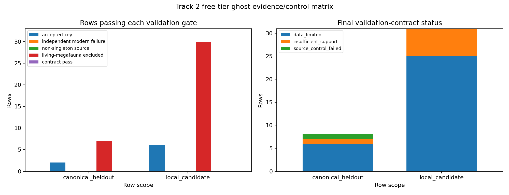

# Track 2 Free-Tier Ghost Evidence Controls

## Scope

This sidecar tests whether the frozen M3.T2 Ghost-Partner Candidate Ranker gains
validation support under free-tier/local evidence repair. It preserves existing
candidate ranks and scores, does not refit the ranker, performs only local
accepted-key namespace repair against `phytograph_dataset/taxon_crosswalk.parquet`,
and does not write `prediction_ledger.tsv` or `speculation_ledger.tsv`.

## Decision

Decision: `H2_remains_not_supported_or_data_limited`.

No canonical held-out passes the full validation conjunction
`accepted_key ∧ independent_modern_failure_evidence ∧ non_singleton_or_multi_source_class_support ∧ living_megafauna_excluded`.
Accepted-key recovery did not improve for absent held-outs from the local frozen
crosswalk. No row gains independent modern dispersal-failure evidence beyond the
existing seed citation, and the source-class/singleton ablations remain binding
controls.

## Gate Counts

| scope | rows | accepted_key_present_or_repaired | independent_modern_failure | non_singleton_source_support | living_megafauna_excluded | passes_validation_contract |
| --- | ---: | ---: | ---: | ---: | ---: | ---: |
| canonical_heldout | 8 | 2 | 0 | 0 | 7 | 0 |
| local_candidate | 31 | 6 | 0 | 0 | 30 | 0 |

## Final Status Counts

| row_scope | final_status | rows |
| --- | --- | --- |
| canonical_heldout | data_limited | 6 |
| canonical_heldout | insufficient_support | 1 |
| canonical_heldout | source_control_failed | 1 |
| local_candidate | data_limited | 25 |
| local_candidate | insufficient_support | 6 |

## Rejection Reasons

| row_scope | reason | rows |
| --- | --- | --- |
| canonical_heldout | ablation_fragile | 1 |
| canonical_heldout | accepted_key_absent | 6 |
| canonical_heldout | living_megafauna_ambiguity | 1 |
| canonical_heldout | modern_failure_independent_evidence_absent | 8 |
| canonical_heldout | singleton_or_source_class_fragile | 8 |
| local_candidate | accepted_key_absent | 25 |
| local_candidate | living_megafauna_ambiguity | 1 |
| local_candidate | modern_failure_independent_evidence_absent | 31 |
| local_candidate | singleton_or_source_class_fragile | 31 |

## Canonical Held-Out Matrix

| heldout_scientific_name | candidate_id | best_rank | accepted_key_status | modern_failure_independent_free_tier_status | non_singleton_source_support | living_megafauna_exclusion_status | passes_validation_contract | final_status | rejection_reason |
| --- | --- | --- | --- | --- | --- | --- | --- | --- | --- |
| Persea americana | T2C0028 | 8 | accepted_key_absent_after_free_tier_recovery | not_found_beyond_seed_citation_local_only | False | passes_living_megafauna_exclusion | False | data_limited | accepted_key_absent modern_failure_independent_evidence_absent singleton_or_source_class_fragile |
| Maclura pomifera | T2C0017 | 4 | accepted_key_absent_after_free_tier_recovery | not_found_beyond_seed_citation_local_only | False | passes_living_megafauna_exclusion | False | data_limited | accepted_key_absent modern_failure_independent_evidence_absent singleton_or_source_class_fragile |
| Gleditsia triacanthos | T2C0003 | 11 | accepted_key_absent_after_free_tier_recovery | not_found_beyond_seed_citation_local_only | False | blocked_living_megafauna_ambiguity | False | data_limited | accepted_key_absent modern_failure_independent_evidence_absent singleton_or_source_class_fragile living_megafauna_ambiguity |
| Annona cherimola | T2C0006 | 14 | accepted_key_present_existing | not_found_modern_failure_absent_local_only | False | passes_living_megafauna_exclusion | False | insufficient_support | modern_failure_independent_evidence_absent singleton_or_source_class_fragile |
| Mauritia flexuosa | T2C0022 | 23 | accepted_key_absent_after_free_tier_recovery | not_found_modern_failure_absent_local_only | False | passes_living_megafauna_exclusion | False | data_limited | accepted_key_absent modern_failure_independent_evidence_absent singleton_or_source_class_fragile |
| Spondias mombin | T2C0026 | 30 | accepted_key_absent_after_free_tier_recovery | not_found_modern_failure_absent_local_only | False | passes_living_megafauna_exclusion | False | data_limited | accepted_key_absent modern_failure_independent_evidence_absent singleton_or_source_class_fragile |
| Sideroxylon foetidissimum | T2C0009 | 9 | accepted_key_absent_after_free_tier_recovery | not_found_beyond_seed_citation_local_only | False | passes_living_megafauna_exclusion | False | data_limited | accepted_key_absent modern_failure_independent_evidence_absent singleton_or_source_class_fragile |
| Asimina triloba | T2C0016 | 1 | accepted_key_present_existing | not_found_beyond_seed_citation_local_only | False | passes_living_megafauna_exclusion | False | source_control_failed | modern_failure_independent_evidence_absent singleton_or_source_class_fragile ablation_fragile |

## Controls

The singleton-source ablation still leaves `0` candidate
rows and `0` validation-ready held-outs.
The source-count/candidate-class normalized sensitivity leaves
`0` validation-ready held-outs. These
controls block promotion even where morphology and extinct-fauna citation support
are present.

## Barrier 4 Interpretation

H2 remains not supported under the existing validation contract. Missing accepted
keys are namespace/data limitations, not biological falsifications; missing
independent modern-failure evidence is insufficient support; singleton/source-class
fragility is a control failure; living-megafauna ambiguity blocks ghost-megafauna
interpretation unless an explicit extant-versus-extinct dispersal contrast is
added in future evidence.

## Future Data Required

Reopen only with direct, provenance-preserved evidence that supplies all gates at
once: accepted focal taxon keys for the canonical held-outs, modern-process
evidence for dispersal or recruitment failure beyond the seed citation,
non-singleton or multi-source-class support for the same plant-extinct-fauna
pair, and an explicit exclusion or separation of living-megafauna dispersal.
