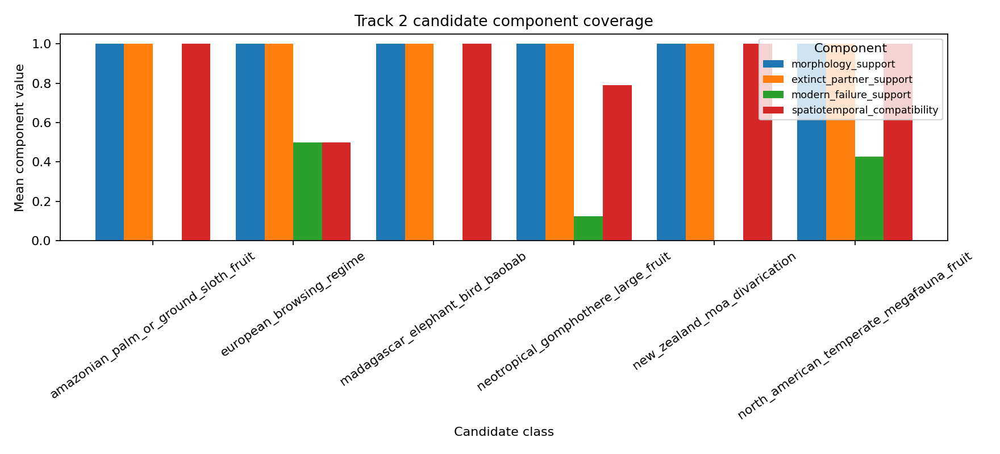

# Track 2 Ghost-Partner Candidate Ranker

## Status

This is the M3.T2 Ghost-Partner Candidate Ranker over the validated Barrier 2
Track 2 enrichment layer. It ranks cited paleobotany, extinct-fauna, and
Janzen-Martin seed rows for validation priority only. It does not claim any row
is an established anachronism and it does not write the master
`prediction_ledger.tsv`.

## Inputs

| Input | Role |
|---|---|
| `tracks/track2/data/ghost_partner_seed_edges.parquet` | 31 cited candidate seed edges from Wave 2 enrichment |
| `tracks/track2/data/anachronism_candidate_seed_summary.tsv` | candidate-class seed coverage |
| `tracks/track2/data/ghost_partner_support_nodes.parquet` | extinct-fauna, paleo-context, and modern-disperser support nodes |
| `tracks/track2/data/ghost_partner_range_context_edges.parquet` | PHYLACINE range-context support, not prediction evidence |
| `data/barrier2_track_enrichment_conformance.json` | Barrier 2 conformance status: Track 2 ready at seed scale |

## Mechanism

The score is a transparent prioritization statistic:

```text
S(c) = 0.25 M + 0.25 E + 0.20 F + 0.20 G + 0.10 P - 0.15 L - 0.10 Q
```

`M` is morphology support, `E` is extinct-fauna or paleo-context support, `F`
is modern dispersal-failure support, `G` is geography/time compatibility, `P`
is provenance completeness, `L` is living-megafauna ambiguity, and `Q` is
singleton-source thinness. The score is not a truth probability.

Special-point behavior is explicit: missing accepted focal keys become
`data_limited`; morphology without modern failure/geography support remains
`insufficient_support`; living-megafauna-compatible cases receive an ambiguity
penalty and flag; singleton source rows carry a source-thinness penalty.

## Outputs

| Output | Rows | Purpose |
|---|---:|---|
| `tracks/track2/data/ghost_partner_candidate_scores.tsv` | 31 | ranked candidate table with component columns |
| `tracks/track2/data/ghost_partner_predictions.tsv` | 31 | track-local candidate prediction ledger; no master ledger write |
| `tracks/track2/data/ghost_partner_score_components.tsv` | 217 | long-form component diagnostics |
| `tracks/track2/data/ghost_partner_data_limited_cases.tsv` | 30 | blocked or caveated rows |
| `tracks/track2/data/janzen_martin_heldout_recovery_scaffold.tsv` | 8 | held-out canonical-case recovery scaffold |
| `tracks/track2/figures/ghost_candidate_score_components.png` | 1 | component coverage by candidate class |



## Candidate Status Counts

| Status | Count |
|---|---:|
| `candidate_pending_validation` | 1 |
| `data_limited` | 25 |
| `insufficient_support` | 5 |

## Top Ranked Candidates

| Rank | Candidate | Taxon | Score | Status | Ambiguity |
|---:|---|---|---:|---|---|
| 1 | `T2C0016` | Asimina triloba | 0.800 | `candidate_pending_validation` | `source_singleton` |
| 2 | `T2C0018` | Diospyros virginiana | 0.800 | `data_limited` | `source_singleton` |
| 3 | `T2C0019` | Gymnocladus dioicus | 0.800 | `data_limited` | `source_singleton` |
| 4 | `T2C0017` | Maclura pomifera | 0.800 | `data_limited` | `source_singleton` |
| 5 | `T2C0021` | Maclura pomifera | 0.800 | `data_limited` | `source_singleton` |
| 6 | `T2C0011` | Crescentia alata | 0.775 | `data_limited` | `source_singleton` |
| 7 | `T2C0024` | Enterolobium cyclocarpum | 0.775 | `data_limited` | `source_singleton` |
| 8 | `T2C0028` | Persea americana | 0.775 | `data_limited` | `source_singleton` |

## Held-Out Janzen-Martin Scaffold

This table is a validation scaffold, not a validation result. Labels must be
withheld from future training/scoring passes and used only to evaluate recovery.

| Held-out taxon | In seed layer | Best rank | Candidate status | Recovery bucket |
|---|---:|---:|---|---|
| Persea americana | True | 26 | `data_limited` | `recovered_but_data_limited` |
| Maclura pomifera | True | 5 | `data_limited` | `recovered_but_data_limited` |
| Gleditsia triacanthos | True | 21 | `data_limited` | `recovered_but_data_limited` |
| Annona cherimola | True | 14 | `insufficient_support` | `recovered_but_insufficient_support` |
| Mauritia flexuosa | True | 24 | `data_limited` | `recovered_but_data_limited` |
| Spondias mombin | True | 30 | `data_limited` | `recovered_but_data_limited` |
| Sideroxylon foetidissimum | True | 9 | `data_limited` | `recovered_but_data_limited` |
| Asimina triloba | True | 1 | `candidate_pending_validation` | `recovered_validation_ready_seed` |

## Evidence Boundaries

- `inferred_anachronism_claim` is `false` for every candidate and prediction row.
- `enters_master_prediction_ledger` is `false` for every track-local prediction
  row in this M3 branch.
- Rows missing accepted focal taxon keys remain `data_limited`; this branch does
  not perform independent synonym normalization.
- `hypothesis_caveat` states why each row is a candidate hypothesis and what
  validation gap blocks stronger interpretation.
- Living-megafauna-compatible cases are flagged as ambiguity controls rather
  than treated as ghost-megafauna evidence.

## Validation Readiness

The 1 `candidate_pending_validation` rows are ready as a Wave 4 validation
queue. Data-limited canonical cases such as *Maclura pomifera*, *Gleditsia
triacanthos*, *Mauritia flexuosa*, and *Persea americana* need accepted-key
recovery before they can be used as canonical taxon-key validation targets.

## Reproduction

```bash
python3 scripts/track2_ghost_partner_ranker.py
python3 -m pytest -q tracks/track2/tests/test_ghost_partner_ranker.py
```
