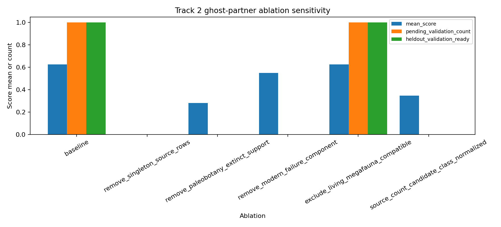

# Track 2 Validation And Ablation

## Scope

This Wave 4 layer audits canonical Janzen-Martin recovery over the fixed M3.T2
ranker outputs. It does not refit the ranker, fetch new literature, infer new
anachronism claims, or write the master `prediction_ledger.tsv`.

## Held-Out Recovery

| Held-out taxon | Accepted-key status | Modern-failure status | Validation class | Ablation outcome | Recovery reason |
|---|---|---|---|---|---|
| Persea americana | `accepted_key_absent` | `seed_modern_failure_present` | `data_limited` | `data_limited` | accepted-key absent; modern-failure evidence present in seed citation |
| Maclura pomifera | `accepted_key_absent` | `seed_modern_failure_present` | `data_limited` | `data_limited` | accepted-key absent; modern-failure evidence present in seed citation |
| Gleditsia triacanthos | `accepted_key_absent` | `seed_modern_failure_present` | `data_limited` | `data_limited` | accepted-key absent; modern-failure evidence present in seed citation; living-megafauna ambiguous |
| Annona cherimola | `accepted_key_already_present` | `needs_independent_modern_failure_check` | `insufficient_support` | `insufficient_support` | accepted-key already present; morphology-only or no explicit modern-failure component; insufficient support |
| Mauritia flexuosa | `accepted_key_absent` | `needs_independent_modern_failure_check` | `data_limited` | `data_limited` | accepted-key absent; morphology-only or no explicit modern-failure component; insufficient support |
| Spondias mombin | `accepted_key_absent` | `needs_independent_modern_failure_check` | `data_limited` | `data_limited` | accepted-key absent; morphology-only or no explicit modern-failure component; insufficient support |
| Sideroxylon foetidissimum | `accepted_key_absent` | `seed_modern_failure_present` | `data_limited` | `data_limited` | accepted-key absent; modern-failure evidence present in seed citation |
| Asimina triloba | `accepted_key_already_present` | `seed_modern_failure_present` | `validation_ready` | `falsified_by_ablation` | accepted-key already present; modern-failure evidence present in seed citation |

Summary: `1` held-out cases are validation-ready under the current local
evidence rules, `6` are data-limited, and `1` are
insufficient-support. A validation-ready case still means "ready for external
validation", not validated biology.

## Ablation Results

| Ablation | Candidate rows | Mean score | Pending-validation rows | Held-out validation-ready rows | Mean score delta |
|---|---:|---:|---:|---:|---:|
| `baseline` | 31 | 0.627 | 1 | 1 | 0.000 |
| `remove_singleton_source_rows` | 0 | 0.000 | 0 | 0 | -0.627 |
| `remove_paleobotany_extinct_support` | 31 | 0.281 | 0 | 0 | -0.347 |
| `remove_modern_failure_component` | 31 | 0.550 | 0 | 0 | -0.077 |
| `exclude_living_megafauna_compatible` | 30 | 0.627 | 1 | 1 | -0.001 |
| `source_count_candidate_class_normalized` | 31 | 0.347 | 0 | 0 | -0.280 |

## Interpretation

Removing singleton-source rows removes all current candidates, so the present
Track 2 seed layer is not robust to source-singleton ablation. Removing the
modern dispersal-failure component eliminates validation-ready status, which
confirms that morphology-only support remains capped. Removing paleobotany and
extinct-fauna support collapses the score basis, so the instrument is genuinely
using the Track 2 evidence layer rather than only large-fruit morphology.

## Status Classification

No held-out case is validated by this branch. `falsified-by-ablation` for a
validation-ready subset is `yes` under singleton-source row
removal, so Track 2 should remain data-limited until independent modern-failure
evidence and non-singleton source support are attached.

## Guardrails

All output rows preserve `inferred_anachronism_claim=False` and
`enters_master_prediction_ledger=False`. The held-out scaffold remains an
evaluation scaffold only; labels must stay withheld from future training or
scoring passes.
