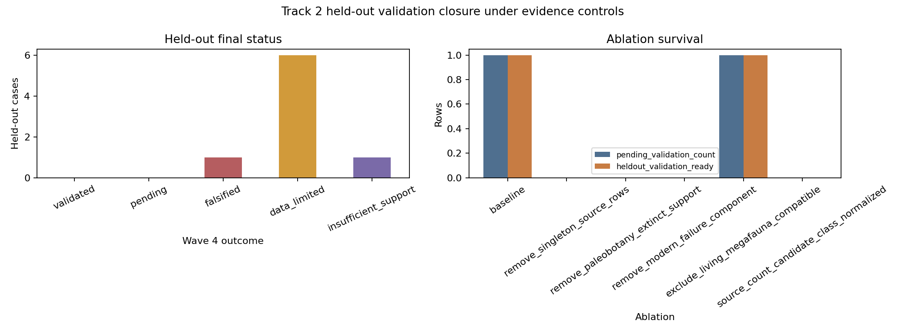

# Track 2 Wave 4 Validation Closure

## Scope

This closure package adjudicates the existing Track 2 held-out Janzen-Martin
validation scaffold under the frozen M3.T2 Ghost-Partner Candidate Ranker. It
does not refit the ranker, fetch new literature, infer new ecological history,
or write the master `prediction_ledger.tsv` or `speculation_ledger.tsv`.

## Decision

No held-out Janzen-Martin case is validated by the current frozen evidence
package. The final held-out disposition is: 0 validated, 0 pending, 1 falsified, 6 data-limited, 1 insufficient-support.

The branch therefore closes M4.V2 as a track-local null/data-limited validation
result: H2 is not supported at the requested 30% canonical recovery threshold
under current accepted-key and ablation controls.

## Held-Out Outcomes

| heldout_scientific_name | candidate_id | best_rank | accepted_key_status | modern_failure_evidence_status | ablation_outcome | wave4_outcome_status | blocking_controls |
| --- | --- | --- | --- | --- | --- | --- | --- |
| Persea americana | T2C0028 | 8 | accepted_key_absent | seed_modern_failure_present | data_limited | data_limited | accepted_key_absent singleton_source |
| Maclura pomifera | T2C0017 | 4 | accepted_key_absent | seed_modern_failure_present | data_limited | data_limited | accepted_key_absent singleton_source |
| Gleditsia triacanthos | T2C0003 | 11 | accepted_key_absent | seed_modern_failure_present | data_limited | data_limited | accepted_key_absent singleton_source living_megafauna_ambiguity |
| Annona cherimola | T2C0006 | 14 | accepted_key_already_present | needs_independent_modern_failure_check | insufficient_support | insufficient_support | modern_failure_missing singleton_source |
| Mauritia flexuosa | T2C0022 | 23 | accepted_key_absent | needs_independent_modern_failure_check | data_limited | data_limited | accepted_key_absent modern_failure_missing singleton_source |
| Spondias mombin | T2C0026 | 30 | accepted_key_absent | needs_independent_modern_failure_check | data_limited | data_limited | accepted_key_absent modern_failure_missing singleton_source |
| Sideroxylon foetidissimum | T2C0009 | 9 | accepted_key_absent | seed_modern_failure_present | data_limited | data_limited | accepted_key_absent singleton_source |
| Asimina triloba | T2C0016 | 1 | accepted_key_already_present | seed_modern_failure_present | falsified_by_ablation | falsified | singleton_source ablation_fragile |

## Mechanism Finding

The ranker can nominate a case only when cited morphology/extinct-partner
support is present, but validation requires stronger conditions: an accepted
focal taxon key, explicit modern dispersal-failure support, and survival under
source and living-megafauna controls. Six held-out cases remain data-limited,
one is insufficient-support, and the only pre-ablation validation-ready case
(`Asimina triloba`) is falsified by source/singleton ablation.

Special points:

- Missing accepted key: candidate is data-limited, not a failed biological
  hypothesis.
- Modern-failure support equal to zero: morphology-only cases are capped at
  insufficient support.
- Singleton-source support: current candidate layer collapses when singleton
  rows are removed.
- Living-megafauna ambiguity: ghost-partner interpretation is penalized and
  cannot validate a case.

## Ablation Summary

| ablation | candidate_rows | pending_validation_count | heldout_validation_ready | mean_score_delta_vs_baseline |
| --- | --- | --- | --- | --- |
| baseline | 31 | 1 | 1 | 0.0 |
| remove_singleton_source_rows | 0 | 0 | 0 | -0.627 |
| remove_paleobotany_extinct_support | 31 | 0 | 0 | -0.347 |
| remove_modern_failure_component | 31 | 0 | 0 | -0.077 |
| exclude_living_megafauna_compatible | 30 | 1 | 1 | -0.001 |
| source_count_candidate_class_normalized | 31 | 0 | 0 | -0.28 |

The singleton-source ablation leaves `0` candidate
rows and `0` validation-ready held-out
rows. Source/class normalization leaves `0`
validation-ready held-out rows. Removing the modern-failure component leaves
`0` pending-validation rows. These
controls rule out a validated H2 recovery result in the current substrate.

## Guardrails

All rows are track-local validation outcomes. `inferred_anachronism_claim` is
false for every row and `enters_master_prediction_ledger` is false for every
row. A `falsified` outcome here means falsified as a Wave 4 validation-ready
recovery under the stated controls, not proof that a biological anachronism is
absent.

## Reopen Conditions

Reopen Track 2 validation only when at least one of these changes is available:

- accepted-key repair for currently absent canonical held-out taxa;
- independent modern dispersal-failure evidence beyond the seed citation;
- non-singleton source support for candidate plant-extinct-fauna pairs;
- an explicit living-megafauna contrast that separates current dispersal from
  ghost-megafauna interpretation.
