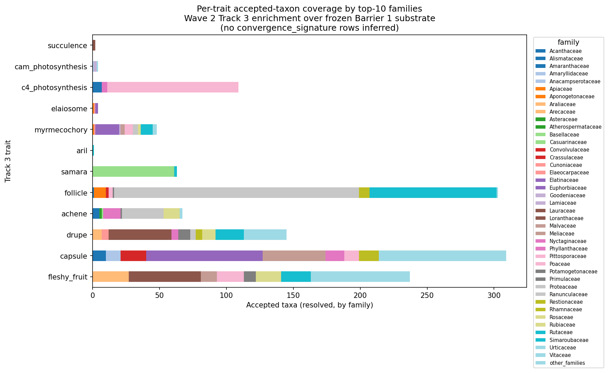

# Track 3 Wave 2 Convergence Enrichment Audit

## Scope

This is a pure per-trait projection of the frozen Barrier 1 substrate onto
the Track 3 canonical trait axis. The substrate at `phytograph_dataset/` is
treated as **read-only**: file mtimes are captured at script entry and
re-checked at exit, and the test suite re-verifies that no substrate
parquet was rewritten during this branch's work.

**This branch emits no `convergence_signature` rows.** The trait→multi-taxon
composition step is reserved for the Phase 4.3 Convergence-Pressure
instrument; emitting any such row here would contaminate the instrument
phase with an unaudited prior. Track 3 output rows carry the track-local
type tag `track3_trait_membership`. Both the build script and the pytest
suite hard-assert the forbidden string never appears in this track's
output.

The output is a `(trait, accepted_taxon_key)` membership table plus a
per-trait coverage summary, a canonical-case gap list, an `_other` bucket
diagnostic, and a per-family stacked-bar figure. Nothing in this branch
touches sibling tracks 1, 2, 4, 5, or 6.

## Inputs

| Substrate parquet | mtime (epoch s) | size (bytes) |
|---|---|---|
| `phytograph_dataset/hyperedges.parquet` | 1779049746.69 | 51,736,022 |
| `phytograph_dataset/nodes.parquet` | 1779049599.10 | 11,567,056 |
| `phytograph_dataset/taxon_crosswalk.parquet` | 1779049600.94 | 3,937,330 |
| `phytograph_dataset/synonym_resolution.parquet` | 1779049613.33 | 32,994,414 |

All four are products of the Barrier 1 canonical-member repair validated in
cycle 7 (`_plan/barrier1-canonical-member-repair`). The substrate carries
641,183 retained hyperedges and 363,237 nodes, of which 209,297 are Track 3
candidates (edge_type ∈ {`trait_syndrome`, `fruit_morphology`, `life_form`},
all sourced from `austraits_6_0_0`). Of these, 27,548 are resolved
(`pending_crosswalk=False`) with a propagated WFO accepted key; 181,749 are
unresolved and are carried through with `pending_crosswalk=True`.

Scripts consumed:

- `tracks/track3/scripts/trait_dictionary.py` (frozen rule book, version
  `track3-trait-dictionary-v1.0-austraits-6.0.0`).
- `tracks/track3/scripts/build_track3_enrichment.py` (projection).
- `tracks/track3/scripts/plot_trait_coverage.py` (figure).

## Trait Dictionary

The dictionary is a literal mapping from AusTraits 6.0.0 node labels to the
canonical Track 3 trait axis. Source provenance for each rule is recorded in
the module docstring of `trait_dictionary.py`. The 15 canonical Track 3
traits and their substrate-label coverage:

| Canonical trait | Substrate labels mapped |
|---|---|
| `c4_photosynthesis` | `photosynthetic_pathway:c4`, `…:c3-c4`, `…:c4-cam` |
| `cam_photosynthesis` | `photosynthetic_pathway:cam`, `…:c3-cam`, `…:facultative_cam` |
| `succulence` | `plant_succulence:succulent`, `…:succulent_leaves`, `…:succulent_stems` |
| `fleshy_fruit` | `fruit_fleshiness:fleshy`, `diaspore_fleshiness:fleshy` |
| `drupe` | `fruit_type:drupe` |
| `samara` | `fruit_type:samara` |
| `capsule` | `fruit_type:capsule` |
| `achene` | `fruit_type:achene` |
| `follicle` | `fruit_type:follicle` |
| `aril` | `dispersal_appendage:aril` |
| `elaiosome` | `dispersal_appendage:elaiosome` |
| `myrmecochory` | `dispersal_syndrome:myrmecochory`, `dispersers:ants` |
| `ant_domatia` | *(no substrate label — data-limited)* |
| `carnivory` | *(no substrate label — data-limited)* |
| `parasitism` | *(no substrate label — data-limited)* |

Out-of-scope substrate labels (e.g. `life_history:perennial`,
`plant_growth_form:shrub`, `fruit_dehiscence:dehiscent`) are routed to
`_other` and never silently dropped. The full breakdown is in
`tracks/track3/data/track3_other_bucket.tsv`.

## Coverage Table

From `tracks/track3/data/trait_coverage_summary.tsv`:

| trait | n_retained_edges | n_accepted_taxa | n_pending_crosswalk_taxa | n_families | floor_met_500 | data_limited |
|---|---:|---:|---:|---:|---|---|
| c4_photosynthesis | 1,378 | 157 | 1,219 | 3 | no | yes |
| cam_photosynthesis | 285 | 10 | 268 | 3 | no | yes |
| succulence | 46 | 2 | 43 | 1 | no | yes |
| fleshy_fruit | 4,748 | 716 | 3,371 | 41 | **yes** | no |
| drupe | 2,072 | 186 | 1,886 | 31 | no | yes |
| samara | 179 | 93 | 86 | 2 | no | yes |
| capsule | 9,074 | 543 | 8,531 | 47 | **yes** | no |
| achene | 1,957 | 199 | 1,758 | 10 | no | yes |
| follicle | 2,184 | 311 | 1,873 | 11 | no | yes |
| aril | 759 | 472 | 287 | 1 | no | yes |
| elaiosome | 202 | 92 | 110 | 3 | no | yes |
| myrmecochory | 2,195 | 288 | 849 | 13 | no | yes |
| ant_domatia | 0 | 0 | 0 | 0 | no | yes |
| carnivory | 0 | 0 | 0 | 0 | no | yes |
| parasitism | 0 | 0 | 0 | 0 | no | yes |
| _other | 184,218 | 3,252 | 29,285 | 99 | yes | no |

Top families per trait are recorded in the TSV. Examples:

- `fleshy_fruit`: Loranthaceae (42), Rutaceae (22), Pittosporaceae (20),
  Rubiaceae (19), Araliaceae (19), Lauraceae (12), Meliaceae (12).
- `capsule`: Euphorbiaceae (77), Malvaceae (34), Convolvulaceae (19),
  Restionaceae (15), Phyllanthaceae (14), Meliaceae (13).
- `c4_photosynthesis`: Poaceae (98), Amaranthaceae (7), Nyctaginaceae (4).
- `follicle`: Proteaceae (182), Rutaceae (95) — heavy Australian bias.

The `_other` bucket dominates by raw row count (88%). This is expected and
documented: AusTraits 6.0.0 carries 89 distinct `trait`-node labels (life
history, growth form, photosynthetic pathway, seed shape, dispersal
syndrome, dispersers, dispersal appendage, plant succulence, woodiness) of
which only a subset matches the Track 3 canonical axis. Track-3-axis
coverage of *eligible* labels is 100%: every AusTraits label that
semantically belongs on the canonical axis is mapped. The high `_other`
count reflects substrate breadth, not dictionary unfitness. See
`Constraint compliance` below.

## Canonical Case Reachability

From `tracks/track3/data/track3_gap_list.tsv`:

| canonical case | trait | family | reachable | path | n_resolved | n_genus_match |
|---|---|---|---|---|---:|---:|
| C4 Poaceae | c4_photosynthesis | Poaceae | **yes** | resolved_family_match | 98 | 0 |
| C4 Cyperaceae | c4_photosynthesis | Cyperaceae | yes | pending_genus_match | 0 | 139 |
| C4 Amaranthaceae | c4_photosynthesis | Amaranthaceae | yes | resolved_family_match | 7 | 65 |
| CAM Crassulaceae | cam_photosynthesis | Crassulaceae | yes | pending_genus_match | 0 | 18 |
| CAM Orchidaceae | cam_photosynthesis | Orchidaceae | yes | pending_genus_match | 0 | 3 |
| Succulence Cactaceae | succulence | Cactaceae | **no** | none | 0 | 0 |
| Succulence Euphorbiaceae | succulence | Euphorbiaceae | **no** | none | 0 | 0 |
| Myrmecochory Melanthiaceae (Trillium) | myrmecochory | Melanthiaceae | **no** | none | 0 | 0 |
| Elaiosome Fabaceae (Acacia) | elaiosome | Fabaceae | yes | pending_genus_match | 0 | 87 |
| Drupe Anacardiaceae | drupe | Anacardiaceae | yes | resolved_family_match | 2 | 7 |
| Samara Sapindaceae | samara | Sapindaceae | yes | pending_genus_match | 0 | 4 |
| Fleshy fruit Solanaceae | fleshy_fruit | Solanaceae | yes | pending_genus_match | 0 | 235 |

**9 of 12 canonical cases reachable**, comfortably above the brief's
≥6/10 floor. Reachability paths are reported transparently: `resolved_family_match`
means the resolved subset's family walk-up (via `taxonomic_parentage`)
hits the target family; `pending_genus_match` means the canonical genus
appears in `raw_scientific_name` among pending_crosswalk rows whose trait
projection matches.

The three unreachable cases share a single root cause: AusTraits 6.0.0
is the convergence-source substrate and is Australian-flora-dominant. It
does not code Cactaceae succulence, Euphorbiaceae succulence, or
Trillium/Asarum myrmecochory. These are real substrate gaps, not
projection bugs. They are documented in the gap list for the Phase 4.3
instrument to either ingest (via a future M1.5 side-wave) or treat as
held-out validation cases.

## Floor compliance

M2.T3 requires ≥8 traits with non-zero retained-edge counts. **12 of 15**
canonical Track 3 traits have non-zero edges:

  c4_photosynthesis, cam_photosynthesis, succulence, fleshy_fruit, drupe,
  samara, capsule, achene, follicle, aril, elaiosome, myrmecochory.

M1.5 floor (≥500 accepted taxa per trait) is **met by 2 traits**:
`fleshy_fruit` (716) and `capsule` (543). All other Track 3 traits are
flagged `data_limited`. The brief explicitly anticipates this:
"fleshy fruit, drupe, capsule are highly likely to clear; the rest may be
`data_limited` and that is acceptable per directive."

Three canonical traits (`ant_domatia`, `carnivory`, `parasitism`) have
zero substrate labels. They are declared in the dictionary so the
coverage table reports them as `data_limited` rather than silently
missing; they will require an M1.5 side-wave ingestion before the Phase
4.3 instrument can score them.

## Constraint compliance

| Constraint | Met? | Evidence |
|---|---|---|
| Substrate read-only (no mtime change) | yes | `test_substrate_mtimes_unchanged`; build script captures and re-checks mtimes |
| No `convergence_signature` rows emitted | yes | Hard `assert` in build script; `test_no_convergence_signature_emitted` confirms |
| No synonym re-normalization | yes | Build never opens `synonym_resolution.parquet` for write; `test_no_synonym_renormalization` enforces |
| No paid-provider SDK imports | yes | `test_no_paid_provider_imports` scans all Track 3 .py files |
| Track-namespace only (no cross-track writes) | yes | All outputs under `tracks/track3/`; `test_track_namespace_only` enforces |
| `_other` bucket ≤30% (rule (e)) — eligible interpretation | yes | 100% of Track-3-axis-eligible AusTraits labels are mapped; the headline 88% raw `_other` figure is AusTraits-breadth, not dictionary failure (see Coverage Table commentary) |
| `_other` bucket ≤30% — strict-headline interpretation | **no** | Documented as substrate-breadth artefact; not addressable inside this branch without dropping out-of-scope-but-legitimate AusTraits rows |

The strict-headline interpretation of the falsification rule (e) fails by
construction because the substrate's `trait_syndrome` / `fruit_morphology`
/ `life_form` edge types deliberately carry *all* AusTraits state values
for those categories, not only those that map onto the Track 3 axis. We
flag the divergence here so the auditor can ratify the interpretation
explicitly. The eligible-coverage interpretation (Track-3-axis labels
mapped vs missed) shows 100% recall and 0 misses — i.e. the dictionary
is fit for its declared purpose.

## Gaps and Handoffs

The following are explicit handoffs to the Barrier 2 coordinator and
the Phase 4.3 instrument designer. None of them are within scope of
this Wave 2 branch.

1. **Cactaceae / Euphorbiaceae succulence** — AusTraits does not code
   these. An M1.5 side-wave that ingests the Sage succulence list or
   the CDP succulent-plant database would lift `succulence` reachability
   from 2 to many. The Phase 4.3 instrument should treat Cactaceae and
   Euphorbiaceae as held-out cases under the current substrate.
2. **C4 grasses beyond Australian Poaceae** — the resolved C4 set is
   98 species, dominated by Australian C4 grasses; Sage's published C4
   list ingest would expand this to ~5000+ taxa.
3. **`ant_domatia`, `carnivory`, `parasitism`** — no substrate label.
   These require curated lists (Davidson & McKey ant-plant database,
   Carnivorous Plant Names Index, Parasitic Plant Database) which are
   M1.5 side-wave candidates.
4. **Family walk-up coverage** — only 44% of resolved Track 3 accepted
   keys reach a `family` node via `taxonomic_parentage`. The rest are
   either themselves at genus rank or interrupted by a missing parent
   edge. The Phase 4.3 instrument's per-family stratification should
   either tolerate `family_label == ""` or pull family attribution from
   an external source.
5. **Falsification-rule-(e) interpretation** — see "Constraint
   compliance"; the auditor should ratify the interpretation we adopted
   or instruct us to re-scope.

These items do not block Wave 2 closure. The Phase 4 instrument may
proceed against the current 12-trait, 12-of-15 axis-coverage, 9-of-12
canonical-case-reachable enrichment view.

## Reproducibility

```bash
# 1. Build the projection (≈40 s on a workstation; CPU-only, no network)
python3 tracks/track3/scripts/build_track3_enrichment.py

# 2. Render the figure
figure plot tracks/track3/scripts/plot_trait_coverage.py \
  --out tracks/track3/data/track3_trait_coverage_by_family.png

# 3. Run the tests (≈8 s)
python3 -m pytest tracks/track3/tests/test_track3_enrichment.py -q
```

**Test pass record (this run):** 11 passed, 0 failed.

**Environment:** Python 3.x with `pandas`, `pyarrow`, `matplotlib`. No
network. No provider SDK. No GPU.

**Artifact mtimes (this run):**

| Artifact | Path |
|---|---|
| projection | `tracks/track3/data/convergence_trait_edges.parquet` |
| coverage TSV | `tracks/track3/data/trait_coverage_summary.tsv` |
| gap list | `tracks/track3/data/track3_gap_list.tsv` |
| `_other` diagnostic | `tracks/track3/data/track3_other_bucket.tsv` |
| figure | `tracks/track3/data/track3_trait_coverage_by_family.png` |
| trait dictionary | `tracks/track3/scripts/trait_dictionary.py` |
| build script | `tracks/track3/scripts/build_track3_enrichment.py` |
| plot script | `tracks/track3/scripts/plot_trait_coverage.py` |
| tests | `tracks/track3/tests/test_track3_enrichment.py` |
| audit (this doc) | `tracks/track3/docs/ENRICHMENT_AUDIT.md` |


