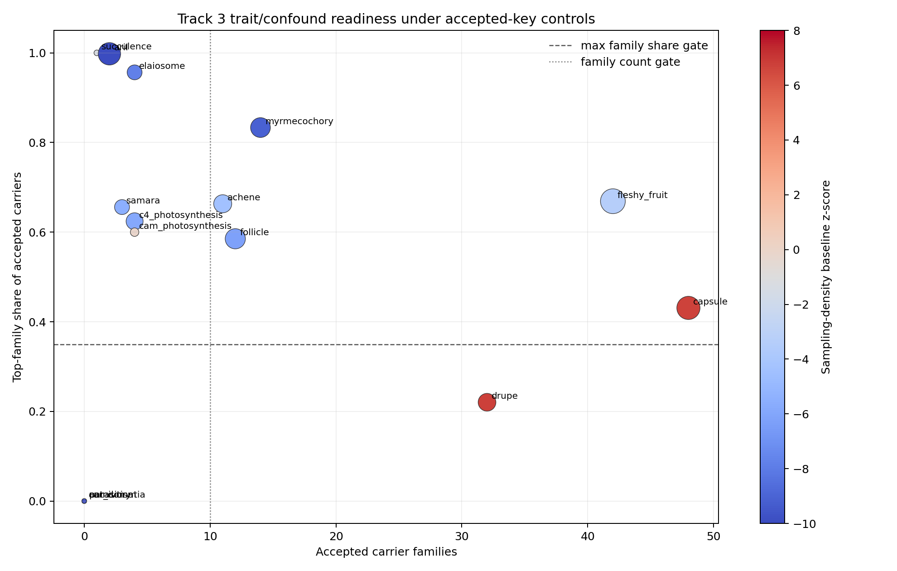

# Track 3 Free-Tier Trait/Confound Matrix

## Scope

This branch builds an accepted-key trait-by-taxon matrix for frozen Track 3 canonical traits and tests whether family-size and sampling-density controls leave any trait class ready for controlled convergence validation. It reads only Track 3-local frozen artifacts and does not modify `prediction_ledger.tsv`, `speculation_ledger.tsv`, the schema, the substrate, or other tracks.

## H3 Decision

H3 remains `confound_limited`. No canonical trait satisfies all controlled-readiness gates. `drupe` and `capsule` still clear the prior aggregate `CP_min >= 2.0` screen, but both remain below controlled-readiness because the accepted-key matrix has large pending-crosswalk loss and all retained carriers come from one frozen source family (`austraits_6_0_0`), so a single source explains the retained carrier set.

Controlled-ready traits: none.

## Key Trait Decisions

| trait | controlled_readiness_status | n_accepted_taxa | n_families | CP_min | max_family_share | family_size_baseline_z | sampling_density_baseline_z | accepted_resolution_share | blocker_classification |
|---|---|---|---|---|---|---|---|---|---|
| c4_photosynthesis | data_limited_pending_prior | 157 | 4 | -7.066 | 0.624 | -7.181 | -5.911 | 0.114 | insufficient_independent_families;projection_loss;family_dominance;cp_below_threshold;family_size_dominated;sampling_density_dominated;single_source_dominated |
| fleshy_fruit | data_limited_pending_prior | 716 | 42 | -5.850 | 0.669 | -6.030 | -3.338 | 0.175 | projection_loss;family_dominance;cp_below_threshold;family_size_dominated;sampling_density_dominated;single_source_dominated |
| drupe | data_limited_pending_prior | 186 | 32 | 5.647 | 0.220 | 5.267 | 6.763 | 0.090 | projection_loss;single_source_dominated |
| samara | data_limited_pending_prior | 93 | 3 | -5.930 | 0.656 | -6.033 | -5.515 | 0.520 | insufficient_accepted_taxa;insufficient_independent_families;family_dominance;cp_below_threshold;family_size_dominated;sampling_density_dominated;single_source_dominated |
| capsule | data_limited_pending_prior | 543 | 48 | 4.831 | 0.431 | 3.929 | 6.702 | 0.060 | projection_loss;family_dominance;single_source_dominated |
| elaiosome | data_limited_pending_prior | 92 | 4 | -9.142 | 0.957 | -8.631 | -7.752 | 0.455 | insufficient_accepted_taxa;insufficient_independent_families;family_dominance;cp_below_threshold;family_size_dominated;sampling_density_dominated;single_source_dominated |
| myrmecochory | confound_limited_pending_prior | 288 | 14 | -10.328 | 0.833 | -10.481 | -9.120 | 0.253 | family_dominance;cp_below_threshold;family_size_dominated;sampling_density_dominated;single_source_dominated |

## Matrix And Diagnostics

- Matrix rows: 3069 accepted-key `(trait, accepted_taxon_key)` carrier rows.
- Diagnostics file: `tracks/track3/data/track3_free_tier_trait_confound_diagnostics.tsv`.
- Readiness file: `tracks/track3/data/track3_free_tier_trait_readiness.tsv`.
- Summary file: `tracks/track3/data/track3_free_tier_trait_confound_summary.json`.

The diagnostic baseline uses family entropy of accepted carriers as the dispersion statistic. Family-size expectation draws carriers according to accepted Track 3 family opportunity; sampling-density expectation draws according to accepted Track 3 edge exposure. A trait can be called `controlled_convergence_ready` only when it clears CP, accepted-taxon count, family-count, top-family share, both baseline z-score, accepted-resolution reporting, and source-dominance gates.

## Blocker Interpretation

`drupe` and `capsule` are not biological negatives; they are still source-coded pending priors from the frozen substrate. The controlled-readiness blockers are projection loss and source dominance, not a refutation of convergence biology. Canonical textbook traits with weak recovery remain blocked by combinations of `cp_below_threshold`, `family_size_dominated`, `sampling_density_dominated`, `projection_loss`, `family_dominance`, `zero_carrier`, or `insufficient_independent_families`.

## Ledger Boundary

No row from this branch enters the master prediction ledger. The output supports Barrier 4 reconciliation by making the confound-limited status machine-readable.
