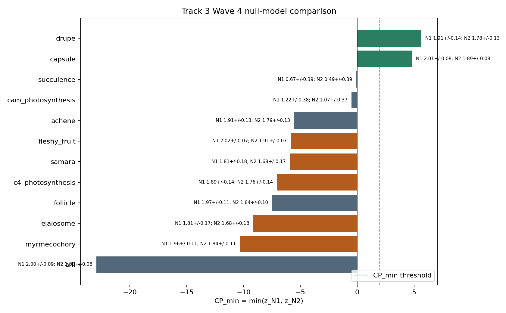

# Track 3 Wave 4 Validation And Confound Ablation

## Scope

This branch reinterprets the frozen M3.T3 convergence-pressure outputs for Wave 4 validation and ablation. It reads only Track 3-local artifacts and writes Track 3-local outputs; `prediction_ledger.tsv` and `speculation_ledger.tsv` are not promoted by this branch.

## Method

The instrument score is `CP_min(T)=min(z_N1,z_N2)`, where `z_N1=(H_family-mean_N1)/sd_N1` and `z_N2=(H_family-mean_N2)/sd_N2`. N1 preserves family-size carrier structure and N2 preserves sampling-density carrier structure. A trait can remain a pending convergence-prior only when both z-scores are finite, both null standard deviations are non-zero, `_other` is excluded, and the confound falsifier does not fail.

The Wave 4 interpretation is deliberately non-adaptive: these outputs do not establish adaptive convergence, independent origins, evolutionary inevitability, new trait occurrences, new taxonomy, or new distribution facts.

## H3 Decision

Decision: `data_limited`.

The current branch does not validate H3. `drupe` and `capsule` remain pending convergence-prior hypotheses, but canonical textbook traits do not consistently clear the frozen-substrate threshold and the confound regression is substantial (`R2_observed_H_family=0.835`, `R2_CP_min=0.852`). The existing hard falsifier does not fail because residual-rank agreement is below threshold (`rho=0.406`), so the result is data-limited rather than falsified by confound.

## Per-Trait Outcomes

| trait | row_class | n_carriers | n_families | CP_N1 | CP_N2 | CP_min | wave4_status | confound_verdict | special_handling |
| --- | --- | --- | --- | --- | --- | --- | --- | --- | --- |
| ant_domatia | data_limited_canonical_trait | 0 | 0 |  |  |  | data_limited_not_prediction | PASS | zero_carrier_trait; no biological absence claim |
| c4_photosynthesis | observed_trait_evidence_summary | 158 | 4 | -7.066 | -6.121 | -7.066 | data_limited_not_prediction | PASS | canonical_weak_recovery; no biological negative claim |
| carnivory | data_limited_canonical_trait | 0 | 0 |  |  |  | data_limited_not_prediction | PASS | zero_carrier_trait; no biological absence claim |
| elaiosome | observed_trait_evidence_summary | 93 | 4 | -9.142 | -8.027 | -9.142 | data_limited_not_prediction | PASS | canonical_weak_recovery; no biological negative claim |
| fleshy_fruit | observed_trait_evidence_summary | 717 | 42 | -5.850 | -4.056 | -5.850 | data_limited_not_prediction | PASS | canonical_weak_recovery; no biological negative claim |
| myrmecochory | observed_trait_evidence_summary | 289 | 14 | -10.328 | -9.655 | -10.328 | data_limited_not_prediction | PASS | canonical_weak_recovery; no biological negative claim |
| parasitism | data_limited_canonical_trait | 0 | 0 |  |  |  | data_limited_not_prediction | PASS | zero_carrier_trait; no biological absence claim |
| samara | observed_trait_evidence_summary | 94 | 3 | -5.930 | -5.467 | -5.930 | data_limited_not_prediction | PASS | canonical_weak_recovery; no biological negative claim |
| _other | diagnostic_bucket_excluded | 3253 | 100 |  | 0.000 |  | diagnostic_not_prediction | PASS | excluded_bucket; null comparison intentionally not used |
| achene | observed_trait_evidence_summary | 200 | 11 | -5.560 | -4.710 | -5.560 | observed_evidence_not_prediction | PASS | observed_trait_summary_only |
| aril | observed_trait_evidence_summary | 473 | 2 | -22.940 | -22.675 | -22.940 | observed_evidence_not_prediction | PASS | observed_trait_summary_only |
| cam_photosynthesis | observed_trait_evidence_summary | 11 | 4 | -0.508 | -0.087 | -0.508 | observed_evidence_not_prediction | PASS | observed_trait_summary_only |
| follicle | observed_trait_evidence_summary | 312 | 12 | -7.497 | -6.673 | -7.497 | observed_evidence_not_prediction | PASS | observed_trait_summary_only |
| succulence | observed_trait_evidence_summary | 3 | 2 | -0.086 | 0.380 | -0.086 | observed_evidence_not_prediction | PASS | observed_trait_summary_only |
| capsule | pending_convergent_trait_hypothesis | 544 | 48 | 4.831 | 6.523 | 4.831 | pending_convergence_prior | PASS | pending_hypothesis_only; no adaptive-origin claim |
| drupe | pending_convergent_trait_hypothesis | 187 | 32 | 5.647 | 6.640 | 5.647 | pending_convergence_prior | PASS | pending_hypothesis_only; no adaptive-origin claim |

## Pending Hypotheses

| trait | n_carriers | n_families | CP_N1 | CP_N2 | CP_min | canonical_recovery_band | canonical_recovery_agreement | wave4_status | status_rationale |
| --- | --- | --- | --- | --- | --- | --- | --- | --- | --- |
| capsule | 544 | 48 | 4.831 | 6.523 | 4.831 |  |  | pending_convergence_prior | capsule clears CP_min >= 2.0 against both nulls, but no independent Wave 4 validation source has confirmed the trait as a biological convergence result. |
| drupe | 187 | 32 | 5.647 | 6.640 | 5.647 | high | yes | pending_convergence_prior | drupe clears CP_min >= 2.0 against both nulls, but no independent Wave 4 validation source has confirmed the trait as a biological convergence result. |

`drupe` and `capsule` clear `CP_min >= 2.0` against both nulls and are the only current pending hypothesis rows. They do not enter the master prediction ledger here because independent validation and Barrier 4 reconciliation are still required.

## Diagnostic And Data-Limited Non-Predictions

| trait | n_carriers | n_families | CP_min | canonical_recovery_band | canonical_recovery_agreement | wave4_status | status_rationale |
| --- | --- | --- | --- | --- | --- | --- | --- |
| _other | 3253 | 100 |  |  |  | diagnostic_not_prediction | _other is an out-of-axis coverage bucket and is excluded from canonical convergence scoring. |
| ant_domatia | 0 | 0 |  |  |  | data_limited_not_prediction | ant_domatia has zero accepted-key carriers, so CP evidence is undefined in this frozen substrate. |
| c4_photosynthesis | 158 | 4 | -7.066 | high | yes | data_limited_not_prediction | c4_photosynthesis is a textbook convergence case, but it does not clear the current frozen-substrate CP_min threshold; this is treated as source/substrate limitation, not a negative biological result. |
| carnivory | 0 | 0 |  |  |  | data_limited_not_prediction | carnivory has zero accepted-key carriers, so CP evidence is undefined in this frozen substrate. |
| elaiosome | 93 | 4 | -9.142 | medium | yes | data_limited_not_prediction | elaiosome is a textbook convergence case, but it does not clear the current frozen-substrate CP_min threshold; this is treated as source/substrate limitation, not a negative biological result. |
| fleshy_fruit | 717 | 42 | -5.850 | high | yes | data_limited_not_prediction | fleshy_fruit is a textbook convergence case, but it does not clear the current frozen-substrate CP_min threshold; this is treated as source/substrate limitation, not a negative biological result. |
| myrmecochory | 289 | 14 | -10.328 | medium | yes | data_limited_not_prediction | myrmecochory is a textbook convergence case, but it does not clear the current frozen-substrate CP_min threshold; this is treated as source/substrate limitation, not a negative biological result. |
| parasitism | 0 | 0 |  |  |  | data_limited_not_prediction | parasitism has zero accepted-key carriers, so CP evidence is undefined in this frozen substrate. |
| samara | 94 | 3 | -5.930 | medium | yes | data_limited_not_prediction | samara is a textbook convergence case, but it does not clear the current frozen-substrate CP_min threshold; this is treated as source/substrate limitation, not a negative biological result. |

`_other` is a coverage diagnostic and is not a biological trait hypothesis. `ant_domatia`, `carnivory`, and `parasitism` have zero retained accepted-key carriers, so their CP evidence is undefined. Negative or low CP for canonical traits such as `c4_photosynthesis`, `fleshy_fruit`, `myrmecochory`, `elaiosome`, and `samara` is treated as weak recovery in this frozen substrate, not as evidence that those textbook traits are biologically absent or non-convergent.

## Figure

## Outputs

- `tracks/track3/data/track3_wave4_validation_outcomes.tsv`
- `tracks/track3/data/track3_wave4_validation_summary.json`
- `tracks/track3/figures/track3_wave4_null_model_comparison.png`
- `tracks/track3/reports/track3_wave4_validation_ablation.md`

## Ledger Boundary

Every row has `enters_master_prediction_ledger=False`. This branch supplies a track-local Wave 4 validation/ablation package for auditor review; any master-ledger status change belongs to Barrier 4 reconciliation.
