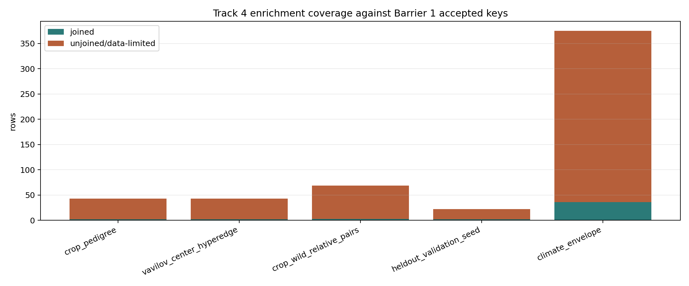

# Track 4 Domestication Enrichment Audit

## Scope

This Wave 2 enrichment attaches local M1.6 domestication staging rows to the validated Barrier 1 substrate. It does not write to `phytograph_dataset/`, does not broaden schema v1.0, does not run a Crop Substitution Engine, and does not independently normalize synonyms.

## Generated Artifacts

| Artifact | Purpose |
|---|---|
| `tracks/track4/data/domestication_enrichment_edges.parquet` | Retained observed Track 4 hyperedges with accepted focal taxon keys. |
| `tracks/track4/data/crop_cwr_coverage_summary.tsv` | Joined vs unjoined coverage by evidence category. |
| `tracks/track4/data/heldout_validation_seed.tsv` | Held-out validation seed rows for later Track 4 validation. |
| `tracks/track4/data/climate_envelope_coverage.tsv` | Climate-envelope availability and data-limited status by taxon. |
| `tracks/track4/data/domestication_key_join_failures.tsv` | Rows excluded from retained edge output because Barrier 1 had no accepted focal key. |
| `tracks/track4/data/track4_enrichment_coverage.png` | Joined vs unjoined coverage figure. |

## Counts

| Category | Staged rows | Joined rows | Unjoined rows | Shortfall |
|---|---:|---:|---:|---|
| crop_pedigree | 43 | 2 | 41 | focal accepted-key gaps |
| vavilov_center_hyperedge | 43 | 2 | 41 | focal accepted-key gaps |
| cultivation_or_domestication | 104 | 2 | 102 | focal accepted-key gaps |
| crop_wild_relative_pairs | 69 | 3 | 66 | crop and/or wild ancestor accepted-key gaps |
| heldout_validation_seed | 22 | 2 | 20 | held-out focal accepted-key gaps |
| climate_envelope | 375 | 36 | 339 | all rows data-limited until occurrence coordinates and bioclim values are extracted |

Retained hyperedges by type: crop_pedigree=2, vavilov_center_hyperedge=2, cultivation_or_domestication=2.

## Evidence Distinctions

Crop pedigree rows retain crop, wild ancestor, selection trait, Vavilov/region, and source roles in `role_map_json` and `canonical_node_ids_json`. Vavilov-center rows are separate from current distribution evidence and carry contested-center caveats from M1.6. Climate rows are not converted into predictions; they are marked `observed` only when accepted keys, occurrence counts, and bioclim values are present, otherwise `data-limited`.

## Data-Limited Gaps

Focal accepted-key gaps dominate this branch: 523 staged rows could not be retained as Track 4 hyperedges or keyed climate evidence because Barrier 1 had no accepted key for the focal name. CWR-pair coverage is sparse: 3 of 69 crop-wild ancestor pairs have both crop and wild ancestor accepted keys. Bioclim coverage remains unavailable: 0 of 375 rows have observed climate vectors; the rest are placeholders awaiting occurrence-coordinate extraction.

## Held-Out Validation Seed

The held-out seed table contains 22 rows. Species-level overlap with retained crop-pedigree training evidence is 0; this must remain zero before Wave 4 validation uses the seed set.

## Figure

## Readiness Judgment

Track 4 is ready for Barrier 2 as a data-limited enrichment layer, not as a predictive instrument. It provides nonzero observed crop-pedigree and Vavilov-center edges with accepted focal keys, but the later Crop Substitution Engine must treat CWR-pair coverage and climate envelopes as incomplete rather than inferred.
