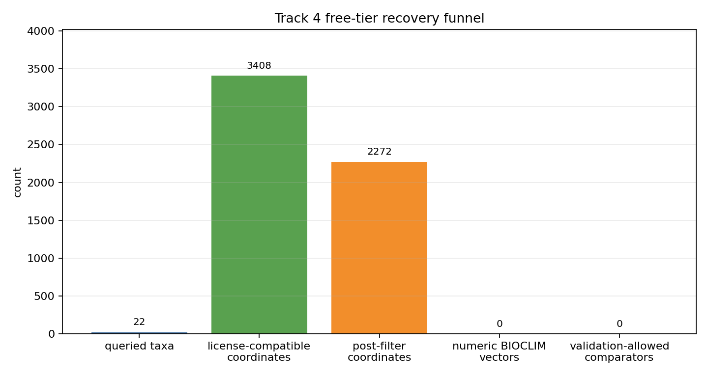

# Track 4 Free-Tier BIOCLIM Recovery

determination: `still_data_limited`

## Scope

This branch tested whether a bounded Track 4 crop/CWR panel could recover validation readiness using free GBIF occurrence records, iNaturalist-mediated records exposed through GBIF-compatible metadata, and local/free climate extraction. It did not change schema v1.0, rerun the Crop Substitution Engine, alter existing Track 4 candidate scores, or write to the master prediction/speculation ledgers.

## Recovery Artifacts

| Artifact | Purpose | Result |
|---|---|---|
| `tracks/track4/data/free_tier_occurrence_summary.tsv` | Bounded GBIF occurrence query summary with license and coordinate filters | 30 query-role rows; 8,423 returned records; 3,408 CC0/CC-BY coordinate records; 3,358 post-filter records. |
| `tracks/track4/data/free_tier_bioclim_vectors.tsv` | Climate-vector feasibility table | 30 rows; 2,272 deduplicated post-filter coordinates counted; 0 numeric BIOCLIM vectors because no local WorldClim/CHELSA raster or sampled climate file was present. |
| `tracks/track4/data/free_tier_validation_comparators.tsv` | Open/local comparator readiness table | 25 rows; 0 validation-allowed candidate-level comparator rows. |
| `tracks/track4/figures/track4_free_tier_bioclim_recovery.png` | Recovery funnel | Shows nonzero coordinate recovery but zero numeric BIOCLIM vectors and zero validation-allowed comparators. |

## Predicate Results

| Predicate | Result | Evidence |
|---|---|---|
| Free occurrence recovery | passed for bounded coordinate discovery | GBIF returned license-compatible, post-filter coordinates for crop anchors and candidate wild relatives, including `Arachis hypogaea`, `Arachis duranensis`, `Arachis ipaensis`, `Avena sativa`, `Avena sterilis`, `Aegilops speltoides`, and `Aegilops tauschii`. |
| BIOCLIM readiness | failed | `free_tier_bioclim_vectors.tsv` has `extraction_status=not_computed_no_local_raster_or_runtime` for all 30 rows and 0 rows with numeric `mean`, `median`, `min`, or `max`. |
| Comparator readiness | failed | `free_tier_validation_comparators.tsv` has 0 `validation_allowed=true` rows. Training-derived candidate rows overlap existing evidence, and held-out rows remain crop-program-level only. |
| Same-genus control | unresolved | The only candidate-level rows recovered from existing Track 4 candidates are same-genus `Arachis` or `Avena` rows and are not disjoint from training evidence. |

## Quantitative Notes

The occurrence blocker is partly reduced: free GBIF/iNaturalist-mediated queries provide nonzero coordinates after license, uncertainty, severe-geospatial-issue, duplicate-coordinate, and cultivated/managed filters. The climate blocker remains decisive because no local raster or sampled climate source was found in the workspace, and this branch did not perform a large uncontrolled raster download. Missing climate is represented as `not_computed`, not as zero climate mismatch.

Open comparator recovery did not produce validation-ready rows. Crossref metadata probes found candidate-name/stress-adjacent literature for the training-derived `Arachis`/`Avena` candidates, but those rows are not disjoint held-out comparator evidence and cannot validate the recommender. Existing held-out expert rows remain crop-program-level sources that do not name candidate wild-relative substitutes.

## Readiness Decision

Bounded validation readiness is not met. The branch converts the previous `0 coordinates` local blocker into a narrower blocker: coordinates exist for a bounded panel, but numeric BIOCLIM extraction is still unavailable locally/free, and validation-allowed candidate-level comparator rows remain zero. H4 remains `data_limited`; no climate-substitution recommendation or master-ledger prediction row is supported.

Minimum future-data predicate: add an audited local WorldClim/CHELSA raster manifest or sampled climate table, compute numeric summaries for at least one crop anchor and one paired wild relative, and add at least one disjoint candidate-level expert comparator row naming a climate-stress context.
