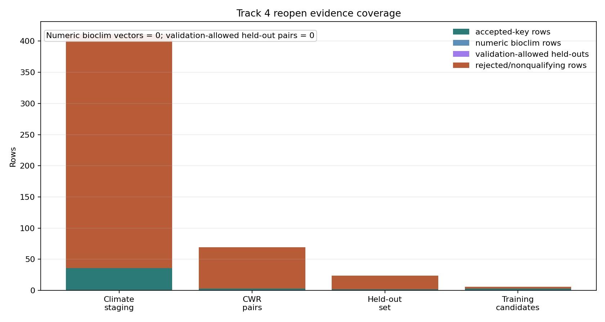

# Track 4 Reopen: Bioclim Validation Readiness

## Scope

This evidence-recovery branch inspects existing local Track 4 and M1.6 domestication artifacts for accepted-key crop/CWR climate vectors and held-out expert-comparison readiness. It does not change schema v1.0, rerun the Crop Substitution Engine, alter Track 4 scoring code, edit final synthesis artifacts, or promote rows into the master prediction/speculation ledgers.

determination: `no_new_qualifying_evidence`.

## Sources Inspected

| Source artifact | Role in this branch | Result |
|---|---|---|
| `tracks/track4/data/climate_envelope_coverage.tsv` | Accepted-key climate coverage from WorldClim/CHELSA staging | 375 rows, 36 accepted-key joins, 0 numeric BIOCLIM values. |
| `tracks/track4/data/crop_wild_relative_pairs.tsv` | Crop/CWR accepted-key pair evidence | 69 rows, 3 fully joined crop/CWR rows. |
| `tracks/track4/data/heldout_validation_seed.tsv` | Held-out expert crop-source set | 22 crop-level expert rows, 2 accepted-key joins, 0 training overlaps, 0 candidate-level comparators. |
| `tracks/track4/data/crop_substitution_candidates.tsv` | Prior M3.T4 candidate rows | 3 training-derived candidates; not usable as held-out expert comparisons. |

## Evidence Products

`crop_cwr_bioclim_vectors.tsv` records 10 accepted-key crop/CWR climate-coverage attempts tied to the Track 4 crop matrix. These are not qualifying vectors: every row has `bioclim_variable=none_available`, empty `value`, `aggregation_method=not_computed`, and a caveat stating that no observed occurrence coordinates or numeric BIOCLIM values were available locally.

`crop_cwr_validation_pairs.tsv` records 22 held-out expert crop-source rows. All have `overlaps_training_evidence=false`, but all also have `validation_allowed=false` because the local held-out source is crop-level only and does not provide candidate-level expert CWR comparator rows.

## Diagnostics

| Diagnostic source | Candidate rows | Accepted-key rows | Numeric bioclim rows | Validation-allowed held-outs | Dominant blocker |
|---|---:|---:|---:|---:|---|
| WorldClim/CHELSA climate-envelope staging | 375 | 36 | 0 | 0 | No observed occurrence coordinates or numeric bioclim values in local M1.6 staging. |
| Track 4 crop-wild-relative pairs | 69 | 3 | 0 | 0 | Crop and/or wild-relative accepted-key gaps; joined pairs still lack observed bioclim vectors. |
| Held-out expert crop set | 22 | 2 | 0 | 0 | Crop-level expert sources only; no candidate-level comparator without training leakage. |
| M3.T4 training-derived candidate rows | 3 | 3 | 0 | 0 | Training-derived rows cannot serve as held-out expert comparisons. |

## Controls

Same-genus proximity remains unresolved rather than passed. The only scored candidate rows from M3.T4 are within-genus crop/CWR relationships (`Arachis` and `Avena`) and are derived from training pedigree/CWR evidence, so they cannot establish a hypergraph advantage over a same-genus baseline.

Crop-popularity control remains unresolved. The accepted crop anchors with prior candidates are common crops already present in curated pedigree evidence, and no independent validation rows are available to separate evidence quality from crop salience.

Missing-climate coverage is the decisive failure. There are accepted-key crop and CWR rows, but there are zero observed or defensibly range-derived numeric BIOCLIM values; therefore climate-aware validation remains not computable.

## Reopen Gate

The H4 reopen gate is not met. The branch improves the audit trail for why climate-aware validation cannot run, but it does not add qualifying observed/range-derived crop/CWR bioclim vectors and does not add validation-allowed held-out expert comparison pairs. No climate-substitution recommendation, prediction-ledger row, or speculation-ledger row is promoted from this package.

Minimum future-data recipe: extract occurrence-backed crop and CWR coordinates, compute per-accepted-key BIOCLIM summaries with provenance and licenses, add candidate-level expert recommendation rows that are disjoint from training pedigree/CWR evidence, then rerun this readiness package before any substitution scoring cycle.
