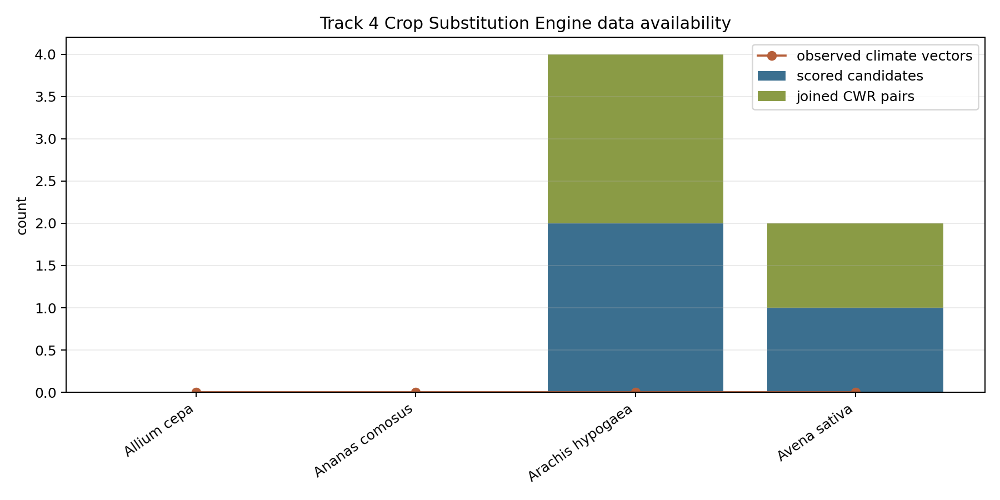

# Track 4 Domestication Hypergraph

## Scope

This artifact is the first data-limited Crop Substitution Engine for Track 4. It reads only the frozen Barrier 2 Track 4 enrichment namespace and does not write to `phytograph_dataset/`, does not broaden `phytograph_schema.md`, and does not independently normalize synonyms.

The engine emits candidate wild relatives only where observed pedigree/CWR evidence is already joined to Barrier 1 accepted keys. It does not make climate-match recommendations because Track 4 currently has 0 observed bioclim vectors.

## Instrument Outputs

| Artifact | Purpose |
|---|---|
| `tracks/track4/data/crop_substitution_candidates.tsv` | Ranked data-limited wild-relative candidates from joined pedigree/CWR evidence. |
| `tracks/track4/data/crop_substitution_data_availability.tsv` | Per-crop readiness and shortfall table. |
| `tracks/track4/data/crop_substitution_engine_summary.json` | Machine-readable count summary for Barrier 3. |
| `tracks/track4/data/crop_substitution_data_availability.png` | Plot of candidate counts, joined CWR pairs, and observed climate-vector availability. |
| `scripts/track4_crop_substitution_engine.py` | Reproducible builder for the instrument outputs. |

## Mechanism

For each retained `crop_pedigree` edge, the instrument extracts joined wild-ancestor roles and scores each crop-wild relative pair by a non-climate evidence score:

`score = 0.45 * pedigree + 0.25 * joined_CWR + 0.20 * selection_trait_coverage + 0.10 * Vavilov_context`

Climate is not assigned a zero score. At the special point where observed bioclim vectors equal zero, climate is outside the denominator and is recorded as `not_computable_no_observed_bioclim_vectors`.

## Counts

| Quantity | Count |
|---|---:|
| Retained Track 4 hyperedges | 6 |
| Retained crop-pedigree edges | 2 |
| Joined CWR pairs | 3 / 69 |
| Scored candidates | 3 |
| Crops with scored candidates | 2 |
| Held-out validation rows with accepted keys | 2 / 22 |
| Observed bioclim vectors | 0 / 375 |

## Ranked Candidates

| Crop | Candidate wild relative | Rank | Non-climate score | Boundary |
|---|---|---:|---:|---|
| Arachis hypogaea | Arachis duranensis | 1 | 1.0 | candidate ranking only; not a validated crop-substitution recommendation |
| Arachis hypogaea | Arachis ipaensis | 2 | 1.0 | candidate ranking only; not a validated crop-substitution recommendation |
| Avena sativa | Avena sterilis | 1 | 0.933333 | candidate ranking only; not a validated crop-substitution recommendation |

## Data Availability

| Crop | Retained pedigree? | Scored candidates | Climate status | Instrument status |
|---|---:|---:|---|---|
| Arachis hypogaea | True | 2 | data-limited | candidate_scored_pedigree_only |
| Avena sativa | True | 1 | data-limited | candidate_scored_pedigree_only |
| Allium cepa | False | 0 | data-limited | data_limited_no_scored_candidate |
| Ananas comosus | False | 0 | data-limited | data_limited_no_scored_candidate |

## Evidence Boundary

Rows in `crop_substitution_candidates.tsv` are `pending_data_limited` candidate rankings, not validated recommendations. The ranking supports only this claim: given the current retained Track 4 evidence, these wild relatives are the only candidate substitutes with joined pedigree/CWR support. It does not support suitability under a target climate envelope, cultivar performance, edibility, native range, or deployment advice.

## Data-Limited Findings

- Climate matching is unavailable because all Track 4 climate rows have `bioclim_values_present=False`.
- The current instrument can score only 2 crops with retained crop-pedigree evidence.
- The held-out validation seed remains mostly unkeyed at Barrier 1 scale, so Wave 4 validation must either recover accepted keys/CWR evidence first or mark those cases data-limited.
- A sister-species baseline and multi-parent-edge ablation are not run here; they are Wave 4 falsification work.

## Figure

## Barrier 3 Readiness

Track 4 is ready for Barrier 3 integration as a queryable, data-limited instrument. The Atlas may expose the candidate rows only if it preserves `prediction_status=pending_data_limited`, `climate_match_status=not_computable_no_observed_bioclim_vectors`, and the evidence boundary above.
