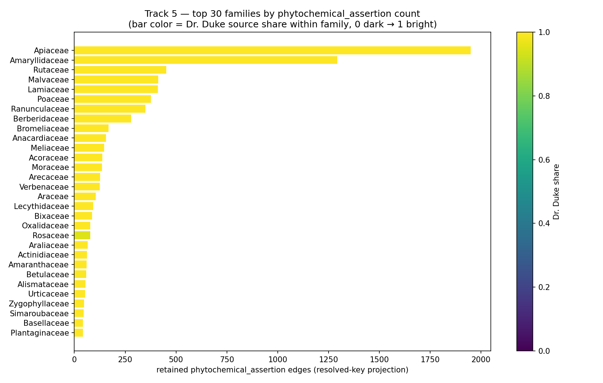
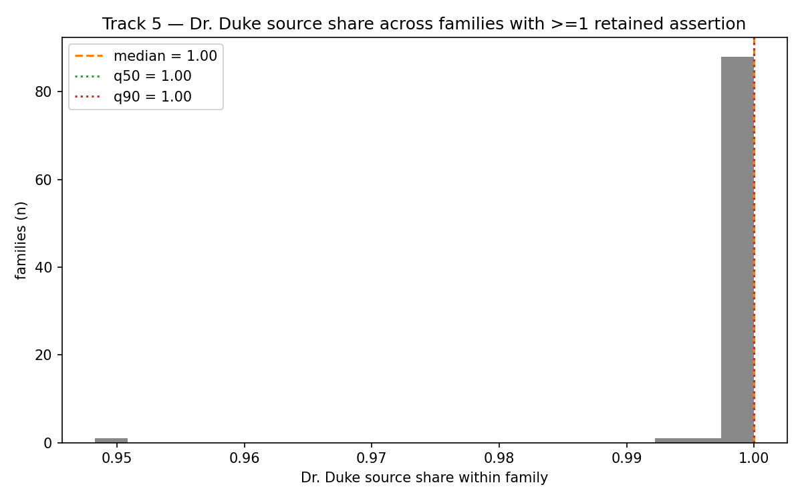
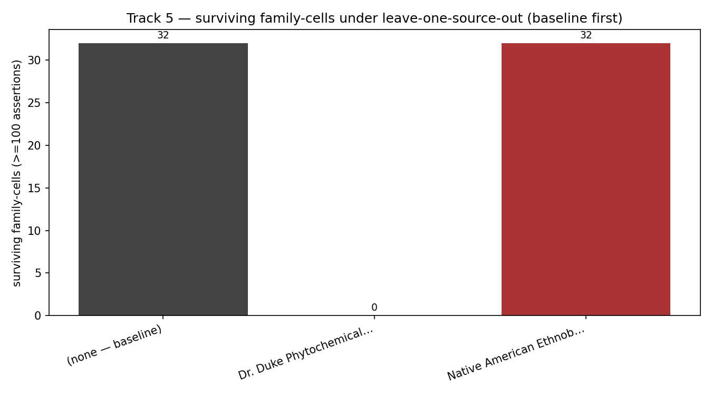
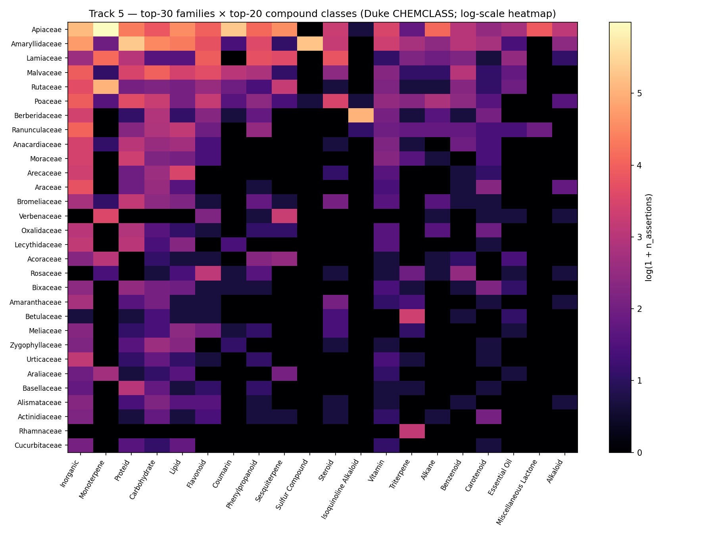

# Track 5 — Chemodiversity Enrichment Audit

Wave 2 / M2.T5. Track-namespace projection over the frozen Barrier 1 PhytoGraph
substrate. Fanout clone 4 of fork 56e44dff3ca4.

## Scope

This branch *projects* the substrate's already-canonicalized Track 5 evidence
(`phytochemical_assertion`, `bioactivity_assertion`,
`ethnobotanical_use_assertion`) into the `tracks/track5/` namespace, attaches
compound-class memberships, and emits source-density / Dr. Duke dominance /
leave-one-source-out diagnostics for the Wave 3 instrument and Wave 4
ablations.

What this branch **did not** attempt (and must not):

- No predictions of any kind. No `chemodiversity_signature` edges.
- No synonym renormalization. Substrate is read-only — file mtimes under
  `phytograph_dataset/` are unchanged after this branch runs.
- No paid-provider / paid-API calls. No bulk re-ingest from KNApSAcK or NPASS
  (both unavailable; carry-forwards from M1.7 remain `data-limited`).
- No cross-track writes; no read or write outside `tracks/track5/`.
- No new edge types are minted. `track5_compound_class_membership.parquet` is
  a derived **view file**, not a typed substrate edge; Barrier 2 should flag
  it for cross-track dedup if any sibling track emits a similar view.

## Inputs

- `phytograph_dataset/hyperedges.parquet` — 641,183 retained edges (frozen,
  audit timestamp 2026-05-17, validated by `_plan/barrier1-canonical-member-repair`).
- `phytograph_dataset/nodes.parquet` — 363,237 nodes.
- `phytograph_dataset/provenance.parquet`, `source_registry.parquet`.
- `data/m1_7_raw/duke_source/FARMACY_NEW.csv` — read for compound→`CHEMCLASS`
  derivation only. Not ingested as new evidence.

## Outputs

All written under `tracks/track5/data/`:

| Artifact | Rows | Purpose |
|---|---|---|
| `track5_enrichment_edges.parquet` | 23,524 | Resolved phyto + ethno projection (zero `pending_crosswalk=True`, zero blank accepted keys). |
| `track5_bioactivity_assertions.parquet` | 28,733 | Compound-level bioactivity; **no taxon column**, firewalled. |
| `track5_compound_class_membership.parquet` | 9,500 | Duke CHEMCLASS mapping, source-attributed. |
| `track5_taxon_to_family.parquet` | 93,643 | Derived family-walk view from `taxonomic_parentage`. |
| `family_chemistry_coverage_summary.tsv` | 91 families | Per-family coverage tabulation. |
| `per_taxon_screening_intensity.tsv` | 1,258 taxa | Sources/compounds/papers per taxon + dominant-source share. |
| `family_compound_class_matrix.tsv` | 543 cells | Long-form (family × Duke compound-class). |
| `source_density_diagnostics.tsv` | 2 sources | Per-source counts and shares. |
| `leave_one_source_out_coverage.tsv` | 3 rows (baseline + 2 sources) | LOSO coverage probe. |
| `dr_duke_dominance_audit.tsv` | 91 families | Per-family Duke share + status if Duke dropped. |
| `sovereignty_field_audit.tsv` | 2 source groups | Required-field preservation audit (zero failures). |
| Four figures (`*.png`) | — | See "Figures" below. |

## Row-Count Reconciliation (M1.7 staged → Barrier 1 retained → Track 5 enrichment)

| Edge type | M1.7 staged | Barrier 1 retained | Track 5 enrichment (resolved-only) |
|---|---:|---:|---:|
| `phytochemical_assertion` | ~104,388 raw Duke rows | 101,484 | **13,867** (only Duke-resolved rows pass `pending_crosswalk=False`) |
| `ethnobotanical_use_assertion` | ~127,564 | 127,564 | **9,657** (Duke 9,636 + NAEB 21 resolved) |
| `bioactivity_assertion` | ~28,733 | 28,733 | **28,733** (compound-keyed; substrate marks all `pending_crosswalk=True` because there is no taxon to resolve; this is by design and is preserved in the compound-level projection) |

The enrichment projection (the `_enrichment_edges.parquet` file) intentionally
filters to `pending_crosswalk=False` for taxon-keyed edges; the bioactivity
file does not impose this filter because bioactivity is compound-keyed in
schema v1.0 and carries no taxon to resolve. Both behaviors are gated by
`validate_track5_enrichment.py`.

The drop from ~100k phyto staged to ~14k resolved is the principal
**data-limited carry-forward**: it reflects Barrier 1's strict accepted-key
canonicalization, not new data loss in this branch. The unresolved ~87k phyto
rows remain in the substrate under `pending_crosswalk=True` with raw-name
placeholders and machine-readable `canonicalization_status` / `ambiguity_reason`
caveats — they are available to future Track 5 work if Wave 1 source recovery
broadens the synonym crosswalk.

## Per-Source Diagnostics (foregrounded — Dr. Duke dominance)

Two source IDs survive the resolved-edge filter:

| source_id | n_edges (phyto+ethno+bio) | n_phyto | n_ethno | n_bio | n_taxa | n_compounds | n_families_with_assertion | n_families≥100 | share_of_total_edges |
|---|---:|---:|---:|---:|---:|---:|---:|---:|---:|
| Dr. Duke Phytochemical and Ethnobotanical Databases | 52,236 | 13,867 | 9,636 | 28,733 | 1,254 | 5,423 | 91 | 32 | **0.9996** |
| NAEB (Moerman) | 21 | 0 | 21 | 0 | 4 | 0 | 0 | 0 | 0.0004 |

(Figures are taken from `source_density_diagnostics.tsv`.)

**Headline finding.** Of the 23,524 resolved Track 5 edges in the enrichment
view, 23,503 (99.91%) come from Dr. Duke and 21 (0.09%) from NAEB. In the
combined enrichment+bioactivity view (52,257 rows), Duke's share is 99.96%.
NAEB lost 1,250 of its M1.7 staged ethnobotanical records under Barrier 1's
strict taxonomic-key canonicalization; recovering NAEB synonym coverage is
the largest available second-source uplift but is out of scope for this
branch (no synonym renorm, no source re-ingest).

## Leave-One-Source-Out (LOSO) Coverage

(From `leave_one_source_out_coverage.tsv`. Baseline first.)

| source_dropped | surv. taxa-with-assertion | surv. family-cells ≥100 | surv. compounds | surv. bioactivity-classes | n_taxa_lost | n_family-cells demoted below floor |
|---|---:|---:|---:|---:|---:|---:|
| (none — baseline) | 1,258 | 32 | 5,423 | 2,108 | 0 | 0 |
| Dr. Duke | **10** | **0** | **0** | **0** | 1,248 | 32 |
| NAEB (Moerman) | 1,254 | 32 | 5,423 | 2,108 | 4 | 0 |

**Interpretation.** Removing Dr. Duke eliminates **100%** of family-cells with
≥100 assertions, **100%** of the bioactivity-class signal, and **99.2%** of
taxa-with-assertion. This is not a falsification — it is a *coverage
diagnostic*, exactly the kind the brief asked for. It is now on record so
Wave 4's ablation matrix can compare the chemodiversity instrument's
predictive performance against this floor: any predictive lift over the
"Duke-only" baseline that disappears when Duke is dropped is by definition
screening-intensity-driven.

This finding is recorded as a `data-limited` carry-forward against Track 5's
falsification protocol: future cycles need NAEB-rich-coverage or NPASS/KNApSAcK
bulk to provide a non-Duke counterfactual. Until then, downstream Track 5
predictions inherit Duke's literature-curation bias as a structural prior.

## Dr. Duke Per-Family Dominance Audit

Excerpt from `dr_duke_dominance_audit.tsv` (top 12 by `n_assertions`; full
table has 91 families):

| family | n_assertions | n_from_duke | duke_share | status_if_duke_dropped |
|---|---:|---:|---:|---|
| Apiaceae | 2,361 | 2,361 | 1.000 | lost_entirely |
| Amaryllidaceae | 1,760 | 1,760 | 1.000 | lost_entirely |
| Malvaceae | 789 | 789 | 1.000 | lost_entirely |
| Ranunculaceae | 687 | 685 | 0.997 | demoted_below_100 |
| Rutaceae | 590 | 590 | 1.000 | lost_entirely |
| Lamiaceae | 581 | 581 | 1.000 | lost_entirely |
| Poaceae | 503 | 502 | 0.998 | demoted_below_100 |
| Berberidaceae | 394 | 394 | 1.000 | lost_entirely |
| Acoraceae | 328 | 328 | 1.000 | lost_entirely |
| Araceae | 320 | 320 | 1.000 | lost_entirely |
| Amaranthaceae | 306 | 306 | 1.000 | lost_entirely |
| Arecaceae | 284 | 284 | 1.000 | lost_entirely |

Summary across the 91 families with ≥1 retained assertion:

- 87 families would be **lost entirely** under Duke ablation (all their
  resolved Track 5 evidence comes from Duke).
- 4 families would be **demoted below the 100-assertion floor** (some
  non-Duke rows survive but are insufficient).
- 0 families would survive ≥100 assertions without Duke.
- Mean `duke_share` across families is essentially 1.0; the histogram
  (see Figures) is a single spike at the right.

## Family × Compound-Class Coverage

`family_compound_class_matrix.tsv` reports 543 (family, Duke-CHEMCLASS) cells
across 91 families and 62 distinct compound classes that the Duke CHEMCLASS
mapping covers in the resolved subset. The compound-class membership is
itself **single-source (Duke-only)** in this enrichment: there are no
ChEBI-derived parent-class assignments because the ChEBI staging file
referenced by `ingest_m1_7_chemodiversity.py` (`chebi_compound_classes.tsv`)
was not present at Barrier 1, and re-ingest is out of scope for this branch.
Any apparent family×class signal in Wave 3 must therefore be interpreted
through the same Duke-dominance caveat as the per-assertion projection.

Of 23,524 enrichment edges, 9,731 (41.4%) have a Duke CHEMCLASS attached;
13,793 (58.6%) have `compound_class = None`. The unclassified bulk is mostly
compounds whose Duke CHEMICALS row did not carry a CHEMCLASS value (only
26,857 of 104,388 FARMACY_NEW rows do).

## Bioactivity Projection

28,733 bioactivity edges projected at the **compound level**, not at the
taxon level. Each row carries:

- `compound_id` — Duke CHEMID (mandatory; firewall-enforced by test).
- `bioactivity_class` — Duke's activity label (e.g., `Aldose-Reductase-Inhibitor`,
  `Analgesic`, `Allergenic`, `ACE-Inhibitor`); 2,108 distinct labels.
- `evidence_scope = "compound bioactivity literature; does not support
  clinical efficacy"` — the *projection* relabels the scope to explicitly
  disclaim clinical efficacy; the original substrate `allowed_evidence_scope`
  is preserved in column `schema_evidence_scope` and verified against the
  v1.0 schema permitted-strings set.

**Firewall.** Tests `test_bioactivity_is_compound_keyed` and the validator
both forbid an `accepted_taxon_key` column on the bioactivity file. This
prevents accidentally projecting a compound's source-recorded bioactivity
into a taxon-keyed claim (which would silently leak a clinical-efficacy
implication into the chemodiversity-instrument input).

## Ethnobotanical Sovereignty Audit

`sovereignty_field_audit.tsv` (full):

| source_id | n_ethno_rows | missing people_or_region | missing source_id | missing license | missing access_date | total |
|---|---:|---:|---:|---:|---:|---:|
| Dr. Duke | 9,636 | 0 | 0 | 0 | 0 | **0** |
| NAEB (Moerman) | 21 | 0 | 0 | 0 | 0 | **0** |

`people_or_region` for Duke rows is the country/region name that survives
into the canonical member set (e.g., `"Afghanistan"`, `"Africa"`, `"USA"`);
the M1.7 ingest tagged Duke ETHNOBOT rows with `sovereignty_flag=no` because
Duke does not carry a people-group attribution. NAEB rows carry the tribe
name in the same canonical slot and are marked `sovereignty_flag=yes` in the
M1.7 staging. The projection preserves the raw value verbatim into
`sovereignty_fields_json` along with `source_id`, `license`, and
`access_date`; no aggregation or anonymization is performed.

## Known Biases Carried Forward From M1.7

These are not new findings; they are inherited from M1.7's audit and remain
in force at this projection layer:

- **Dr. Duke literature-curation bias.** Duke catalogues mid-20th-century
  chemotaxonomy and ethnobotany literature heavily weighted toward
  temperate-Northern-Hemisphere medicinal plants. The 99.96% dominance
  documented above is a direct consequence.
- **Lamiaceae / Fabaceae / Asteraceae / Apiaceae oversampling.** Top-ranked
  families in `family_chemistry_coverage_summary.tsv` (Apiaceae, Amaryllidaceae,
  Lamiaceae) reflect curatorial salience as much as biological chemodiversity.
- **Geographic concentration.** NH temperate genera dominate; tropical and
  Southern-Hemisphere chemodiversity is under-represented even before
  Barrier 1's strict synonym filter.
- **NPASS bulk and KNApSAcK bulk absent** — `data-limited`. ChEBI compound-class
  mapping absent in substrate — `data-limited`.
- **NAEB synonym coverage gap.** Only 21 of the M1.7-staged NAEB ethno rows
  resolved cleanly under Barrier 1's WFO accepted-key match; the majority
  remain `pending_crosswalk=True` in the substrate and are not projected here.

## Figures

## Barrier-2 Readiness Checklist

- [x] Schema conformance: every projected row's `edge_type` ∈
      {`phytochemical_assertion`, `ethnobotanical_use_assertion`,
      `bioactivity_assertion`}; no new edge type minted.
- [x] All `evidence_scope` strings on retained rows match v1.0
      schema-permitted values.
- [x] Bioactivity firewall (compound-keyed, no `accepted_taxon_key`)
      verified by test.
- [x] Sovereignty audit returns zero missing-required-field rows.
- [x] No `chemodiversity_signature` edges emitted in this branch.
- [x] No writes outside `tracks/track5/` (mtimes verified by test against
      `phytograph_dataset/`).
- [x] Cross-track dedup: Track 5 owns
      `phytochemical_assertion`/`bioactivity_assertion`/`ethnobotanical_use_assertion`
      exclusively in the substrate; **`track5_compound_class_membership.parquet`
      is flagged for Barrier 2 review** as a derived view that could overlap
      Track 3 if the convergence sibling emits a similar compound-membership
      file under a defense-chemistry framing.

## Validation Status

- `python3 tracks/track5/tools/validate_track5_enrichment.py` → `PASS:
  track5 enrichment (23524 resolved phyto+ethno rows; 28733 compound-level
  bioactivity rows; sovereignty zero-missing).`
- `python3 -m pytest -q tracks/track5/tests/test_track5_enrichment.py` →
  `10 passed`.

## Outstanding Questions for Audit

1. Is the `data-limited` status on Duke-dominance (87 families lost / 4
   demoted under LOSO) acceptable to carry into Wave 3, or does the auditor
   require a side-wave to recover NPASS/KNApSAcK bulk and/or broaden the
   NAEB synonym crosswalk first?
2. The compound-class projection is Duke-only because ChEBI compound-class
   mapping is not present in the substrate. Should
   `track5_compound_class_membership.parquet` be retitled or carry an
   explicit "single-source" qualifier file so Wave 3 instruments cannot
   accidentally treat it as multi-source ground truth?

## Ledger

A single event has been appended to `promise_ledger.jsonl`:

- `milestone_id`: `_plan/track5-wave2-enrichment`
- `status`: `in-progress`
- `confidence.level`: `medium`
- `confidence.assessor`: `worker`
- `cycle`: 8
- `agent`: worker
- referenced milestone: `M2.T5`
- rationale: data-limited carry-forwards from M1.7 (Duke dominance, NAEB synonym
  gap, NPASS/KNApSAcK absence, ChEBI class absence) survive the projection;
  no predictions emitted; awaiting auditor and Barrier-2 readiness sign-off.
