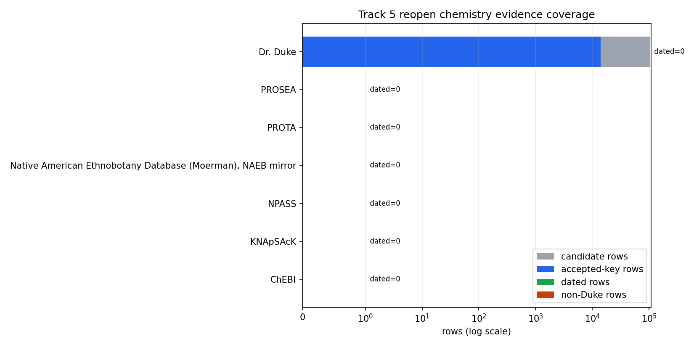

# Track 5 Reopen Temporal Chemistry Evidence

## Determination

determination: `no_new_qualifying_evidence`.

The frozen local chemistry substrate does not contain qualifying non-Duke temporal taxon-compound evidence. The only retained accepted-key phytochemical assertion stratum is Duke-derived, and the staged non-Duke sources inspected here contain zero local taxon-compound detection rows with accepted keys and usable discovery or isolation years. Therefore H5 remains `not_validated_source_biased`, and the chemodiversity predictor was not rerun.

## Sources Inspected

| Source | Candidate rows | Accepted-key rows | Dated rows | Non-Duke rows | Held-out taxa covered | Chemical classes covered | Rejected rows | Dominant rejection reason |
|---|---:|---:|---:|---:|---:|---:|---:|---|
| Dr. Duke Phytochemical and Ethnobotanical Databases | 103663 | 13867 | 0 | 0 | 1 | 62 | 103663 | Duke rows have accepted-key joins but no usable discovery_or_isolation_year field and are not non-Duke evidence |
| ChEBI | 0 | 0 | 0 | 0 | 0 | 0 | 0 | no local phytochemical taxon-compound detection rows staged for this source |
| KNApSAcK | 0 | 0 | 0 | 0 | 0 | 0 | 0 | no local phytochemical taxon-compound detection rows staged for this source |
| NPASS | 0 | 0 | 0 | 0 | 0 | 0 | 0 | no local phytochemical taxon-compound detection rows staged for this source |
| Native American Ethnobotany Database (Moerman), NAEB mirror | 0 | 0 | 0 | 0 | 0 | 0 | 0 | no local phytochemical taxon-compound detection rows staged for this source |
| PROSEA | 0 | 0 | 0 | 0 | 0 | 0 | 0 | no local phytochemical taxon-compound detection rows staged for this source |
| PROTA | 0 | 0 | 0 | 0 | 0 | 0 | 0 | no local phytochemical taxon-compound detection rows staged for this source |

## Canonical Holdout Matrix

| Holdout taxon | Accepted key | Target class | Target year | Non-Duke before year | Non-Duke after year | Validation allowed | Dominant failure reason |
|---|---|---|---:|---|---|---|---|
| Taxus brevifolia |  | Diterpene | 1971 | false | false | false | holdout taxon lacks accepted-key join in frozen substrate; no non-Duke dated evidence available |
| Catharanthus roseus |  | Alkaloid | 1958 | false | false | false | holdout taxon lacks accepted-key join in frozen substrate; no non-Duke dated evidence available |
| Cinchona officinalis |  | Alkaloid | 1820 | false | false | false | holdout taxon lacks accepted-key join in frozen substrate; no non-Duke dated evidence available |
| Artemisia annua | wfo:wfo-0000083255-2025-12 | Sesquiterpene | 1972 | false | false | false | no accepted-key non-Duke taxon-compound row has a usable discovery_or_isolation_year before or after target year |
| Digitalis purpurea |  | Cardenolide | 1875 | false | false | false | holdout taxon lacks accepted-key join in frozen substrate; no non-Duke dated evidence available |
| Papaver somniferum |  | Alkaloid | 1804 | false | false | false | holdout taxon lacks accepted-key join in frozen substrate; no non-Duke dated evidence available |
| Atropa belladonna |  | Alkaloid | 1831 | false | false | false | holdout taxon lacks accepted-key join in frozen substrate; no non-Duke dated evidence available |
| Salix alba |  | Glycoside | 1828 | false | false | false | holdout taxon lacks accepted-key join in frozen substrate; no non-Duke dated evidence available |

## Source-Dominance Diagnostics

The prior no-Duke ablation remains decisive for the current mechanism: `source_ablation_results.tsv` reports 1,405 baseline prediction rows and 0 prediction rows under `no_duke`, `source_density_matched`, and `screening_count_matched` variants. This reopen package adds no qualifying row to change that condition: `|N ∩ D| = 0`, where `N` is accepted-key non-Duke taxon-compound evidence and `D` is rows with a usable discovery_or_isolation_year.

## Reopen Gate

The reopen threshold is not met. Accepted-key rows exist for Duke-derived chemistry evidence, but Duke is the source-dominant stratum being tested against and its local records do not provide discovery_or_isolation_year fields suitable for temporally frozen holdouts. KNApSAcK, NPASS, and ChEBI remain represented in the source audit as inspected non-Duke sources, but they contribute no local accepted-key dated taxon-compound detection rows in the frozen workspace.

## Evidence Firewall

This package makes no phytochemical novelty, clinical efficacy, preparation, dosage, safety, or bioactivity claim. Ethnobotanical-use-only and bioactivity-class-only rows remain excluded from taxon-compound detection evidence. Master `prediction_ledger.tsv` and `speculation_ledger.tsv` stay header-only.
