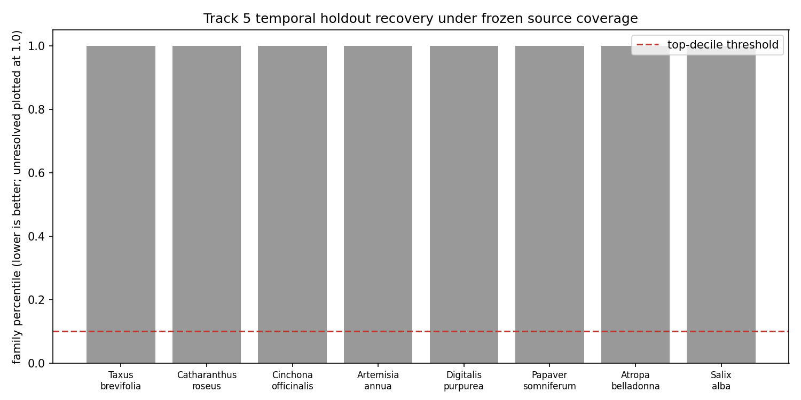
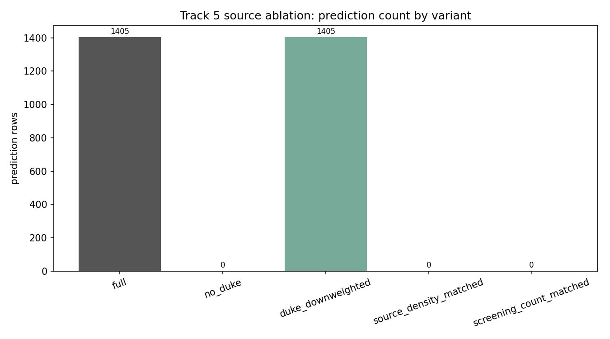
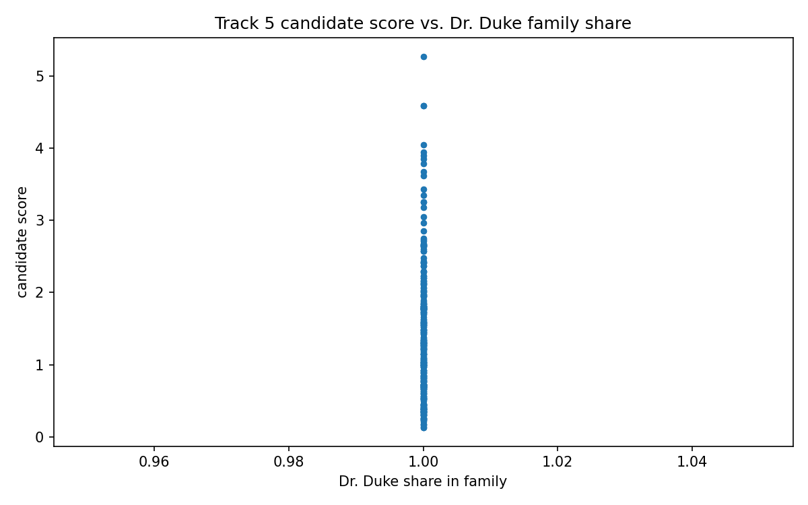

# Track 5 Temporal Holdout Validation and Source Ablation

## Scope

This Wave 4 branch tests whether the validated M3.T5 neighborhood-completion
prior has recoverable signal outside Dr. Duke source dominance. It writes
Track 5-local validation and ablation artifacts only; it does not promote rows
to the master `prediction_ledger.tsv` and does not claim any new taxon-level
detection, bioactivity, safety, therapeutic value, or clinical efficacy.

## Artifacts

| Artifact | Rows / status | Meaning |
|---|---:|---|
| `tracks/track5/data/temporal_holdout_recovery.tsv` | 8 | Canonical phytochemical discovery holdouts with cutoff dates, target-label hiding status, rank/percentile columns, negative controls where family coverage exists, and validation-source text. |
| `tracks/track5/data/source_ablation_results.tsv` | 5 | Full, no-Duke, Duke-downweighted, source-density-matched, and screening-count-matched ablation variants. |
| `tracks/track5/data/phytochemistry_predictions_no_duke.tsv` | 0 | Required no-Duke prediction table with stable columns. |
| `tracks/track5/data/phytochemistry_predictions_source_matched.tsv` | 0 | Required source-density-matched prediction table with stable columns. |
| `tracks/track5/data/non_duke_class_harmonization.tsv` | 1 null row | Explicit null result: no local non-Duke detection/class rows are available to harmonize. |







## Temporal Holdout Results

The four required canonical cases have explicit cutoff dates:

| Taxon | Target class | Cutoff | Result |
|---|---|---:|---|
| *Taxus brevifolia* | Diterpene | 1970-12-31 | `data-limited`: name absent from frozen substrate and family/class signature absent. |
| *Catharanthus roseus* | Alkaloid | 1957-12-31 | `data-limited`: name appears only without accepted key and family/class signature absent. |
| *Cinchona officinalis* | Alkaloid | 1819-12-31 | `data-limited`: name absent from frozen substrate and family/class signature absent. |
| *Artemisia annua* | Sesquiterpene | 1971-12-31 | `data-limited`: accepted key resolved and target label hidden, but Asteraceae/Sesquiterpene signature is absent from the qualified M3.T5 signatures. |

All eight holdout rows are `data-limited`; none reaches top-decile recovery.
The current frozen Track 5 tables do not contain historical assertion dates, so
the script records `cutoff_filter_status=no_assertion_dates_available`. The
temporal test therefore cannot validate H5 at this stage; it falsifies only the
stronger claim that the current M3.T5 inputs are already sufficient for
canonical temporal recovery.

## Source Ablation Results

| Variant | Prediction rows | Top-decile holdout recovery | Interpretation |
|---|---:|---:|---|
| full | 1,405 | 0 | Baseline M3.T5 output remains a Duke-sensitive pending prior. |
| no-Duke | 0 | 0 | Removing Dr. Duke collapses all prediction support. |
| Duke-downweighted | 1,405 | 0 | Rows persist only because Duke still supplies `S_f[k]`; this is not independent support. |
| source-density-matched | 0 | 0 | No matched non-Duke phytochemical detection stratum exists. |
| screening-count-matched | 0 | 0 | No non-Duke screening stratum exists for matched comparison. |

Non-Duke class harmonization is also a null result: current local
ChEBI/NPASS/KNApSAcK-derived taxon detection/class rows are absent, so no
non-Duke compound-class support can be recovered without a source-recovery
side wave.

## Negative Control

Where the expected family exists in the frozen family table, the script selects
a same-family low-screening negative-control taxon. No canonical case receives
a meaningful score under the current family/class signatures, so the controls
do not rescue a positive interpretation; they reinforce that current failure is
coverage- and source-composition-driven.

## Interpretation

This branch produces a valid falsification/data-limited result. The M3.T5
instrument is reproducible, but current evidence is not enough to support H5:
canonical discoveries are not recovered under pre-discovery framing, and all
non-Duke or matched variants collapse to zero prediction rows. The next useful
Track 5 work is source recovery and class harmonization for non-Duke detection
rows, not more scoring over the same frozen Duke-dominated table.

## Commands

```bash
python3 tracks/track5/scripts/build_temporal_holdout_validation.py
python3 tracks/track5/scripts/run_source_ablation_matrix.py
python3 tracks/track5/scripts/harmonize_non_duke_compound_classes.py
python3 -m pytest -q tracks/track5/tests/test_track5_enrichment.py tracks/track5/tests/test_track5_predictor.py tracks/track5/tests/test_track5_wave4_validation.py
```

## Evidence Firewall

Every new table uses screening-prior or detection/class-harmonization language
only. Bioactivity remains compound-level or compound-class-indirected, and no
row asserts taxon-level bioactivity, clinical efficacy, dosage, safety, or
therapeutic value.
