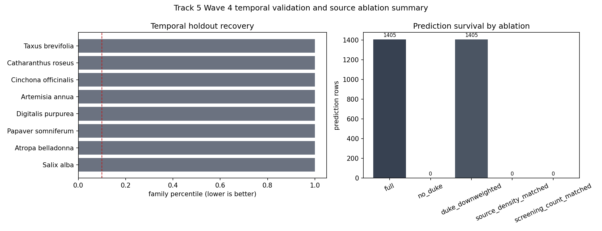

# Track 5 Wave 4 Temporal and Source Closure

## Decision

H5 is not validated under the frozen Track 5 inputs. The temporal holdout set does not recover the required canonical source taxa in the top decile of their families, and the source controls show that the M3.T5 score is a Duke-dominated screening prior rather than a source-independent chemodiversity signal. The appropriate closure is `M4.V5=deferred/data_limited` for temporal validation and `M4.A-track5-duke-source-ablation=validated` as a source-bias/null ablation result.

## Temporal Holdout Outcomes

| Target taxon | Chemical class | Family | Cutoff status | Rank | Family percentile | Top decile | Outcome |
|---|---|---|---|---:|---:|---|---|
| Taxus brevifolia | Diterpene | Taxaceae | no_assertion_dates_available |  |  | false | data_limited_not_recovered |
| Catharanthus roseus | Alkaloid | Apocynaceae | no_assertion_dates_available |  |  | false | data_limited_not_recovered |
| Cinchona officinalis | Alkaloid | Rubiaceae | no_assertion_dates_available |  |  | false | data_limited_not_recovered |
| Artemisia annua | Sesquiterpene | Asteraceae | no_assertion_dates_available |  |  | false | data_limited_not_recovered |
| Digitalis purpurea | Cardenolide | Plantaginaceae | no_assertion_dates_available |  |  | false | data_limited_not_recovered |
| Papaver somniferum | Alkaloid | Papaveraceae | no_assertion_dates_available |  |  | false | data_limited_not_recovered |
| Atropa belladonna | Alkaloid | Solanaceae | no_assertion_dates_available |  |  | false | data_limited_not_recovered |
| Salix alba | Glycoside | Salicaceae | no_assertion_dates_available |  |  | false | data_limited_not_recovered |

Missing ranks and percentiles are meaningful null results: the current tables lack historical assertion dates, several targets do not resolve to accepted keys in the frozen substrate, and qualified family/class signatures are absent for the tested target classes. These are coverage and temporal-provenance limits, not evidence about real-world compound absence.

## Source Ablation Outcomes

| Variant | Prediction rows | Outcome | Interpretation |
|---|---:|---|---|
| full | 1405 | baseline_source_dominated | M3.T5 baseline; all prediction rows carry Dr. Duke sensitivity. |
| no_duke | 0 | collapsed_or_no_eligible_non_duke_stratum | Removing Dr. Duke leaves no qualifying phytochemical family/class signal. |
| duke_downweighted | 1405 | not_independent_duke_still_present | Rows persist only because Duke evidence still supplies S_f[k]; not independent support. |
| source_density_matched | 0 | collapsed_or_no_eligible_non_duke_stratum | No matched non-Duke phytochemical source stratum exists in current frozen data. |
| screening_count_matched | 0 | collapsed_or_no_eligible_non_duke_stratum | Screening-count match cannot be formed without non-Duke detection rows. |

The no-Duke result is decisive for the current instrument mechanics. The score is `score(t,k|f)=S_f[k]*w_specificity(k)*w_screening(t)`, so if Duke supplies the retained family/class rows used to estimate `S_f[k]`, removing Duke makes that term zero or undefined and prediction rows vanish. Duke-downweighted rows do not establish independence because Duke still defines `S_f[k]`.

## Source-Bias Interpretation

The current Track 5 artifact measures where a Duke-backed family/class signature plus screening intensity makes a candidate eligible for follow-up. It does not yet distinguish biological chemodiversity neighborhood completion from source coverage, screening density, or class-harmonization availability. The validated contribution of this branch is therefore the ablation finding: source-independent Track 5 signal is absent under the current frozen inputs, and a fair non-Duke matched comparison is data-limited because the required local non-Duke detection/class stratum is empty.

## Evidence Firewall

This closure is about prediction mechanics and source coverage only. It does not assert taxon-level compound detection, medical effect, preparation advice, dose, or safety status. All positive biological interpretation remains blocked until non-Duke source recovery, historical assertion dating, and Barrier 4 ledger reconciliation are available.
