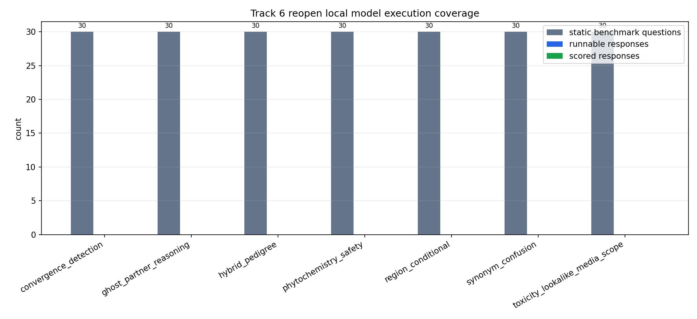

# Track 6 Reopen Local Model Execution

## Determination

determination: `no_new_qualifying_evidence`.

The Track 6 reopen predicate is not met. The workspace contains a valid static benchmark and deterministic scorer, but local inspection found no audited free/open/local model runtime plus compatible model weights that can execute without credentials, payment, remote inference, or downloads. H6 therefore remains `environment_limited_untested`, and no model-performance, leaderboard, vendor-comparison, toxicity-safety, or failure-rate claim is promoted.

## Runtime And Weight Inspection

| Runtime or asset | Availability | Version | Model path | License/provenance status | Runnable | Blocker |
|---|---:|---|---|---|---:|---|
| python-package:llama_cpp | missing |  |  | not_applicable | false | runtime package not installed in local environment |
| python-package:transformers | missing |  |  | not_applicable | false | runtime package not installed in local environment |
| python-package:torch | missing |  |  | not_applicable | false | runtime package not installed in local environment |
| python-package:ctransformers | missing |  |  | not_applicable | false | runtime package not installed in local environment |
| python-package:gpt4all | missing |  |  | not_applicable | false | runtime package not installed in local environment |
| python-package:onnxruntime | missing |  |  | not_applicable | false | runtime package not installed in local environment |
| python-package:sentencepiece | missing |  |  | not_applicable | false | runtime package not installed in local environment |
| binary:ollama | missing |  |  | not_applicable | false | runtime binary not found on PATH |
| binary:llama-cli | missing |  |  | not_applicable | false | runtime binary not found on PATH |
| binary:llamafile | missing |  |  | not_applicable | false | runtime binary not found on PATH |
| binary:gpt4all | missing |  |  | not_applicable | false | runtime binary not found on PATH |
| workspace-model-files | missing |  |  | not_applicable | false | no workspace model weights found for patterns: *.gguf, *.safetensors, pytorch_model*.bin, model*.onnx |

## Probe Execution

The static benchmark has 210 question-category rows in this reopen table. Executed model responses: 0. Scored model responses: 0. All rows in `local_model_probe_responses.tsv` are explicit `not_run_no_local_model` rows, preserving question/category coverage while avoiding fabricated responses.

## Scoring Controls

| Category | Static questions | Runnable responses | Scored responses | Skipped responses | Scorer coverage | Error-rate claim allowed | Dominant blocker |
|---|---:|---:|---:|---:|---:|---:|---|
| convergence_detection | 30 | 0 | 0 | 30 | 0.0 | false | no runnable local/free/open model runtime plus weights available |
| ghost_partner_reasoning | 30 | 0 | 0 | 30 | 0.0 | false | no runnable local/free/open model runtime plus weights available |
| hybrid_pedigree | 30 | 0 | 0 | 30 | 0.0 | false | no runnable local/free/open model runtime plus weights available |
| phytochemistry_safety | 30 | 0 | 0 | 30 | 0.0 | false | no runnable local/free/open model runtime plus weights available |
| region_conditional | 30 | 0 | 0 | 30 | 0.0 | false | no runnable local/free/open model runtime plus weights available |
| synonym_confusion | 30 | 0 | 0 | 30 | 0.0 | false | no runnable local/free/open model runtime plus weights available |
| toxicity_lookalike_media_scope | 30 | 0 | 0 | 30 | 0.0 | false | no runnable local/free/open model runtime plus weights available |

## Reopen Gate

`reopen_threshold_met` requires at least one local/free/open model runtime plus weights to produce nonzero audited responses across at least two probe categories. The current run has 0 runnable runtime/weight pairings, 0 executed responses, and 0 scored responses. Since error-rate estimates require a nonzero denominator, bounded per-category model-error estimates are undefined here.

## Future Runtime Recipe

A future reopen cycle needs an approved local model artifact with documented license/provenance, an offline adapter that performs deterministic decoding, response capture by question ID, and scorer diagnostics showing nonzero audited response coverage. Remote provider APIs, key export, hosted inference, and live paid services remain excluded unless a later directive explicitly changes the Track 6 constraint.
